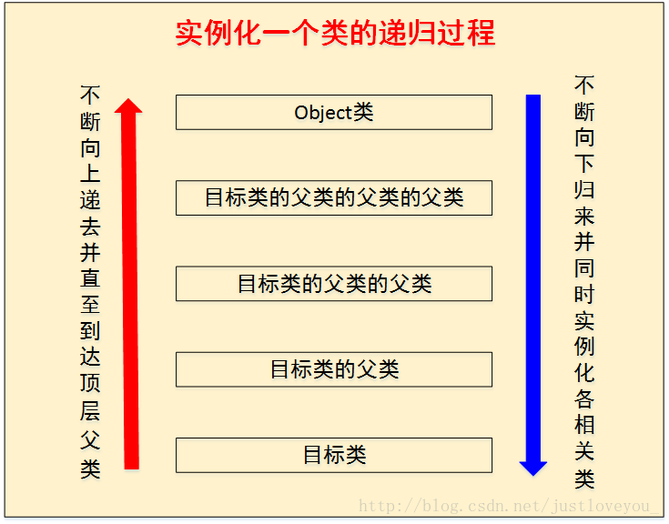

版权声明：本文为CSDN博主「书呆子Rico」的原创文章，遵循 CC 4.0 BY-SA 版权协议，转载请附上原文出处链接及本声明。
原文链接：https://blog.csdn.net/justloveyou_/article/details/72466416

---

### Java对象创建时机

1. 使用new关键字创建对象

   在Java规范中被称为 : **由执行类实例创建表达式而引起的对象创建**

   ```java
   Student student = new Student();
   ```

2. 使用Class类的newInstance方法(反射机制)

   通过Java的反射机制使用Class类的newInstance方法来创建对象，事实上，这个newInstance方法调用无参的构造器创建对象

   ```java
   Student student2 = (Student)Class.forName("Student类全限定名").newInstance();　
   Student stu = Student.class.newInstance();　
   ```

3. 使用Constructor类的newInstance方法(反射机制)

   java.lang.relect.Constructor类里也有一个newInstance方法可以创建对象，该方法和Class类中的newInstance方法很像，但是相比之下，Constructor类的newInstance方法更加强大些，我们可以通过这个newInstance方法调用有参数的和私有的构造函数

   ```java
   public class Student {
   
       private int id;
   
       public Student(Integer id) {
           this.id = id;
       }
   
       public static void main(String[] args) throws Exception {
   
           Constructor<Student> constructor = Student.class
                   .getConstructor(Integer.class);
           Student stu3 = constructor.newInstance(123);
       }
   }
   ```

   事实上Class的newInstance方法内部调用的也是Constructor的newInstance方法。

4. 使用Clone方法创建对象

   无论何时我们调用一个对象的clone方法，JVM都会帮我们创建一个新的、一样的对象，特别需要说明的是，用clone方法创建对象的过程中并不会调用任何构造函数。

   简单而言，要想使用clone方法，我们就必须先实现Cloneable接口并实现其定义的clone方法，这也是原型模式的应用

   ```java
   public class Student implements Cloneable{
   
       private int id;
   
       public Student(Integer id) {
           this.id = id;
       }
   
       @Override
       protected Object clone() throws CloneNotSupportedException {
           // TODO Auto-generated method stub
           return super.clone();
       }
   
       public static void main(String[] args) throws Exception {
   
           Constructor<Student> constructor = Student.class
                   .getConstructor(Integer.class);
           Student stu3 = constructor.newInstance(123);
           Student stu4 = (Student) stu3.clone();
       }
   }
   ```

5. 使用(反)序列化机制创建对象

   　当我们反序列化一个对象时，JVM会给我们创建一个单独的对象，在此过程中，JVM并不会调用任何构造函数。为了反序列化一个对象，我们需要让我们的类实现Serializable接口

   ```java
   public class Student implements Cloneable, Serializable {
   
       private int id;
   
       public Student(Integer id) {
           this.id = id;
       }
   
       @Override
       public String toString() {
           return "Student [id=" + id + "]";
       }
   
       public static void main(String[] args) throws Exception {
   
           Constructor<Student> constructor = Student.class
                   .getConstructor(Integer.class);
           Student stu3 = constructor.newInstance(123);
   
           // 写对象
           ObjectOutputStream output = new ObjectOutputStream(
                   new FileOutputStream("student.bin"));
           output.writeObject(stu3);
           output.close();
   
           // 读对象
           ObjectInputStream input = new ObjectInputStream(new FileInputStream(
                   "student.bin"));
           Student stu5 = (Student) input.readObject();
           System.out.println(stu5);
       }
   }
   ```


**从Java虚拟机层面看，除了使用new关键字创建对象的方式外，其他方式全部都是通过转变为invokevirtual指令直接创建对象的。**

---

###  Java 对象的创建过程

　当一个对象被创建时，虚拟机就会为其分配内存来存放对象自己的实例变量及其从父类继承过来的实例变量(即使这些从超类继承过来的实例变量有可能被隐藏也会被分配空间)。<font color="red">在为这些实例变量分配内存的同时，这些实例变量也会被赋予默认值(零值)。</font>在内存分配完成之后，Java虚拟机就会开始对新创建的对象按照程序猿的意志进行初始化。在Java对象初始化过程中，主要涉及三种执行对象初始化的结构，分别是 <font color="red">实例变量初始化、实例代码块初始化 以及 构造函数初始化。</font>

---

1. 实例变量初始化与实例代码块初始化

   **实际上，如果我们对实例变量直接赋值或者使用实例代码块赋值，那么编译器会将其中的代码放到类的构造函数中去，并且这些代码会被放在对超类构造函数的调用语句之后(还记得吗？Java要求构造函数的第一条语句必须是超类构造函数的调用语句)，构造函数本身的代码之前。**

   ```java
   public class Father {
       private int fi = 10;
       private int fj;
       private static int fstatic = 5;
   
       static {
           System.out.println("fstatic = " + fstatic);
           System.out.println("father static invoke");
           fstatic += 5;
       }
   
       {
           fj = 20;
           System.out.println("father invoke!");
       }
   
       public Father() {
           System.out.println("fi = " + fi);
           System.out.println("fj = " + fj);
           System.out.println("fstatic 2 = " + fstatic);
       }
   
   }
   public class Son extends Father {
       private int si = 30;
   
       public Son(){
           System.out.println("si = " + si);
       }
   
       public static void main(String[] args) {
           Son son = new Son();
           /**
           执行结果如下:
   		fstatic = 5
   		father static invoke
   		son static invoke
   		father invoke!
   		fi = 10
   		fj = 20
   		fstatic 2 = 10
   		son invoke!
   		si = 30
           */
       }
   
       {
           System.out.println("son invoke!");
       }
   
       static {
           System.out.println("son static invoke");
       }
   }
   
   
   ```

   可以看到,会先进行类加载,加载父类,并执行其中的静态代码块,然后加载子类,执行子类的静态代码块.**如果我们对实例变量直接赋值或者使用实例代码块赋值，那么编译器会将其中的代码放到类的构造函数中去，并且这些代码会被放在对超类构造函数的调用语句之后**

2. 构造函数初始化

   实例变量初始化与实例代码块初始化总是发生在构造函数初始化之前

   众所周知，每一个Java中的对象都至少会有一个构造函数，如果我们没有显式定义构造函数，那么它将会有一个默认无参的构造函数。在编译生成的字节码中，这些构造函数会被命名成<init>()方法，参数列表与Java语言书写的构造函数的参数列表相同。

   <font color="red">**Java要求在实例化类之前，必须先实例化其超类，以保证所创建实例的完整性。**</font>

   这一点是在构造函数中保证的：Java强制要求Object对象(Object是Java的顶层对象，没有超类)之外的所有对象构造函数的第一条语句必须是超类构造函数的调用语句或者是类中定义的其他的构造函数，如果我们既没有调用其他的构造函数，也没有显式调用超类的构造函数，那么编译器会为我们自动生成一个对超类构造函数的调用

   如果我们显式调用超类的构造函数，那么该调用必须放在构造函数所有代码的最前面，也就是必须是构造函数的第一条指令。正因为如此，Java才可以使得一个对象在初始化之前其所有的超类都被初始化完成，并保证创建一个完整的对象出来。

3. **实例化一个类的对象的过程是一个典型的递归过程**

   具体过程是这样的：

   　　在准备实例化一个类的对象前，首先准备实例化该类的父类，如果该类的父类还有父类，那么准备实例化该类的父类的父类，依次递归直到递归到Object类。此时，首先实例化Object类，再依次对以下各类进行实例化，直到完成对目标类的实例化。具体而言，在实例化每个类时，都遵循如下顺序：先依次执行实例变量初始化和实例代码块初始化，再执行构造函数初始化。也就是说，编译器会将实例变量初始化和实例代码块初始化相关代码放到类的构造函数中去，并且这些代码会被放在对超类构造函数的调用语句之后，构造函数本身的代码之前。

   (如果是未加载这些父类,同时会进行类加载逻辑)

   

---

### 类的初始化时机与过程

在类加载过程中，准备阶段是正式为类变量(static 成员变量)分配内存并设置类变量初始值（零值）的阶段，而初始化阶段是真正开始执行类中定义的java程序代码(字节码)并按程序猿的意图去初始化类变量的过程。更直接地说，初始化阶段就是执行类构造器<clinit>()方法的过程。<font color="red"><clinit>()方法是由编译器自动收集类中的所有类变量的赋值动作和静态代码块static{}中的语句合并产生的，其中编译器收集的顺序是由语句在源文件中出现的顺序所决定。</font>

<font color="red">类构造器<clinit>()与实例构造器<init>()不同，它不需要程序员进行显式调用，虚拟机会保证在子类类构造器<clinit>()执行之前，父类的类构造<clinit>()执行完毕。</font>由于父类的构造器<clinit>()先执行，也就意味着父类中定义的静态代码块/静态变量的初始化要优先于子类的静态代码块/静态变量的初始化执行。特别地，类构造器<clinit>()对于类或者接口来说并不是必需的，如果一个类中没有静态代码块，也没有对类变量的赋值操作，那么编译器可以不为这个类生产类构造器<clinit>()。此外，在同一个类加载器下，一个类只会被初始化一次，但是一个类可以任意地实例化对象。也就是说，<font color="red">在一个类的生命周期中，类构造器<clinit>()最多会被虚拟机调用一次，而实例构造器<init>()则会被虚拟机调用多次，只要程序员还在创建对象。</font>
~~这也就解释了为什么静态代码块会优先执行~~

---

###  总结

1、一个实例变量在对象初始化的过程中会被赋值几次？

　　我们知道，JVM在为一个对象分配完内存之后，会给每一个实例变量赋予默认值，这个时候实例变量被第一次赋值，这个赋值过程是没有办法避免的。如果我们在声明实例变量x的同时对其进行了赋值操作，那么这个时候，这个实例变量就被第二次赋值了。如果我们在实例代码块中，又对变量x做了初始化操作，那么这个时候，这个实例变量就被第三次赋值了。如果我们在构造函数中，也对变量x做了初始化操作，那么这个时候，变量x就被第四次赋值。也就是说，在Java的对象初始化过程中，一个实例变量最多可以被初始化4次。

---

2、类的初始化过程与类的实例化过程的异同？

　　类的初始化是指类加载过程中的初始化阶段对类变量按照程序猿的意图进行赋值的过程；而类的实例化是指在类完全加载到内存中后创建对象的过程。

---

3、假如一个类还未加载到内存中，那么在创建一个该类的实例时，具体过程是怎样的？

　　我们知道，要想创建一个类的实例，必须先将该类加载到内存并进行初始化，也就是说，类初始化操作是在类实例化操作之前进行的，但并不意味着：只有类初始化操作结束后才能进行类实例化操作。

```java
public class StaticTest {
    public static void main(String[] args) {
        staticFunction();
    }

    static StaticTest st = new StaticTest();

    static {   //静态代码块
        System.out.println("1");
    }

    {       // 实例代码块
        System.out.println("2");
    }

    StaticTest() {    // 实例构造器
        System.out.println("3");
        System.out.println("a=" + a + ",b=" + b);
    }

    public static void staticFunction() {   // 静态方法
        System.out.println("4");
    }

    int a = 110;    // 实例变量
    static int b = 112;     // 静态变量
}/* Output: 
        2
        3
        a=110,b=0
        1
        4
 *///:~
```

类实例化的一般过程是：<font color="red">**父类的类构造器() -> 子类的类构造器() -> 父类的成员变量和实例代码块 -> 父类的构造函数 -> 子类的成员变量和实例代码块 -> 子类的构造函数。**</font>