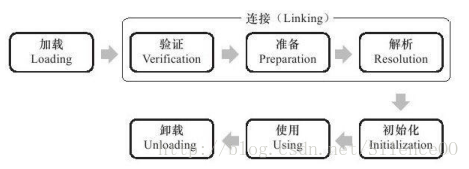

版权声明：本文为CSDN博主「书呆子Rico」的原创文章，遵循 CC 4.0 BY-SA 版权协议，转载请附上原文出处链接及本声明。
原文链接：https://blog.csdn.net/justloveyou_/article/details/72466105

---

### 什么是类加载机制

虚拟机把描述类的数据从Class文件加载到内存，并对数据进行校验、转换解析和初始化，最终形成可以被虚拟机直接使用的Java类型，这就是虚拟机的类加载机制。

### 类加载的时机

类从被加载到虚拟机内存中开始，到卸载出内存为止，它的整个生命周期包括：加载（Loading）、验证（Verification）、准（Preparation）、解析（Resolution）、初始化（Initialization）、使用（Using）和卸载（Unloading）7个阶段。其中验证、准备、解析3个部分统称为连接（Linking），这7个阶段的发生顺序如图：



加载、验证、准备、初始化和卸载这5个阶段的顺序是确定的，类的加载过程必须按照这种顺序按部就班地开始，而解析阶段则不一定：它在某些情况下可以在初始化阶段之后再开始，这是为了支持Java语言的运行时绑定（也称为动态绑定或晚期绑定）。

什么情况下需要开始类加载过程的第一个阶段：加载？Java虚拟机规范中并没有进行强制约束，这点可以交给虚拟机的具体实现来自由把握。但是对于初始化阶段，虚拟机规范则是严格规定了<font color="red">有且只有5种情况</font>必须立即对类进行“初始化”（而加载、验证、准备自然需要在此之前开始）：

1. 遇到new、getstatic、putstatic或invokestatic这4条字节码指令时，如果类没有进行过初始化，则需要先触发其初始化。生成这4条指令的最常见的Java代码场景是：使用new关键字实例化对象的时候、读取或设置一个类的静态字段（被final修饰、已在编译期把结果放入常量池的静态字段除外）的时候，以及调用一个类的静态方法的时候。
2. 使用java.lang.reflect包的方法对类进行反射调用的时候，如果类没有进行过初始化，则需要先触发其初始化。
3. 当初始化一个类的时候，如果发现其父类还没有进行过初始化，则需要先触发其父类的初始化。
4. 当虚拟机启动时，用户需要指定一个要执行的主类（包含main（）方法的那个类），虚拟机会先初始化这个主类。
5. 当使用JDK 1.7的动态语言支持时，如果一个java.lang.invoke.MethodHandle实例最后的解析结果REF_getStatic、REF_putStatic、REF_invokeStatic的方法句柄，并且这个方法句柄所对应的类没有进行过初始化，则需要先触发其初始化。

这五种场景中的行为称为对一个类进行 **主动引用**。除此之外，所有引用类的方式，都不会触发初始化，称为 **被动引用**。

> 类的实例化与类的初始化是两个完全不同的概念：
>
> 类的实例化是指创建一个类的实例(对象)的过程；
>
> 类的初始化是指为类中各个类成员(被static修饰的成员变量)赋初始值的过程，是类生命周期中的一个阶段。

> 被动引用的经典场景
>
> 1. **通过子类引用父类的静态字段，不会导致子类初始化**
>
> ```java
> public class SSClass{
>     static{
>         System.out.println("SSClass");
>     }
> }  
> 
> public class SClass extends SSClass{
>     static{
>         System.out.println("SClass init!");
>     }
> 
>     public static int value = 123;
> 
>     public SClass(){
>         System.out.println("init SClass");
>     }
> }
> 
> public class SubClass extends SClass{
>     static{
>         System.out.println("SubClass init");
>     }
> 
>     static int a;
> 
>     public SubClass(){
>         System.out.println("init SubClass");
>     }
> }
> 
> public class NotInitialization{
>     public static void main(String[] args){
>         System.out.println(SubClass.value);
>     }
> }/* Output: 
>         SSClass
>         SClass init!
>         123     
>  *///:~
> 
> /**
> 对于静态字段，只有直接定义这个字段的类才会被初始化，因此通过其子类来引用父类中定义的静态字段，只会触发父类的初始化而不会触发子类的初始化。在本例中，由于value字段是在类SClass中定义的，因此该类会被初始化；此外，在初始化类SClass时，虚拟机会发现其父类SSClass还未被初始化，因此虚拟机将先初始化父类SSClass，然后初始化子类SClass，而SubClass始终不会被初始化。
> */
> 
> ```
>
> ---
>
> 2. **通过数组定义来引用类，不会触发此类的初始化**
>
> ```java
> public class NotInitialization{
>     public static void main(String[] args){
>         SClass[] sca = new SClass[10];
>     }
> }
> ```
>
> 上述案例运行之后并没有任何输出，说明虚拟机并没有初始化类SClass。但是，这段代码触发了另外一个名为[Lcn.edu.tju.rico.SClass的类的初始化。从类名称我们可以看出，这个类代表了元素类型为SClass的一维数组，它是由虚拟机自动生成的，直接继承于Object的子类，创建动作由字节码指令newarray触发。
>
> ---
>
> 3. **常量在编译阶段会存入调用类的常量池中，本质上并没有直接引用到定义常量的类，因此不会触发定义常量的类的初始化**
>
> ```java
> public class ConstClass{
> 
>     static{
>         System.out.println("ConstClass init!");
>     }
> 
>     public static  final String CONSTANT = "hello world";
> }
> 
> public class NotInitialization{
>     public static void main(String[] args){
>         System.out.println(ConstClass.CONSTANT);
>     }
> }/* Output: 
>         hello world
>  *///:~
> ```
>
> 上述代码运行之后，只输出 “hello wo	rld”，这是因为虽然在Java源码中引用了ConstClass类中的常量CONSTANT，但是编译阶段将此常量的值“hello world”存储到了NotInitialization常量池中，对常量ConstClass.CONSTANT的引用实际都被转化为NotInitialization类对自身常量池的引用了。也就是说，实际上NotInitialization的Class文件之中并没有ConstClass类的符号引用入口，这两个类在编译为Class文件之后就不存在关系了。

### 类加载过程

#### 1、加载

“加载”是“类加载”（Class Loading）过程的一个阶段。在加载阶段，虚拟机需要完成以下3件事情：

1. 通过一个类的全限定名来获取定义此类的二进制字节流。

2. 将这个字节流所代表的静态存储结构转化为方法区的运行时数据结构。

3. 在内存中生成一个代表这个类的java.lang.Class对象，作为方法区这个类的各种数据的访问入口。

加载阶段完成后，虚拟机外部的二进制字节流就按照虚拟机所需的格式存储在方法区之中，方法区中的数据存储格式由虚拟机实现自行定义，虚拟机规范未规定此区域的具体数据结构。然后在内存中实例化一个java.lang.Class类的对象（并没有明确规定是在Java堆中，对于HotSpot虚拟机而言，Class对象比较特殊，它虽然是对象，但是存放在方法区里面），这个对象将作为程序访问方法区中的这些类型数据的外部接口。

#### 2、验证

验证是链接阶段的第一步，这一步主要的目的是确保class文件的字节流中包含的信息符合当前虚拟机的要求，并且不会危害虚拟机自身安全。
验证阶段主要包括四个检验过程：文件格式验证、元数据验证、字节码验证和符号引用验证。

1. 文件格式验证

   验证class文件格式规范，例如： class文件是否以魔数0xCAFEBABE开头 ， 主、次版本号是否在当前虚拟机处理范围之内等

2. 元数据验证

   这个阶段是对字节码描述的信息进行语义分析，以保证起描述的信息符合java语言规范要求。验证点可能包括：这个类是否有父类(除了java.lang.Object之外，所有的类都应当有父类)、这个类是否继承了不允许被继承的类(被final修饰的)、如果这个类的父类是抽象类，是否实现了起父类或接口中要求实现的所有方法。

3. 字节码验证

   进行数据流和控制流分析，这个阶段对类的方法体进行校验分析，这个阶段的任务是保证被校验类的方法在运行时不会做出危害虚拟机安全的行为。如：保证访法体中的类型转换有效，例如可以把一个子类对象赋值给父类数据类型，这是安全的，但不能把一个父类对象赋值给子类数据类型、保证跳转命令不会跳转到方法体以外的字节码命令上。

4. 符号引用验证

   确保解析动作能正确执行。

#### 3、准备(Preparation)

准备阶段是正式为类变量(static 成员变量)分配内存并设置类变量初始值（零值）的阶段，这些变量所使用的内存都将在方法区中进行分配。这时候进行内存分配的仅包括类变量，而不包括实例变量，实例变量将会在对象实例化时随着对象一起分配在堆中。其次，这里所说的初始值“通常情况”下是数据类型的零值