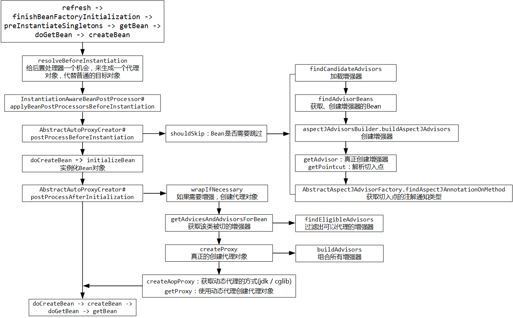
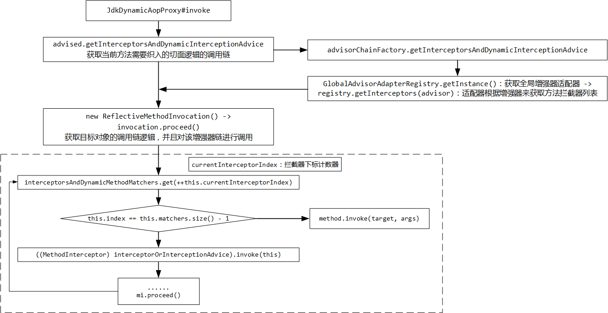

## 1. 注解AOP基础

### 1.1 AOP的通知类型

- `@Before`：前置通知（logStart）
- `@After`：后置通知（logEnd）
- `@AfterReturning`：返回通知（logReturn，方法正常返回）
- `@AfterThrowing`：异常通知（logException，方法抛出异常）
- `@Around`：环绕通知（编程式推进目标方法运行）

前四种注解都属于**声明式AOP**，`@Around` 属于**编程式AOP**。

### 1.2 AOP的重要概念

在开始研究AOP原理之前，小伙伴们咱一起回顾下AOP的重要核心概念术语：

- **JoinPoint**（连接点）：可能被拦截到的点，在Spring中指的是类中的任意方法（SpringFramework 只支持方法类型的连接点）

- **Pointcut**（切入点）：要对哪些 **JoinPoint** 进行拦截的定义（可以简单理解为已经被增强的方法）（哪些切入点要被增强，需要由切入点表达式来描述）

- Advice

  （通知 / 增强）：拦截到

   

  JoinPoint

   

  之后所要做的事情（额外要执行的代码）

  - 通知的类型就是上面所说的5种

- **Target**（目标对象）：需要被代理的目标对象

- **Introduction**（引入）：一种特殊的通知，它能在不修改原有类代码的前提下，在运行期为原始类动态地添加一些属性或方法

- **Weaving**（织入）：把增强应用到目标对象，创建代理对象的过程（SpringAOP用动态代理织入，而 Aspect 可以采用编译期织入和类装载期织入）

- **Proxy**（代理）：一个类被AOP织入增强后，就产生一个结果代理类

- **Aspect**（切面）：**切入点**和**通知**的结合

---

AOP代码示例如下:

```java
@Aspect
@Component
public class LogAspect {
    
    // 切入com.example.demo下面的一级包下面的所有类的所有方法
    @Before("execution(public * com.example.demo.*.*(..))")
    public void doBefore(JoinPoint joinPoint) {
        System.out.println("doBefore run...");
    }
    
    // 切入被@LogBack标注的方法
    @After("@annotation(com.example.demo.LogBack)")
    public void doAfter(JoinPoint joinPoint) {
        System.out.println("doAfter run...");
    }
    
    // 切入com.example.demo.service.DemoService类的所有方法中第一个参数为Serializable类型的方法
    @AfterReturning(value = "execution(public * com.example.demo.service.DemoService.*(java.io.Serializable, ..))", returning = "result")
    public void doAfterReturning(JoinPoint joinPoint, Object result) {
        System.out.println("doAfterReturning run, result: " + result);
    }
    
    // 切入com.example.demo下所有的controller包下面的所有类的所有方法
    @AfterThrowing(value = "execution(public * com.example.demo..controller.*(..))", throwing = "ex")
    public void doAfterThrowing(JoinPoint joinPoint, Exception ex) {
        System.out.println("doAfterThrowing catch exception: " + ex.getMessage());
    }
    
    // 切入com.example.demo.controller.DemoController的所有返回值为String的方法
    @Around("execution(public String com.example.demo.controller.DemoController.*(..))")
    public Object doAround(ProceedingJoinPoint joinPoint) {
        System.out.println("doAround run...");
        Object result = null;
        try {
            System.out.println("method before invoke...");
            result = joinPoint.proceed();
            System.out.println("method invoked, result: " + result);
        } catch (Throwable throwable) {
            System.out.println("method throws Exception: " + throwable.getMessage());
            throwable.printStackTrace();
        }
        return result;
    }
    
}
```

## 2. @EnableAspectJAutoProxy的作用

```java
@Import(AspectJAutoProxyRegistrar.class)
public @interface EnableAspectJAutoProxy {

    boolean proxyTargetClass() default false;

    boolean exposeProxy() default false;

}
```

注解标注了 `@Import` ，它导入了一个 `AspectJAutoProxyRegistrar` 。

> Registers an AnnotationAwareAspectJAutoProxyCreator against the current BeanDefinitionRegistry as appropriate based on a given @EnableAspectJAutoProxy annotation.
>
> 根据给定的 `@EnableAspectJAutoProxy` 注解，根据当前 `BeanDefinitionRegistry` 在适当的位置注册 `AnnotationAwareAspectJAutoProxyCreator` 。

要在IOC容器中注册一个 `AnnotationAwareAspectJAutoProxyCreator` 。

### 2.1 AspectJAutoProxyRegistrar

```java
class AspectJAutoProxyRegistrar implements ImportBeanDefinitionRegistrar {

    @Override
    public void registerBeanDefinitions(
            AnnotationMetadata importingClassMetadata, BeanDefinitionRegistry registry) {
        AopConfigUtils.registerAspectJAnnotationAutoProxyCreatorIfNecessary(registry);

        AnnotationAttributes enableAspectJAutoProxy =
                AnnotationConfigUtils.attributesFor(importingClassMetadata, EnableAspectJAutoProxy.class);
        if (enableAspectJAutoProxy != null) {
            if (enableAspectJAutoProxy.getBoolean("proxyTargetClass")) {
                AopConfigUtils.forceAutoProxyCreatorToUseClassProxying(registry);
            }
            // 强制暴露代理
            if (enableAspectJAutoProxy.getBoolean("exposeProxy")) {
                AopConfigUtils.forceAutoProxyCreatorToExposeProxy(registry);
            }
        }
    }

}
```

它实现了 `ImportBeanDefinitionRegistrar` 接口，会编程式的向IOC容器中注册组件。下面的 `registerBeanDefinitions` 方法中分为两个步骤：注册 `AspectJAnnotationAutoProxyCreator` ，解析 `@EnableAspectJAutoProxy` 注解。

#### 2.1.1 AopConfigUtils.registerAspectJAnnotationAutoProxyCreatorIfNecessary

```java
@Nullable
public static BeanDefinition registerAspectJAnnotationAutoProxyCreatorIfNecessary(BeanDefinitionRegistry registry) {
    return registerAspectJAnnotationAutoProxyCreatorIfNecessary(registry, null);
}

@Nullable
public static BeanDefinition registerAspectJAnnotationAutoProxyCreatorIfNecessary(
        BeanDefinitionRegistry registry, @Nullable Object source) {
    // 注意在这个方法中已经把AnnotationAwareAspectJAutoProxyCreator的字节码传入方法了
    return registerOrEscalateApcAsRequired(AnnotationAwareAspectJAutoProxyCreator.class, registry, source);
}

public static final String AUTO_PROXY_CREATOR_BEAN_NAME =
        "org.springframework.aop.config.internalAutoProxyCreator";

private static BeanDefinition registerOrEscalateApcAsRequired(
        Class<?> cls, BeanDefinitionRegistry registry, @Nullable Object source) {

    Assert.notNull(registry, "BeanDefinitionRegistry must not be null");

    //方法进入后先判断IOC容器中是否包含一个特定的Bean，如果没有，下面直接用 RootBeanDefinition 创建。
    if (registry.containsBeanDefinition(AUTO_PROXY_CREATOR_BEAN_NAME)) {
        BeanDefinition apcDefinition = registry.getBeanDefinition(AUTO_PROXY_CREATOR_BEAN_NAME);
        if (!cls.getName().equals(apcDefinition.getBeanClassName())) {
            int currentPriority = findPriorityForClass(apcDefinition.getBeanClassName());
            int requiredPriority = findPriorityForClass(cls);
            if (currentPriority < requiredPriority) {
                apcDefinition.setBeanClassName(cls.getName());
            }
        }
        return null;
    }

    RootBeanDefinition beanDefinition = new RootBeanDefinition(cls);
    beanDefinition.setSource(source);
    beanDefinition.getPropertyValues().add("order", Ordered.HIGHEST_PRECEDENCE);
    beanDefinition.setRole(BeanDefinition.ROLE_INFRASTRUCTURE);
    registry.registerBeanDefinition(AUTO_PROXY_CREATOR_BEAN_NAME, beanDefinition);
    return beanDefinition;
}
```

#### 2.1.2 解析@EnableAspectJAutoProxy注解

```java
AnnotationAttributes enableAspectJAutoProxy =
            AnnotationConfigUtils.attributesFor(importingClassMetadata, EnableAspectJAutoProxy.class);
    if (enableAspectJAutoProxy != null) {
        if (enableAspectJAutoProxy.getBoolean("proxyTargetClass")) {
            AopConfigUtils.forceAutoProxyCreatorToUseClassProxying(registry);
        }
        if (enableAspectJAutoProxy.getBoolean("exposeProxy")) {
            AopConfigUtils.forceAutoProxyCreatorToExposeProxy(registry);
        }
    }
```

因为默认的 `@EnableAspectJAutoProxy` 中两个属性默认均为false，故这部分不起作用。

至此，可以发现，`@EnableAspectJAutoProxy` 的根本作用是在IOC容器中注册了一个 `AnnotationAwareAspectJAutoProxyCreator` 。

## 3. AnnotationAwareAspectJAutoProxyCreator的作用时机

> AspectJAwareAdvisorAutoProxyCreator subclass that processes all AspectJ annotation aspects in the current application context, as well as Spring Advisors. Any AspectJ annotated classes will automatically be recognized, and their advice applied if Spring AOP's proxy-based model is capable of applying it. This covers method execution joinpoints. If the `<aop:include>` element is used, only @AspectJ beans with names matched by an include pattern will be considered as defining aspects to use for Spring auto-proxying. Processing of Spring Advisors follows the rules established in org.springframework.aop.framework.autoproxy.AbstractAdvisorAutoProxyCreator.
>
> `AspectJAwareAdvisorAutoProxyCreator`子类，用于处理当前应用程序上下文中的所有 `@AspectJ` 注解的切面，以及Spring的Advisor。
>
> 如果Spring AOP的基于代理的模型能够应用任何被 `@AspectJ` 注解标注的类，那么它们的增强方法将被自动识别。这涵盖了方法执行的切入点表达式。
>
> 如果使用`<aop:include>`元素，则只有名称与包含模式匹配的被 @AspectJ 标注的Bean将被视为定义要用于Spring自动代理的方面。
>
> Spring Advisor的处理遵循 `AbstractAdvisorAutoProxyCreator` 中建立的规则。

继承结构如下:

```java
public class AnnotationAwareAspectJAutoProxyCreator 
    extends AspectJAwareAdvisorAutoProxyCreator

public class AspectJAwareAdvisorAutoProxyCreator 
    extends AbstractAdvisorAutoProxyCreator

public abstract class AbstractAdvisorAutoProxyCreator 
    extends AbstractAutoProxyCreator

public abstract class AbstractAutoProxyCreator 
    extends ProxyProcessorSupport 
    implements SmartInstantiationAwareBeanPostProcessor, BeanFactoryAware

public class ProxyProcessorSupport 
    extends ProxyConfig 
    implements Ordered, BeanClassLoaderAware, AopInfrastructureBean
```

- 实现了 **`SmartInstantiationAwareBeanPostProcessor`** ，可以做组件的 **创建前后、初始化前后的后置处理工作** 。
- 实现了 **`BeanFactoryAware`** ，可以将 **`BeanFactory`** 注入到组件中

### 3.0 SmartInstantiationAwareBeanPostProcessor

> Extension of the InstantiationAwareBeanPostProcessor interface, adding a callback for predicting the eventual type of a processed bean. NOTE: This interface is a special purpose interface, mainly for internal use within the framework. In general, application-provided post-processors should simply implement the plain BeanPostProcessor interface or derive from the InstantiationAwareBeanPostProcessorAdapter class.
>
> 扩展 `InstantiationAwareBeanPostProcessor` 接口，添加了用于预测已处理bean的最终类型的回调。 注意：此接口是专用接口，主要供框架内部使用。通常，应用程序提供的后处理器应简单地实现纯 `BeanPostProcessor` 接口或从 `InstantiationAwareBeanPostProcessorAdapter` 类派生。

它扩展了 `InstantiationAwareBeanPostProcessor` 接口，这个接口之前咱在IOC部分介绍过，它用于组件的创建前后做后置处理，恰好AOP的核心是用代理对象代替普通对象，用这种后置处理器刚好能完成需求。

### 3.1 SpringBoot引导创建IOC容器

根据前面的SpringBoot启动IOC容器的原理，最终会在一系列初始化后进入IOC容器的refresh方法。

```java
// AbstractApplicationContext
public void refresh() throws BeansException, IllegalStateException {
    synchronized (this.startupShutdownMonitor) {
        // ......

        try {
            // Allows post-processing of the bean factory in context subclasses.
            // 4. 准备BeanFactory完成后进行的后置处理
            postProcessBeanFactory(beanFactory);

            // Invoke factory processors registered as beans in the context.
            // 5. 执行BeanFactory创建后的后置处理器
            invokeBeanFactoryPostProcessors(beanFactory);

            // Register bean processors that intercept bean creation.
            // 6. 注册Bean的后置处理器
            registerBeanPostProcessors(beanFactory);

            // ......
    }
}
```

### 3.2 registerBeanPostProcessors

（省略了部分与AOP无关的源码）

```java
protected void registerBeanPostProcessors(ConfigurableListableBeanFactory beanFactory) {
    PostProcessorRegistrationDelegate.registerBeanPostProcessors(beanFactory, this);
}

public static void registerBeanPostProcessors(
        ConfigurableListableBeanFactory beanFactory, AbstractApplicationContext applicationContext) {

    // ......
    // Separate between BeanPostProcessors that implement PriorityOrdered,
    // Ordered, and the rest.
    List<BeanPostProcessor> priorityOrderedPostProcessors = new ArrayList<>();
    List<BeanPostProcessor> internalPostProcessors = new ArrayList<>();
    List<String> orderedPostProcessorNames = new ArrayList<>();
    List<String> nonOrderedPostProcessorNames = new ArrayList<>();
    // 根据PriorityOrdered、Ordered接口，对这些BeanPostProcessor进行归类
    for (String ppName : postProcessorNames) {
        if (beanFactory.isTypeMatch(ppName, PriorityOrdered.class)) {
            BeanPostProcessor pp = beanFactory.getBean(ppName, BeanPostProcessor.class);
            priorityOrderedPostProcessors.add(pp);
            // MergedBeanDefinitionPostProcessor类型的后置处理器被单独放在一个集合中，说明该接口比较特殊
            if (pp instanceof MergedBeanDefinitionPostProcessor) {
                internalPostProcessors.add(pp);
            }
        }
        else if (beanFactory.isTypeMatch(ppName, Ordered.class)) {
            orderedPostProcessorNames.add(ppName);
        }
        else {
            nonOrderedPostProcessorNames.add(ppName);
        }
    }

    // ......

    // Next, register the BeanPostProcessors that implement Ordered.
    // 注册实现了Ordered接口的BeanPostProcessor
    // AnnotationAwareAspectJAutoProxyCreator实现了Ordered接口,实际分类时进入 orderedPostProcessorNames 集合中
    List<BeanPostProcessor> orderedPostProcessors = new ArrayList<>();
    for (String ppName : orderedPostProcessorNames) {
        BeanPostProcessor pp = beanFactory.getBean(ppName, BeanPostProcessor.class);
        orderedPostProcessors.add(pp);
        if (pp instanceof MergedBeanDefinitionPostProcessor) {
            internalPostProcessors.add(pp);
        }
    }
    sortPostProcessors(orderedPostProcessors, beanFactory);
    registerBeanPostProcessors(beanFactory, orderedPostProcessors);

    // ......
}
```

### 3.3 getBean → doCreateBean

根据前面的IOC原理，肯定会执行一系列操作：**getBean → doGetBean → createBean → doCreateBean** 。最终创建这个后置处理器，放入IOC容器中

## 小结

1. 注解AOP的使用需要在切面类上标注 `@Aspect` 和 `@Component` 。
2. 启动AOP的核心是向容器中注册了一个 `AnnotationAwareAspectJAutoProxyCreator` 。

## 4. AnnotationAwareAspectJAutoProxyCreator的后置处理功能

### 4.1 refresh → createBean

这部分依次走 **refresh → finishBeanFactoryInitialization → preInstantiateSingletons → getBean → doGetBean → createBean** 方法。

```java
protected Object createBean(String beanName, RootBeanDefinition mbd, @Nullable Object[] args)
        throws BeanCreationException {

    // ......

    try {
        // Give BeanPostProcessors a chance to return a proxy instead of the target bean instance.
        // 给后置处理器一个机会返回一个代理对象
        Object bean = resolveBeforeInstantiation(beanName, mbdToUse);
        if (bean != null) {
            return bean;
        }
    }
    catch (Throwable ex) {
        throw new BeanCreationException(mbdToUse.getResourceDescription(), beanName,
                "BeanPostProcessor before instantiation of bean failed", ex);
    }

    // doCreateBean ......
}
```

### 4.2 resolveBeforeInstantiation

```java
protected Object resolveBeforeInstantiation(String beanName, RootBeanDefinition mbd) {
    Object bean = null;
    if (!Boolean.FALSE.equals(mbd.beforeInstantiationResolved)) {
        // Make sure bean class is actually resolved at this point.
        if (!mbd.isSynthetic() && hasInstantiationAwareBeanPostProcessors()) {
            Class<?> targetType = determineTargetType(beanName, mbd);
            if (targetType != null) {
                bean = applyBeanPostProcessorsBeforeInstantiation(targetType, beanName);
                if (bean != null) {
                    bean = applyBeanPostProcessorsAfterInitialization(bean, beanName);
                }
            }
        }
        mbd.beforeInstantiationResolved = (bean != null);
    }
    return bean;
}
```

这段源码中先检查是否有 `InstantiationAwareBeanPostProcessor` ，如果有，就调用 `applyBeanPostProcessorsBeforeInstantiation` 方法，给这些后置处理器机会，让它创建真正的代理对象。

### 4.3 applyBeanPostProcessorsBeforeInstantiation

```java
protected Object applyBeanPostProcessorsBeforeInstantiation(Class<?> beanClass, String beanName) {
    for (BeanPostProcessor bp : getBeanPostProcessors()) {
        if (bp instanceof InstantiationAwareBeanPostProcessor) {
            InstantiationAwareBeanPostProcessor ibp = (InstantiationAwareBeanPostProcessor) bp;
            Object result = ibp.postProcessBeforeInstantiation(beanClass, beanName);
            if (result != null) {
                return result;
            }
        }
    }
    return null;
}
```

### 4.4 AbstractAutoProxyCreator#postProcessBeforeInstantiation

```java
public Object postProcessBeforeInstantiation(Class<?> beanClass, String beanName) {
    // 缓存机制
    Object cacheKey = getCacheKey(beanClass, beanName);

  
    if (!StringUtils.hasLength(beanName) || !this.targetSourcedBeans.contains(beanName)) {
        // 判断该Bean是否已经被增强（advisedBeans为已经增强过的Bean）
        if (this.advisedBeans.containsKey(cacheKey)) {
            return null;
        }
        // 4.4.1, 4.4.2 判断是否为基础类型（isInfrastructureClass），或者需要跳过的Bean
        if (isInfrastructureClass(beanClass) || shouldSkip(beanClass, beanName)) {
            this.advisedBeans.put(cacheKey, Boolean.FALSE);
            return null;
        }
    }

    // Create proxy here if we have a custom TargetSource.
    // Suppresses unnecessary default instantiation of the target bean:
    // The TargetSource will handle target instances in a custom fashion.
    // 如果我们有一个自定义的TargetSource，则在此处创建代理。
    // 这段源码要抑制目标bean的不必要的默认实例化：TargetSource将以自定义方式处理目标实例。
    // 4.4.3 自定义目标资源，对于单实例Bean必定会返回null
    TargetSource targetSource = getCustomTargetSource(beanClass, beanName);
    if (targetSource != null) {
        if (StringUtils.hasLength(beanName)) {
            this.targetSourcedBeans.add(beanName);
        }
        Object[] specificInterceptors = getAdvicesAndAdvisorsForBean(beanClass, beanName, targetSource);
        Object proxy = createProxy(beanClass, beanName, specificInterceptors, targetSource);
        this.proxyTypes.put(cacheKey, proxy.getClass());
        return proxy;
    }

    return null;
}
```

#### 4.4.1 isInfrastructureClass：判断Bean是否为基础类型

```java
// AnnotationAwareAspectJAutoProxyCreator
protected boolean isInfrastructureClass(Class<?> beanClass) {
    // 一大段文档注释
    return (super.isInfrastructureClass(beanClass) ||
            (this.aspectJAdvisorFactory != null && this.aspectJAdvisorFactory.isAspect(beanClass)));
}

// AbstractAutoProxyCreator
protected boolean isInfrastructureClass(Class<?> beanClass) {
    boolean retVal = Advice.class.isAssignableFrom(beanClass) ||
            Pointcut.class.isAssignableFrom(beanClass) ||
            Advisor.class.isAssignableFrom(beanClass) ||
            AopInfrastructureBean.class.isAssignableFrom(beanClass);
    if (retVal && logger.isTraceEnabled()) {
        logger.trace("Did not attempt to auto-proxy infrastructure class [" + beanClass.getName() + "]");
    }
    return retVal;
}
```

在 上有一大串单行注释，单独摘到下面，咱一块来看：

> Previously we setProxyTargetClass(true) in the constructor, but that has too broad an impact. Instead we now override isInfrastructureClass to avoid proxying aspects. I'm not entirely happy with that as there is no good reason not to advise aspects, except that it causes advice invocation to go through a proxy, and if the aspect implements e.g the Ordered interface it will be proxied by that interface and fail at runtime as the advice method is not defined on the interface. We could potentially relax the restriction about not advising aspects in the future.
>
> 以前我们在构造函数中有 `setProxyTargetClass(true)`，但是影响范围太广。相反，我们现在重写 `isInfrastructureClass` 方法，以避免代理切面。我对此并不完全满意，因为没有充分的理由不增强那些切面，只是它会导致增强方法只能通过代理调用，并且如果方面实现了例如 `Ordered` 接口，它将被该接口代理并在以下位置失败运行时，因为未在切面上定义增强方法。我们将来可能会放宽对非增强切面的限制。

这个方法会调用到父类的方法，而父类的方法会判断Bean的class是否为一些指定的类型（`Advice` 、`PointCut` 、`Advisor` 、`AopInfrastructureBean`）的子类。很显然我们在用注解AOP的时候都是打 `@Aspect` 注解，没有继承操作，故这部分返回false。

后面还有一段：`this.aspectJAdvisorFactory.isAspect(beanClass)` ：

```java
public boolean isAspect(Class<?> clazz) {
    return (hasAspectAnnotation(clazz) && !compiledByAjc(clazz));
}

private boolean hasAspectAnnotation(Class<?> clazz) {
    return (AnnotationUtils.findAnnotation(clazz, Aspect.class) != null);
}
```

判断是否标注了@Aspect注解

#### 4.4.2 shouldSkip：Bean是否需要跳过

一个很重要的操作在这里面一起进行了：**创建增强器**。

```java
// AspectJAwareAdvisorAutoProxyCreator
protected boolean shouldSkip(Class<?> beanClass, String beanName) {
    // TODO: Consider optimization by caching the list of the aspect names
    List<Advisor> candidateAdvisors = findCandidateAdvisors();
    for (Advisor advisor : candidateAdvisors) {
        if (advisor instanceof AspectJPointcutAdvisor &&
                ((AspectJPointcutAdvisor) advisor).getAspectName().equals(beanName)) {
            return true;
        }
    }
    return super.shouldSkip(beanClass, beanName);
}

// AbstractAutoProxyCreator
protected boolean shouldSkip(Class<?> beanClass, String beanName) {
    return AutoProxyUtils.isOriginalInstance(beanName, beanClass);
}
```

上面的方法是扩展了下面父类的方法。父类的方法很简单，它就是判断**目标对象是不是原始对象**（没有经过代理）

##### 4.4.2.1 findCandidateAdvisors：加载增强器

```java
// AnnotationAwareAspectJAutoProxyCreator
protected List<Advisor> findCandidateAdvisors() {
    // Add all the Spring advisors found according to superclass rules.
    // 添加所有根据父类的规则找到的Spring的增强器
    List<Advisor> advisors = super.findCandidateAdvisors();
    // Build Advisors for all AspectJ aspects in the bean factory.
    // 给所有BeanFactory中的AspectJ切面构建增强器
    if (this.aspectJAdvisorsBuilder != null) {
        advisors.addAll(this.aspectJAdvisorsBuilder.buildAspectJAdvisors());
    }
    return advisors;
}

// AbstractAdvisorAutoProxyCreator
protected List<Advisor> findCandidateAdvisors() {
    Assert.state(this.advisorRetrievalHelper != null, "No BeanFactoryAdvisorRetrievalHelper available");
    // 4.4.2.2 获取、创建增强器的Bean
    return this.advisorRetrievalHelper.findAdvisorBeans();
}
```

先调父类的方法取出一组增强器，再从IOC容器中找出所有标注 `@Aspect` 的组件一起添加上。

##### 4.4.2.2 advisorRetrievalHelper.findAdvisorBeans：获取、创建增强器的Bean

父类获取所有增强器的方法

```java
public List<Advisor> findAdvisorBeans() {
    // Determine list of advisor bean names, if not cached already.
    // 确定增强器bean名称的列表（如果尚未缓存）
    String[] advisorNames = this.cachedAdvisorBeanNames;
    if (advisorNames == null) {
        // Do not initialize FactoryBeans here: We need to leave all regular beans
        // uninitialized to let the auto-proxy creator apply to them!
        // 不要在这里初始化FactoryBeans：我们需要保留所有未初始化的常规bean，以使自动代理创建者对其应用
        // 其实这里只是把那些类型为Advisor的Bean都找出来而已
        advisorNames = BeanFactoryUtils.beanNamesForTypeIncludingAncestors(
                this.beanFactory, Advisor.class, true, false);
        this.cachedAdvisorBeanNames = advisorNames;
    }
    // 如果当前IOC容器中没有任何增强器类Bean，直接返回
    if (advisorNames.length == 0) {
        return new ArrayList<>();
    }

    List<Advisor> advisors = new ArrayList<>();
    // 有增强器类Bean，循环它们
    for (String name : advisorNames) {
        if (isEligibleBean(name)) {
            if (this.beanFactory.isCurrentlyInCreation(name)) {
                if (logger.isTraceEnabled()) {
                    logger.trace("Skipping currently created advisor '" + name + "'");
                }
            }
            else {
                try {
                    // 利用getBean把这些增强器先创建出来
                    advisors.add(this.beanFactory.getBean(name, Advisor.class));
                }
                catch (BeanCreationException ex) {
                    Throwable rootCause = ex.getMostSpecificCause();
                    if (rootCause instanceof BeanCurrentlyInCreationException) {
                        BeanCreationException bce = (BeanCreationException) rootCause;
                        String bceBeanName = bce.getBeanName();
                        // 这里可能也会引发循环依赖，如果这里正在创建这个增强器了，直接continue
                        if (bceBeanName != null && this.beanFactory.isCurrentlyInCreation(bceBeanName)) {
                            if (logger.isTraceEnabled()) {
                                logger.trace("Skipping advisor '" + name +
                                        "' with dependency on currently created bean: " + ex.getMessage());
                            }
                            // Ignore: indicates a reference back to the bean we're trying to advise.
                            // We want to find advisors other than the currently created bean itself.
                            continue;
                        }
                    }
                    throw ex;
                }
            }
        }
    }
    return advisors;
}
```

把那些增强器先创建、初始化出来，放入IOC容器中就完事了。

---

准备构建增强器了，它要调 `aspectJAdvisorsBuilder.buildAspectJAdvisors` 方法：

```java
protected List<Advisor> findCandidateAdvisors() {
    // 添加所有根据父类的规则找到的Spring的增强器
    List<Advisor> advisors = super.findCandidateAdvisors();
    // Build Advisors for all AspectJ aspects in the bean factory.
    // 给所有BeanFactory中的AspectJ切面构建增强器
    if (this.aspectJAdvisorsBuilder != null) {
        advisors.addAll(this.aspectJAdvisorsBuilder.buildAspectJAdvisors());
    }
    return advisors;
}
```

##### 4.4.2.3 【创建增强器】aspectJAdvisorsBuilder.buildAspectJAdvisors

```java
// 在当前的BeanFactory中查找带有@AspectJ注解的切面类Bean，然后返回代表它们的增强器列表。为每个AspectJ通知方法创建一个增强器
public List<Advisor> buildAspectJAdvisors() {
    List<String> aspectNames = this.aspectBeanNames;

    // 提取增强通知
    if (aspectNames == null) {
        synchronized (this) {
            aspectNames = this.aspectBeanNames;
            if (aspectNames == null) {
                List<Advisor> advisors = new ArrayList<>();
                aspectNames = new ArrayList<>();
                // 获取IOC容器中的所有Bean
                String[] beanNames = BeanFactoryUtils.beanNamesForTypeIncludingAncestors(
                        this.beanFactory, Object.class, true, false);
                for (String beanName : beanNames) {
                    if (!isEligibleBean(beanName)) {
                        continue;
                    }
                    // We must be careful not to instantiate beans eagerly as in this case they
                    // would be cached by the Spring container but would not have been weaved.
                    // 我们必须小心，不要急于实例化bean，因为在这种情况下，IOC容器会缓存它们，但不会被织入增强器
                    // 这一部分的功能是在不创建Bean的情况下获取Bean的类型，防止因为增强器还没有创建，导致对象没有被成功代理
                    Class<?> beanType = this.beanFactory.getType(beanName);
                    if (beanType == null) {
                        continue;
                    }
                    // 如果当前循环的Bean是一个切面类
                    if (this.advisorFactory.isAspect(beanType)) {
                        aspectNames.add(beanName);
                        // 包装@Aspect注解的元数据
                        AspectMetadata amd = new AspectMetadata(beanType, beanName);
                        // 默认使用单实例创建切面类
                        if (amd.getAjType().getPerClause().getKind() == PerClauseKind.SINGLETON) {
                            MetadataAwareAspectInstanceFactory factory =
                                    new BeanFactoryAspectInstanceFactory(this.beanFactory, beanName);
                            // 4.4.2.4 如果切面类是一个单实例Bean，则会缓存所有增强器
                            List<Advisor> classAdvisors = this.advisorFactory.getAdvisors(factory);
                            if (this.beanFactory.isSingleton(beanName)) {
                                this.advisorsCache.put(beanName, classAdvisors);
                            }
                            // 否则只会缓存增强器创建工厂，由增强器工厂来创建增强器
                            else {
                                this.aspectFactoryCache.put(beanName, factory);
                            }
                            advisors.addAll(classAdvisors);
                        }
                        else {
                            // Per target or per this.
                            if (this.beanFactory.isSingleton(beanName)) {
                                throw new IllegalArgumentException("Bean with name '" + beanName +
                                        "' is a singleton, but aspect instantiation model is not singleton");
                            }
                            MetadataAwareAspectInstanceFactory factory =
                                    new PrototypeAspectInstanceFactory(this.beanFactory, beanName);
                            this.aspectFactoryCache.put(beanName, factory);
                            advisors.addAll(this.advisorFactory.getAdvisors(factory));
                        }
                    }
                }
                this.aspectBeanNames = aspectNames;
                return advisors;
            }
        }
    }

    // 如果aspectNames不为null，证明之前已经创建过了，直接读缓存即可
    if (aspectNames.isEmpty()) {
        return Collections.emptyList();
    }
    List<Advisor> advisors = new ArrayList<>();
    for (String aspectName : aspectNames) {
        List<Advisor> cachedAdvisors = this.advisorsCache.get(aspectName);
        if (cachedAdvisors != null) {
            advisors.addAll(cachedAdvisors);
        }
        else {
            MetadataAwareAspectInstanceFactory factory = this.aspectFactoryCache.get(aspectName);
            advisors.addAll(this.advisorFactory.getAdvisors(factory));
        }
    }
    return advisors;
}
```

概括一下上面的增强器创建思路：

1. 获取IOC容器中的所有Bean
2. 从所有的Bean中找带有 `@Aspect` 注解的Bean
3. 根据Bean中定义的通知（Advice，即被五种通知类型标注的方法），创建增强器
4. 将增强器放入缓存，以备后续加载

注意源码中有一步我标注了序号：`advisorFactory.getAdvisors` ：

##### 4.4.2.4 advisorFactory.getAdvisors：缓存Bean中的所有增强器

```java
public List<Advisor> getAdvisors(MetadataAwareAspectInstanceFactory aspectInstanceFactory) {
    // 目标Aspect类
    Class<?> aspectClass = aspectInstanceFactory.getAspectMetadata().getAspectClass();
    // 代理对象Bean的name
    String aspectName = aspectInstanceFactory.getAspectMetadata().getAspectName();
    // 校验Aspect类上是不是标注了@Aspect注解
    validate(aspectClass);

    // We need to wrap the MetadataAwareAspectInstanceFactory with a decorator
    // so that it will only instantiate once.
    // 我们需要用装饰器包装MetadataAwareAspectInstanceFactory，使其仅实例化一次
    // 这部分是使用了装饰者模式，把aspectInstanceFactory包装起来，保证增强器不会多次实例化
    MetadataAwareAspectInstanceFactory lazySingletonAspectInstanceFactory =
            new LazySingletonAspectInstanceFactoryDecorator(aspectInstanceFactory);

    // 筛选没有标注@Pointcut注解的方法，并创建增强器
    List<Advisor> advisors = new ArrayList<>();
    for (Method method : getAdvisorMethods(aspectClass)) {
        // 4.4.2.5 真正创建增强器
        Advisor advisor = getAdvisor(method, lazySingletonAspectInstanceFactory, advisors.size(), aspectName);
        if (advisor != null) {
            advisors.add(advisor);
        }
    }

    // If it's a per target aspect, emit the dummy instantiating aspect.
    // 通过在装饰者内部的开始加入SyntheticInstantiationAdvisor增强器，达到延迟初始化切面bean的目的
    if (!advisors.isEmpty() && lazySingletonAspectInstanceFactory.getAspectMetadata().isLazilyInstantiated()) {
        Advisor instantiationAdvisor = new SyntheticInstantiationAdvisor(lazySingletonAspectInstanceFactory);
        advisors.add(0, instantiationAdvisor);
    }

    // Find introduction fields.
    // 对@DeclareParent注解功能的支持（引入）
    for (Field field : aspectClass.getDeclaredFields()) {
        Advisor advisor = getDeclareParentsAdvisor(field);
        if (advisor != null) {
            advisors.add(advisor);
        }
    }

    return advisors;
}
```

核心就是中间部分的 `getAdvisor`：获取/创建增强器（可以类比**getBean**）。

##### 4.4.2.5 getAdvisor：真正创建增强器

```java
public Advisor getAdvisor(Method candidateAdviceMethod, MetadataAwareAspectInstanceFactory aspectInstanceFactory,
        int declarationOrderInAspect, String aspectName) {
    // 校验@Aspect注解等
    validate(aspectInstanceFactory.getAspectMetadata().getAspectClass());

    // 4.4.2.6 解析切入点
    AspectJExpressionPointcut expressionPointcut = getPointcut(
            candidateAdviceMethod, aspectInstanceFactory.getAspectMetadata().getAspectClass());
    if (expressionPointcut == null) {
        return null;
    }

    // 将切入点和通知包装成一个切面
    return new InstantiationModelAwarePointcutAdvisorImpl(expressionPointcut, candidateAdviceMethod,
            this, aspectInstanceFactory, declarationOrderInAspect, aspectName);
}
```

先是解析切入点，之后把**切入点**和**通知**包装成一个**切面**（回想AOP的术语）。

即将怎么过滤类和方法以及需要怎么处理封装为一个切面对象

【切入点】`AspectJExpressionPointcut` 的类结构与实现

```java
public class AspectJExpressionPointcut extends AbstractExpressionPointcut
		implements ClassFilter, IntroductionAwareMethodMatcher, BeanFactoryAware
    //即需要类型匹配,也需要方法匹配
```

实现了一个接口：`ClassFilter` ，而这个 `ClassFilter` 的接口声明：

```java
/**
 * Filter that restricts matching of a pointcut or introduction to
 * a given set of target classes.
 * Can be used as part of a {@link Pointcut} or for the entire
 * targeting of an {@link IntroductionAdvisor}.
 * 限制切入点或简介与给定目标类集匹配的过滤器。
 * 可以用作切入点的一部分，也可以用作IntroductionAdvisor的整个目标。
 */
public interface ClassFilter {
	boolean matches(Class<?> clazz);
	ClassFilter TRUE = TrueClassFilter.INSTANCE;
}
```

##### 4.4.2.6 getPointcut：解析切入点

```java
private AspectJExpressionPointcut getPointcut(Method candidateAdviceMethod, Class<?> candidateAspectClass) {
    // 4.4.2.7 获取切入点的注解通知类型
    // 根据@PointCut注解获取?
    AspectJAnnotation<?> aspectJAnnotation =
            AbstractAspectJAdvisorFactory.findAspectJAnnotationOnMethod(candidateAdviceMethod);
    if (aspectJAnnotation == null) {
        return null;
    }

    AspectJExpressionPointcut ajexp =
            new AspectJExpressionPointcut(candidateAspectClass, new String[0], new Class<?>[0]);
    ajexp.setExpression(aspectJAnnotation.getPointcutExpression());
    if (this.beanFactory != null) {
        ajexp.setBeanFactory(this.beanFactory);
    }
    return ajexp;
}
```

##### 4.4.2.7 AbstractAspectJAdvisorFactory.findAspectJAnnotationOnMethod：获取切入点的注解通知类型

```java
private static final Class<?>[] ASPECTJ_ANNOTATION_CLASSES = new Class<?>[] {
        Pointcut.class, Around.class, Before.class, After.class, AfterReturning.class, AfterThrowing.class};

protected static AspectJAnnotation<?> findAspectJAnnotationOnMethod(Method method) {
    for (Class<?> clazz : ASPECTJ_ANNOTATION_CLASSES) {
        AspectJAnnotation<?> foundAnnotation = findAnnotation(method, (Class<Annotation>) clazz);
        if (foundAnnotation != null) {
            return foundAnnotation;
        }
    }
    return null;
}
```

Pointcut.class, Around.class, Before.class, After.class, AfterReturning.class, AfterThrowing.class

以上是AOP解析时的核心注解

##### 4.4.2.8 回到shouldSkip方法

解析注解通知，包装成切面，缓存到IOC容器中，回到 `findCandidateAdvisors` 方法中：

```java
protected List<Advisor> findCandidateAdvisors() {
    // 添加所有根据父类的规则找到的Spring的增强器
    List<Advisor> advisors = super.findCandidateAdvisors();
    // 给所有BeanFactory中的AspectJ切面构建增强器
    if (this.aspectJAdvisorsBuilder != null) {
        advisors.addAll(this.aspectJAdvisorsBuilder.buildAspectJAdvisors());
    }
    return advisors;
}
```

加载好增强器，直接返回出去，回到 `shouldSkip` 方法：

```java
// AspectJAwareAdvisorAutoProxyCreator
protected boolean shouldSkip(Class<?> beanClass, String beanName) {
    List<Advisor> candidateAdvisors = findCandidateAdvisors();
    for (Advisor advisor : candidateAdvisors) {
        // 循环这些切面，并确定正在创建的Bean的name是否与切面相同，如果发现有相同的，则代表要跳过Bean的创建。
        if (advisor instanceof AspectJPointcutAdvisor &&
                ((AspectJPointcutAdvisor) advisor).getAspectName().equals(beanName)) {
            return true;
        }
    }
    return super.shouldSkip(beanClass, beanName);
}
```

#### 4.4.3 getCustomTargetSource

```java
// 这个方法目的是为了给单例对象创建代理对象
protected TargetSource getCustomTargetSource(Class<?> beanClass, String beanName) {
    // We can't create fancy target sources for directly registered singletons.
    if (this.customTargetSourceCreators != null &&
            this.beanFactory != null && 
        //需要先判断被代理对象是否存在,如果不存在,就不需要创建,返回null!
        this.beanFactory.containsBean(beanName)) {
        for (TargetSourceCreator tsc : this.customTargetSourceCreators) {
            TargetSource ts = tsc.getTargetSource(beanClass, beanName);
            if (ts != null) {
                // Found a matching TargetSource.
                if (logger.isTraceEnabled()) {
                    logger.trace("TargetSourceCreator [" + tsc +
                            "] found custom TargetSource for bean with name '" + beanName + "'");
                }
                return ts;
            }
        }
    }

    // No custom TargetSource found.
    return null;
}
```

#### 4.4.4 并没有创建代理对象，直接返回出去了

Debug发现 `postProcessBeforeInstantiation` 方法并没有创建出Bean实例来，下一步回到 `resolveBeforeInstantiation` 方法中：

```java
protected Object resolveBeforeInstantiation(String beanName, RootBeanDefinition mbd) {
    // ......
    try {
        // Give BeanPostProcessors a chance to return a proxy instead of the target bean instance.
        Object bean = resolveBeforeInstantiation(beanName, mbdToUse);
        if (bean != null) {
            return bean;
        }
    }
    // catch ......

    // 单例对象本身尚未创建,先进行对象创建
    try {
        Object beanInstance = doCreateBean(beanName, mbdToUse, args);
        if (logger.isTraceEnabled()) {
            logger.trace("Finished creating instance of bean '" + beanName + "'");
        }
        return beanInstance;
    }
    // catch ......
}
```

### 4.5 doCreateBean

```java
protected Object doCreateBean(final String beanName, final RootBeanDefinition mbd, final @Nullable Object[] args)
        throws BeanCreationException {
    // ......
    Object exposedObject = bean;
    try {
        populateBean(beanName, mbd, instanceWrapper);
        // 在这边决定暴露的对象是原对象还是代理对象
        exposedObject = initializeBean(beanName, exposedObject, mbd);
    }
    // ......
}
```

进到 `initializeBean` 方法，`BeanPostProcessor` 会在这里执行 `postProcessAfterInitialization` 方法。

### 4.6 initializeBean

```java
protected Object initializeBean(final String beanName, final Object bean, @Nullable RootBeanDefinition mbd) {
    // ......
    if (mbd == null || !mbd.isSynthetic()) {
        // 执行了BeanPostProcessor的After方法
        wrappedBean = applyBeanPostProcessorsAfterInitialization(wrappedBean, beanName);
    }
    return wrappedBean;
}
```

进入 `applyBeanPostProcessorsAfterInitialization` 方法，执行 `BeanPostProcessor` 的 `postProcessAfterInitialization` 方法：

### 4.7 AbstractAutoProxyCreator#postProcessAfterInitialization

```java
public Object postProcessAfterInitialization(@Nullable Object bean, String beanName) {
    if (bean != null) {
        Object cacheKey = getCacheKey(bean.getClass(), beanName);
        // 在这边对单例对象进行代理
        if (this.earlyProxyReferences.remove(cacheKey) != bean) {
            return wrapIfNecessary(bean, beanName, cacheKey);
        }
    }
    return bean;
}
```

### 4.8 wrapIfNecessary

```java
protected Object wrapIfNecessary(Object bean, String beanName, Object cacheKey) {
    if (StringUtils.hasLength(beanName) && this.targetSourcedBeans.contains(beanName)) {
        return bean;
    }
    if (Boolean.FALSE.equals(this.advisedBeans.get(cacheKey))) {
        return bean;
    }
    if (isInfrastructureClass(bean.getClass()) || shouldSkip(bean.getClass(), beanName)) {
        this.advisedBeans.put(cacheKey, Boolean.FALSE);
        return bean;
    }

    // Create proxy if we have advice.
    // 如果需要增强，创建代理对象
    Object[] specificInterceptors = getAdvicesAndAdvisorsForBean(bean.getClass(), beanName, null);
    if (specificInterceptors != DO_NOT_PROXY) {
        this.advisedBeans.put(cacheKey, Boolean.TRUE);
        Object proxy = createProxy(
                bean.getClass(), beanName, specificInterceptors, new SingletonTargetSource(bean));
        this.proxyTypes.put(cacheKey, proxy.getClass());
        return proxy;
    }

    this.advisedBeans.put(cacheKey, Boolean.FALSE);
    return bean;
}
```

#### 4.8.1 getAdvicesAndAdvisorsForBean

获取该bean对象的切面!

```java
@Nullable
protected Object[] getAdvicesAndAdvisorsForBean(Class<?> beanClass, String beanName, @Nullable TargetSource targetSource) {
    List<Advisor> advisors = findEligibleAdvisors(beanClass, beanName);
    if (advisors.isEmpty()) {
        return DO_NOT_PROXY;
    }
    return advisors.toArray();
}
```

##### 4.8.1.0 ExposeInvocationInterceptor

```java
public final class ExposeInvocationInterceptor implements MethodInterceptor, PriorityOrdered, Serializable {

    private static final ThreadLocal<MethodInvocation> invocation =
            new NamedThreadLocal<>("Current AOP method invocation");

    @Override
    public Object invoke(MethodInvocation mi) throws Throwable {
        MethodInvocation oldInvocation = invocation.get();
        // 在执行当前方法引用前,将该方法放入ThreadLocal
        invocation.set(mi);
        try {
            return mi.proceed();
        }
        finally {
            invocation.set(oldInvocation);
        }
    }

}
```

它实现了 `MethodInterceptor` 接口，`invoke` 方法中它只干了一件事，暂时咱可以这么理解：**把当前执行的目标方法放入 `ThreadLocal` 中**。

#### 4.8.2 findEligibleAdvisors

```java
protected List<Advisor> findEligibleAdvisors(Class<?> beanClass, String beanName) {
    List<Advisor> candidateAdvisors = findCandidateAdvisors();
    List<Advisor> eligibleAdvisors = findAdvisorsThatCanApply(candidateAdvisors, beanClass, beanName);
    extendAdvisors(eligibleAdvisors);
    if (!eligibleAdvisors.isEmpty()) {
        eligibleAdvisors = sortAdvisors(eligibleAdvisors);
    }
    return eligibleAdvisors;
}
```

之后 `findAdvisorsThatCanApply` 方法要过滤出**可以代理的增强器**（也就是能切该Bean的切面）

`findAdvisorsThatCanApply` 方法执行完后，下面还要再调一个 `extendAdvisors` 方法：

#### 4.8.3 extendAdvisors

```java
// 扩展切面
protected void extendAdvisors(List<Advisor> candidateAdvisors) {
    AspectJProxyUtils.makeAdvisorChainAspectJCapableIfNecessary(candidateAdvisors);
}

public static boolean makeAdvisorChainAspectJCapableIfNecessary(List<Advisor> advisors) {
    // Don't add advisors to an empty list; may indicate that proxying is just not required
    if (!advisors.isEmpty()) {
        boolean foundAspectJAdvice = false;
        for (Advisor advisor : advisors) {
            // Be careful not to get the Advice without a guard, as this might eagerly
            // instantiate a non-singleton AspectJ aspect...
            if (isAspectJAdvice(advisor)) {
                foundAspectJAdvice = true;
                break;
            }
        }
        // 最后的一个if结构中，在整个增强器的列表最前面插入了一个 ExposeInvocationInterceptor 类型的增强器。
        if (foundAspectJAdvice && !advisors.contains(ExposeInvocationInterceptor.ADVISOR)) {
            // 附加了一个ExposeInvocationInterceptor
            advisors.add(0, ExposeInvocationInterceptor.ADVISOR);
            return true;
        }
    }
    return false;
}
```

### 4.9 回到wrapIfNecessary

```java
protected Object wrapIfNecessary(Object bean, String beanName, Object cacheKey) {
    // ......
    // 如果需要增强，创建代理对象
    Object[] specificInterceptors = getAdvicesAndAdvisorsForBean(bean.getClass(), beanName, null);
    if (specificInterceptors != DO_NOT_PROXY) {
        this.advisedBeans.put(cacheKey, Boolean.TRUE);
        // 创建代理对象!
        Object proxy = createProxy(
                bean.getClass(), beanName, specificInterceptors, new SingletonTargetSource(bean));
        this.proxyTypes.put(cacheKey, proxy.getClass());
        return proxy;
    }
    // ......
}
```

### 4.10 createProxy

```java
protected Object createProxy(Class<?> beanClass, @Nullable String beanName,
        @Nullable Object[] specificInterceptors, TargetSource targetSource) {

    if (this.beanFactory instanceof ConfigurableListableBeanFactory) {
        AutoProxyUtils.exposeTargetClass((ConfigurableListableBeanFactory) this.beanFactory, beanName, beanClass);
    }

    // 创建代理工厂，使用它来创建代理对象
    ProxyFactory proxyFactory = new ProxyFactory();
    // 从当前执行的AbstractAutoProxyCreator中复制一些配置
    proxyFactory.copyFrom(this);

    if (!proxyFactory.isProxyTargetClass()) {
        if (shouldProxyTargetClass(beanClass, beanName)) {
            proxyFactory.setProxyTargetClass(true);
        }
        else {
            evaluateProxyInterfaces(beanClass, proxyFactory);
        }
    }

    // 4.10.1 组合所有增强器
    Advisor[] advisors = buildAdvisors(beanName, specificInterceptors);
    // 将增强器放入代理工厂
    proxyFactory.addAdvisors(advisors);
    proxyFactory.setTargetSource(targetSource);
    customizeProxyFactory(proxyFactory);

    proxyFactory.setFrozen(this.freezeProxy);
    if (advisorsPreFiltered()) {
        proxyFactory.setPreFiltered(true);
    }

    // 4.10.2 真正创建代理对象
    return proxyFactory.getProxy(getProxyClassLoader());
}
```

两个很重要的步骤：组合增强器 → 创建代理对象。

#### 4.10.1 buildAdvisors：组合所有增强器

```java
protected Advisor[] buildAdvisors(@Nullable String beanName, @Nullable Object[] specificInterceptors) {
    // Handle prototypes correctly...
    // 解析通用拦截器
    Advisor[] commonInterceptors = resolveInterceptorNames();

    List<Object> allInterceptors = new ArrayList<>();
    if (specificInterceptors != null) {
        // 把传入的增强器放入AOP拦截器列表中
        allInterceptors.addAll(Arrays.asList(specificInterceptors));
        if (commonInterceptors.length > 0) {
            // 如果先执行通用拦截器,就放在数组的头部!
            if (this.applyCommonInterceptorsFirst) {
                allInterceptors.addAll(0, Arrays.asList(commonInterceptors));
            }
            else {
                allInterceptors.addAll(Arrays.asList(commonInterceptors));
            }
        }
    }
    if (logger.isTraceEnabled()) {
        int nrOfCommonInterceptors = commonInterceptors.length;
        int nrOfSpecificInterceptors = (specificInterceptors != null ? specificInterceptors.length : 0);
        logger.trace("Creating implicit proxy for bean '" + beanName + "' with " + nrOfCommonInterceptors +
                " common interceptors and " + nrOfSpecificInterceptors + " specific interceptors");
    }

    // 4.10.1.1 增强器对象转换为真正的Advisor增强器对象
    Advisor[] advisors = new Advisor[allInterceptors.size()];
    for (int i = 0; i < allInterceptors.size(); i++) {
        advisors[i] = this.advisorAdapterRegistry.wrap(allInterceptors.get(i));
    }
    return advisors;
}
```

除了用参数传递过来的一组增强器，还会去找一些通用的拦截器作为增强器，最后组合在一起封装为一组 `Advisor` 增强器对象，返回出去。

##### 4.10.1.1 advisorAdapterRegistry.wrap

来到 `DefaultAdvisorAdapterRegistry` ：

```java
public Advisor wrap(Object adviceObject) throws UnknownAdviceTypeException {
    // 如果要封装的对象本身就是Advisor类型，那无需处理，直接强转返回
    if (adviceObject instanceof Advisor) {
        return (Advisor) adviceObject;
    }
    // 如果传入的对象不是Advisor，也不是Advice，那无法处理，要抛出异常
    if (!(adviceObject instanceof Advice)) {
        throw new UnknownAdviceTypeException(adviceObject);
    }
    Advice advice = (Advice) adviceObject;
    // MethodInterceptor类型的增强器，会使用DefaultPointcutAdvisor包装
    if (advice instanceof MethodInterceptor) {
        // So well-known it doesn't even need an adapter.
        return new DefaultPointcutAdvisor(advice);
    }
    // 如果传入的增强器可以被适配器适配，那也可以包装
    for (AdvisorAdapter adapter : this.adapters) {
        // Check that it is supported.
        if (adapter.supportsAdvice(advice)) {
            return new DefaultPointcutAdvisor(advice);
        }
    }
    // 其他类型，无法处理，抛出异常
    throw new UnknownAdviceTypeException(advice);
}
```

#### 4.10.2 回到createProxy

```java
protected Object createProxy(Class<?> beanClass, @Nullable String beanName,
        @Nullable Object[] specificInterceptors, TargetSource targetSource) {
    // ......

    // 组合所有增强器
    Advisor[] advisors = buildAdvisors(beanName, specificInterceptors);
    // 将增强器放入代理工厂
    proxyFactory.addAdvisors(advisors);
    // ......

    // 真正创建代理对象
    return proxyFactory.getProxy(getProxyClassLoader());
}
```

一切准备就绪后，要真正创建代理对象了，调用 `proxyFactory.getProxy` 方法：

```java
public Object getProxy(@Nullable ClassLoader classLoader) {
    return createAopProxy().getProxy(classLoader);
}
```

##### 4.10.2.1 createAopProxy

```java
protected final synchronized AopProxy createAopProxy() {
    if (!this.active) {
        activate();
    }
    return getAopProxyFactory().createAopProxy(this);
}

public AopProxyFactory getAopProxyFactory() {
    return this.aopProxyFactory;
}
```

第一步只是取到当前类成员的 `aopProxyFactory` 方法，第二步是调 `ProxyFactory` 的 `createAopProxy` 方法。

##### 4.10.2.2 DefaultAopProxyFactory#createAopProxy

来到 `DefaultAopProxyFactory` ：

```java
public AopProxy createAopProxy(AdvisedSupport config) throws AopConfigException {
    if (config.isOptimize() || config.isProxyTargetClass() || hasNoUserSuppliedProxyInterfaces(config)) {
        Class<?> targetClass = config.getTargetClass();
        if (targetClass == null) {
            throw new AopConfigException("TargetSource cannot determine target class: " +
                    "Either an interface or a target is required for proxy creation.");
        }
        // 如果目标对象有接口，用jdk动态代理；没有接口，用cglib动态代理。
        // 如果被代理是接口类型,走JDK动态代理
        if (targetClass.isInterface() || Proxy.isProxyClass(targetClass)) {
            return new JdkDynamicAopProxy(config);
        }
        // 否则,走Cglib动态代理
        return new ObjenesisCglibAopProxy(config);
    }
    else {
        return new JdkDynamicAopProxy(config);
    }
}
```

```java
protected Object createProxy(Class<?> beanClass, @Nullable String beanName,
        @Nullable Object[] specificInterceptors, TargetSource targetSource) {
    // ......
    // 真正创建代理对象
    return proxyFactory.getProxy(getProxyClassLoader());
}
```

以 jdk动态代理 为例，看一下它的创建原理：

##### 4.10.2.3 [jdk] getProxy

来到 `JdkDynamicAopProxy` 类：

```java
public Object getProxy(@Nullable ClassLoader classLoader) {
    if (logger.isTraceEnabled()) {
        logger.trace("Creating JDK dynamic proxy: " + this.advised.getTargetSource());
    }
    Class<?>[] proxiedInterfaces = AopProxyUtils.completeProxiedInterfaces(this.advised, true);
    findDefinedEqualsAndHashCodeMethods(proxiedInterfaces);
    return Proxy.newProxyInstance(classLoader, proxiedInterfaces, this);
}
```

最后一步：**`Proxy.newProxyInstance`** ，这是最底层的原理，也是我们一开始学动态代理时接触的方式。

## 一张图概括



## 小结

1. `AbstractAutoProxyCreator` 的 `postProcessBeforeInstantiation` 方法并没有创建代理对象，而是通过 `postProcessAfterInitialization` 创建。
2. AOP创建的核心方法在 `AbstractAutoProxyCreator` 的 `wrapIfNecessary` 方法。
3. AOP增强方法的核心是增强器，而增强器的创建在创建目标对象之前。小结
   1. `AbstractAutoProxyCreator` 的 `postProcessBeforeInstantiation` 方法并没有创建代理对象，而是通过 `postProcessAfterInitialization` 创建。
   2. AOP创建的核心方法在 `AbstractAutoProxyCreator` 的 `wrapIfNecessary` 方法。
   3. AOP增强方法的核心是增强器，而增强器的创建在创建目标对象之前。

---

## 5. 目标方法执行的调用链

经过代理之后的代理对象被放在IOC容器后，再调用目标方法，将会按照代理后的对象的调用链来执行。

### 5.1 jdk的invoke方法 - JdkDynamicAopProxy

```java
public Object invoke(Object proxy, Method method, Object[] args) throws Throwable {
    Object oldProxy = null;
    boolean setProxyContext = false;

    TargetSource targetSource = this.advised.targetSource;
    Object target = null;

    try {
        if (!this.equalsDefined && AopUtils.isEqualsMethod(method)) {
            // The target does not implement the equals(Object) method itself.
            // 不代理目标对象的equals(Object)方法
            return equals(args[0]);
        }
        else if (!this.hashCodeDefined && AopUtils.isHashCodeMethod(method)) {
            // The target does not implement the hashCode() method itself.
            // 不代理目标对象的hashCode()方法
            return hashCode();
        }
        else if (method.getDeclaringClass() == DecoratingProxy.class) {
            // There is only getDecoratedClass() declared -> dispatch to proxy config.
            // 5.1.0 DecoratingProxy
            return AopProxyUtils.ultimateTargetClass(this.advised);
        }
        else if (!this.advised.opaque && method.getDeclaringClass().isInterface() &&
                method.getDeclaringClass().isAssignableFrom(Advised.class)) {
            // Service invocations on ProxyConfig with the proxy config...
            // 目标对象本身就是实现了Advised接口，也不代理（不当代理的代理，不当切面的切面）
            return AopUtils.invokeJoinpointUsingReflection(this.advised, method, args);
        }

        Object retVal;

        // 如果配置了代理对象可以暴露，这里会允许在线程内共享这个代理对象
        if (this.advised.exposeProxy) {
            // Make invocation available if necessary.
            oldProxy = AopContext.setCurrentProxy(proxy);
            setProxyContext = true;
        }

        // Get as late as possible to minimize the time we "own" the target,
        // in case it comes from a pool.
        target = targetSource.getTarget();
        Class<?> targetClass = (target != null ? target.getClass() : null);

        // Get the interception chain for this method.
        // 5.1.1 获取当前方法需要织入的切面逻辑的调用链
        List<Object> chain = this.advised.getInterceptorsAndDynamicInterceptionAdvice(method, targetClass);

        // Check whether we have any advice. If we don't, we can fallback on direct
        // reflective invocation of the target, and avoid creating a MethodInvocation.
        if (chain.isEmpty()) {
            // We can skip creating a MethodInvocation: just invoke the target directly
            // Note that the final invoker must be an InvokerInterceptor so we know it does
            // nothing but a reflective operation on the target, and no hot swapping or fancy proxying.
            // 调用链为空，直接执行目标方法
            Object[] argsToUse = AopProxyUtils.adaptArgumentsIfNecessary(method, args);
            retVal = AopUtils.invokeJoinpointUsingReflection(target, method, argsToUse);
        }
        else {
            // We need to create a method invocation...
            // 5.1.2 获取目标对象的调用链逻辑，并且对该增强器链进行调用
            MethodInvocation invocation =
                    new ReflectiveMethodInvocation(proxy, target, method, args, targetClass, chain);
            // Proceed to the joinpoint through the interceptor chain.
            retVal = invocation.proceed();
        }

        // Massage return value if necessary.
        Class<?> returnType = method.getReturnType();
        // 如果返回值是目标对象本身，并且要执行的目标方法的返回值是代理对象的类型，则返回代理对象本身
        // 简言之，如果返回值的类型是目标对象所属类，就把代理对象返回出去
        if (retVal != null && retVal == target &&
                returnType != Object.class && returnType.isInstance(proxy) &&
                !RawTargetAccess.class.isAssignableFrom(method.getDeclaringClass())) {
            // Special case: it returned "this" and the return type of the method
            // is type-compatible. Note that we can't help if the target sets
            // a reference to itself in another returned object.
            retVal = proxy;
        }
        // 如果返回值满足其为空，不是Void类型，并且是基本数据类型，则抛出异常（基本数据类型的返回值不可能为空）
        else if (retVal == null && returnType != Void.TYPE && returnType.isPrimitive()) {
            throw new AopInvocationException(
                    "Null return value from advice does not match primitive return type for: " + method);
        }
        return retVal;
    }
    finally {
        if (target != null && !targetSource.isStatic()) {
            // Must have come from TargetSource.
            targetSource.releaseTarget(target);
        }
        if (setProxyContext) {
            // Restore old proxy.
            AopContext.setCurrentProxy(oldProxy);
        }
    }
}
```

#### 5.1.0 getProxy与DecoratingProxy

```java
public Object getProxy(@Nullable ClassLoader classLoader) {
    if (logger.isTraceEnabled()) {
        logger.trace("Creating JDK dynamic proxy: " + this.advised.getTargetSource());
    }
    /**
    获取了一组proxiedInterfaces(被代理接口)
    包括以下接口:
    1.自定义接口(IXxService)
    2.org.springframework.aop.SpringProxy
    3.org.springframework.aop.framework.Advised
    4.org.springframework.core.DecoratingProxy
    */
    Class<?>[] proxiedInterfaces = AopProxyUtils.completeProxiedInterfaces(this.advised, true);
    findDefinedEqualsAndHashCodeMethods(proxiedInterfaces);
    return Proxy.newProxyInstance(classLoader, proxiedInterfaces, this);
}
```

##### 5.1.0.1 SpringProxy

> Marker interface implemented by all AOP proxies. Used to detect whether or not objects are Spring-generated proxies.
>
> 由所有AOP代理实现的标记接口。用于检测对象是否是Spring生成的代理。

查看源码,发现是一个空接口,类似于Serializable

##### 5.1.0.2 Advised

> Interface to be implemented by classes that hold the configuration of a factory of AOP proxies. This configuration includes the Interceptors and other advice, Advisors, and the proxied interfaces. Any AOP proxy obtained from Spring can be cast to this interface to allow manipulation of its AOP advice.
>
> 由包含AOP代理工厂配置的类实现的接口。此配置包括拦截器和其他通知，增强器以及代理接口。
>
> 从Spring获得的任何AOP代理都可以转换为该接口，以允许对其AOP通知进行操作。

封装了生成代理对象所需要的所有信息，包括拦截器、通知、增强器等。

##### 5.1.0.3 DecoratingProxy

> Interface to be implemented by decorating proxies, in particular Spring AOP proxies but potentially also custom proxies with decorator semantics. Note that this interface should just be implemented if the decorated class is not within the hierarchy of the proxy class to begin with. In particular, a "target-class" proxy such as a Spring AOP CGLIB proxy should not implement it since any lookup on the target class can simply be performed on the proxy class there anyway.
>
> 通过装饰代理（尤其是Spring的AOP代理）实现的接口，但也可能具有装饰器语义的自定义代理。
>
> 请注意，仅当装饰的类不在代理类的层次结构中时才应实现此接口。特别是，诸如SpringAOP的CGLIB代理之类的“目标类”代理不应该实现它，因为无论如何都可以在该代理类上简单地对目标类进行任何查找。

```java
public interface DecoratingProxy {

	// 返回当前代理对象的目标对象的Class类型
	Class<?> getDecoratedClass();

}
```

实现了这个接口，可以保证能从代理对象中很方便的取到目标对象的所属类。

```java
        else if (method.getDeclaringClass() == DecoratingProxy.class) {
            // There is only getDecoratedClass() declared -> dispatch to proxy config.
            return AopProxyUtils.ultimateTargetClass(this.advised);
        }
```

如果当前方法是Spring织入的 `DecoratingProxy` 接口中的方法，则返回目标对象的Class类型。

#### 5.1.1 获取增强器调用链

```java
    // Get the interception chain for this method.
    // 获取当前方法需要织入的切面逻辑的调用链
    List<Object> chain = this.advised.getInterceptorsAndDynamicInterceptionAdvice(method, targetClass);

	// 进入到 AdvisedSupport 中：
public List<Object> getInterceptorsAndDynamicInterceptionAdvice(Method method, @Nullable Class<?> targetClass) {
    // 善于使用缓存!
    MethodCacheKey cacheKey = new MethodCacheKey(method);
    List<Object> cached = this.methodCache.get(cacheKey);
    if (cached == null) {
        cached = this.advisorChainFactory.getInterceptorsAndDynamicInterceptionAdvice(
                this, method, targetClass);
        this.methodCache.put(cacheKey, cached);
    }
    return cached;
}
// 核心方法是if结构中的 advisorChainFactory.getInterceptorsAndDynamicInterceptionAdvice,获取调用链
/*****************************************************************************/
//是不是可以参考springmvc中的interceptors调用链获取过程,先获得所有的拦截器,按照order排序,然后循环适配方法,如果适配就加入拦截器链中
/*****************************************************************************/
// DefaultAdvisorChainFactory
/**
1. 获取全局增强器适配器。
2. 遍历所有增强器，如果增强器的类型是PointcutAdvisor，并且能匹配这个切入点，则拿适配器去解析增强器，返回一组方法拦截器，添加到拦截器列表中。
3. 如果类型是引入类型、其他类型，同样最终添加到拦截器列表中。

其中PointcutAdvisor类型要转换为MethodInterceptor类型，需要借助适配器，调用registry.getInterceptors方法。
*/
public List<Object> getInterceptorsAndDynamicInterceptionAdvice(
        Advised config, Method method, @Nullable Class<?> targetClass) {

    // This is somewhat tricky... We have to process introductions first,
    // but we need to preserve order in the ultimate list.
    // 增强器适配器注册器，它会根据增强器来解析，返回拦截器数组
    AdvisorAdapterRegistry registry = GlobalAdvisorAdapterRegistry.getInstance();
    Advisor[] advisors = config.getAdvisors();
    List<Object> interceptorList = new ArrayList<>(advisors.length);
    Class<?> actualClass = (targetClass != null ? targetClass : method.getDeclaringClass());
    Boolean hasIntroductions = null;

    for (Advisor advisor : advisors) {
        // PointcutAdvisor 就是在@Aspect标注的切面类中声明的那些通知方法的封装
        if (advisor instanceof PointcutAdvisor) {
            // Add it conditionally.
            PointcutAdvisor pointcutAdvisor = (PointcutAdvisor) advisor;
            if (config.isPreFiltered() || pointcutAdvisor.getPointcut().getClassFilter().matches(actualClass)) {
                MethodMatcher mm = pointcutAdvisor.getPointcut().getMethodMatcher();
                boolean match;
                if (mm instanceof IntroductionAwareMethodMatcher) {
                    if (hasIntroductions == null) {
                        hasIntroductions = hasMatchingIntroductions(advisors, actualClass);
                    }
                    match = ((IntroductionAwareMethodMatcher) mm).matches(method, actualClass, hasIntroductions);
                }
                else {
                    match = mm.matches(method, actualClass);
                }
                if (match) {
                    // 5.1.1.1 适配器根据增强器来获取方法拦截器列表
                    MethodInterceptor[] interceptors = registry.getInterceptors(advisor);
                    if (mm.isRuntime()) {
                        // Creating a new object instance in the getInterceptors() method
                        // isn't a problem as we normally cache created chains.
                        for (MethodInterceptor interceptor : interceptors) {
                            interceptorList.add(new InterceptorAndDynamicMethodMatcher(interceptor, mm));
                        }
                    }
                    else {
                        interceptorList.addAll(Arrays.asList(interceptors));
                    }
                }
            }
        }
        else if (advisor instanceof IntroductionAdvisor) {
            IntroductionAdvisor ia = (IntroductionAdvisor) advisor;
            if (config.isPreFiltered() || ia.getClassFilter().matches(actualClass)) {
                Interceptor[] interceptors = registry.getInterceptors(advisor);
                interceptorList.addAll(Arrays.asList(interceptors));
            }
        }
        else {
            Interceptor[] interceptors = registry.getInterceptors(advisor);
            interceptorList.addAll(Arrays.asList(interceptors));
        }
    }

    return interceptorList;
}
```

##### 5.1.1.1 registry.getInterceptors

```java
public MethodInterceptor[] getInterceptors(Advisor advisor) throws UnknownAdviceTypeException {
    // 初始容量为3
    List<MethodInterceptor> interceptors = new ArrayList<>(3);
    Advice advice = advisor.getAdvice();
    if (advice instanceof MethodInterceptor) {
        interceptors.add((MethodInterceptor) advice);
    }
    for (AdvisorAdapter adapter : this.adapters) {
        if (adapter.supportsAdvice(advice)) {
            interceptors.add(adapter.getInterceptor(advisor));
        }
    }
    if (interceptors.isEmpty()) {
        throw new UnknownAdviceTypeException(advisor.getAdvice());
    }
    return interceptors.toArray(new MethodInterceptor[0]);
}
```

通知本身就是 `MethodInterceptor` 对象时，不需要转换；如果通知能被 `AdvisorAdapter` 适配，也可以添加进去。

#### 5.1.2 核心调用逻辑

方法拦截器都获取好了，下面来看核心的增强器链的调用逻辑：

```java
    // We need to create a method invocation...
    // 获取目标对象的调用链逻辑，并且对该增强器链进行调用
    MethodInvocation invocation =
            new ReflectiveMethodInvocation(proxy, target, method, args, targetClass, chain);
    // Proceed to the joinpoint through the interceptor chain.
    retVal = invocation.proceed();
// 进入到 ReflectiveMethodInvocation 的 proceed 方法：

public Object proceed() throws Throwable {
    // We start with an index of -1 and increment early.
    // 拦截器链全部调用完，再调用目标方法
    if (this.currentInterceptorIndex == this.interceptorsAndDynamicMethodMatchers.size() - 1) {
        return invokeJoinpoint();
    }

    // 通过计数器,保证拦截器的有序运行
    // 增加计数器，得到下一个通知或者拦截器
    Object interceptorOrInterceptionAdvice =
            this.interceptorsAndDynamicMethodMatchers.get(++this.currentInterceptorIndex);
    if (interceptorOrInterceptionAdvice instanceof InterceptorAndDynamicMethodMatcher) {
        // Evaluate dynamic method matcher here: static part will already have
        // been evaluated and found to match.
        InterceptorAndDynamicMethodMatcher dm =
                (InterceptorAndDynamicMethodMatcher) interceptorOrInterceptionAdvice;
        Class<?> targetClass = (this.targetClass != null ? this.targetClass : this.method.getDeclaringClass());
        if (dm.methodMatcher.matches(this.method, targetClass, this.arguments)) {
            return dm.interceptor.invoke(this);
        }
        else {
            // Dynamic matching failed.
            // Skip this interceptor and invoke the next in the chain.
            return proceed();
        }
    }
    else {
        // It's an interceptor, so we just invoke it: The pointcut will have
        // been evaluated statically before this object was constructed.
        // 调用拦截器的方法
        return ((MethodInterceptor) interceptorOrInterceptionAdvice).invoke(this);
    }
}
```

**利用一个全局索引值，决定每次执行的拦截器，当所有拦截器都执行完时，索引值刚好等于 `size() - 1`，此时就可以执行真正的目标方法了** 。



下面咱再来看cglib的调用链原理：

### 5.2 cglib的intercept方法 - CglibAopProxy.DynamicAdvisedInterceptor

```java
@Nullable
public Object intercept(Object proxy, Method method, Object[] args, MethodProxy methodProxy) throws Throwable {
    Object oldProxy = null;
    boolean setProxyContext = false;
    Object target = null;
    TargetSource targetSource = this.advised.getTargetSource();
    try {
        if (this.advised.exposeProxy) {
            // Make invocation available if necessary.
            oldProxy = AopContext.setCurrentProxy(proxy);
            setProxyContext = true;
        }
        // Get as late as possible to minimize the time we "own" the target, in case it comes from a pool...
        target = targetSource.getTarget();
        Class<?> targetClass = (target != null ? target.getClass() : null);
        // 获取当前方法需要织入的切面逻辑的调用链（与jdk动态代理一致）
        List<Object> chain = this.advised.getInterceptorsAndDynamicInterceptionAdvice(method, targetClass);
        Object retVal;
        // Check whether we only have one InvokerInterceptor: that is,
        // no real advice, but just reflective invocation of the target.
        if (chain.isEmpty() && Modifier.isPublic(method.getModifiers())) {
            // We can skip creating a MethodInvocation: just invoke the target directly.
            // Note that the final invoker must be an InvokerInterceptor, so we know
            // it does nothing but a reflective operation on the target, and no hot
            // swapping or fancy proxying.
            Object[] argsToUse = AopProxyUtils.adaptArgumentsIfNecessary(method, args);
            retVal = methodProxy.invoke(target, argsToUse);
        }
        else {
            // We need to create a method invocation...
            // 5.2.1 创建CglibMethodInvocation，执行目标方法代理
            retVal = new CglibMethodInvocation(proxy, target, method, args, targetClass, chain, methodProxy).proceed();
        }
        retVal = processReturnType(proxy, target, method, retVal);
        return retVal;
    }
    finally {
        if (target != null && !targetSource.isStatic()) {
            targetSource.releaseTarget(target);
        }
        if (setProxyContext) {
            // Restore old proxy.
            AopContext.setCurrentProxy(oldProxy);
        }
    }
}
```

### 5.3 Aspect中的四种通知在源码中的实现

#### 5.3.1 @Before

```java
public class MethodBeforeAdviceInterceptor implements MethodInterceptor, Serializable {
	private MethodBeforeAdvice advice;

	@Override
	public Object invoke(MethodInvocation mi) throws Throwable {
		// 先执行通知,再执行原方法
		this.advice.before(mi.getMethod(), mi.getArguments(), mi.getThis() );
		return mi.proceed();
	}

}
```

先执行前置通知，再执行目标方法。

#### 5.3.2 @After

```java
public class AspectJAfterAdvice extends AbstractAspectJAdvice
		implements MethodInterceptor, AfterAdvice, Serializable {

	@Override
	public Object invoke(MethodInvocation mi) throws Throwable {
		try {
			return mi.proceed();
		}
		finally {
            // 最终通知,无论如何都会执行
			invokeAdviceMethod(getJoinPointMatch(), null, null);
		}
	}
}
```

执行目标方法后，在finally中执行后置方法。

#### 5.3.3 @AfterReturning

```java
public class AfterReturningAdviceInterceptor implements MethodInterceptor, AfterAdvice, Serializable {
	private final AfterReturningAdvice advice;

	@Override
	public Object invoke(MethodInvocation mi) throws Throwable {
		Object retVal = mi.proceed();
		// 后置通知,正常执行才能调用
		this.advice.afterReturning(retVal, mi.getMethod(), mi.getArguments(), mi.getThis());
		return retVal;
	}

}
```

返回值后置处理中不设置try-catch，说明不出现任何异常时才会触发该后置通知。

#### 5.3.4 @AfterThrowing

```java
public class AspectJAfterThrowingAdvice extends AbstractAspectJAdvice
		implements MethodInterceptor, AfterAdvice, Serializable {

	@Override
	public Object invoke(MethodInvocation mi) throws Throwable {
		try {
			return mi.proceed();
		}
		catch (Throwable ex) {
			if (shouldInvokeOnThrowing(ex)) {
				// catchException才会执行,异常通知
				invokeAdviceMethod(getJoinPointMatch(), null, ex);
			}
            // 执行完还是抛出异常!
			throw ex;
		}
	}
}
```

出现异常时，进入该后置通知，因为设置了try-catch，所以这里catch中根据是否标注了异常通知，进行相应的后置处理。

## 小结

1. jdk动态代理借助接口实现，并且在创建代理对象之前还注入了额外的接口。
2. cglib动态代理的实现机制与jdk动态代理几乎完全一致。
3. 两种动态代理的核心思想都是获取增强器调用链，然后链式执行增强器（拦截器）。
4. 执行拦截器链时，为保证拦截器链能有序执行，会引入下标索引机制。