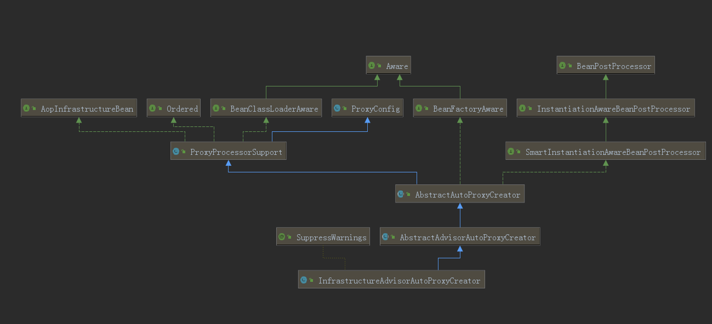

## 1. 编写测试Demo来测试事务

```java
@Service
public class DemoService {
    
    @Transactional(rollbackFor = Exception.class)
    public void test1() {
        System.out.println("test1 run...");
        int i = 1 / 0; //抛出异常!
        System.out.println("test1 finish...");
    }
    
}
```

在启动类上标注 `@EnableTransactionManagement` 注解来启动注解事务。

## 2. @EnableTransactionManagement

```java
@Target(ElementType.TYPE)
@Retention(RetentionPolicy.RUNTIME)
@Documented
@Import(TransactionManagementConfigurationSelector.class)
public @interface EnableTransactionManagement {
    boolean proxyTargetClass() default false;
    /**
    AdviceMode取值包括
    	PROXY, 		//JDK proxy-based advice.
    	ASPECTJ		//AspectJ weaving-based advice.
    */
    AdviceMode mode() default AdviceMode.PROXY;
    
    int order() default Ordered.LOWEST_PRECEDENCE;
}
```

`@EnableTransactionManagement` 注解上面声明了 `@Import` ，它导了一个Selector：`TransactionManagementConfigurationSelector` 。

## 3. TransactionManagementConfigurationSelector

`ImportSelector` 的作用是筛选组件，返回组件的全限定类名，让IOC容器来创建这些组件。

```java
public class TransactionManagementConfigurationSelector extends AdviceModeImportSelector<EnableTransactionManagement> {

	@Override
	protected String[] selectImports(AdviceMode adviceMode) {
		switch (adviceMode) {
			case PROXY:
				return new String[] {AutoProxyRegistrar.class.getName(), ProxyTransactionManagementConfiguration.class.getName()};
			case ASPECTJ:
				return new String[] {TransactionManagementConfigUtils.TRANSACTION_ASPECT_CONFIGURATION_CLASS_NAME};
			default:
				return null;
		}
	}

}
```

`@EnableTransactionManagement` 注解默认使用 `PROXY` 来增强事务，那这个switch结构中就应该返回两个类的全限定类名：`AutoProxyRegistrar` 、`ProxyTransactionManagementConfiguration` ，可以看得出来，声明式事务最终起作用是上述两个组件的功能。下面咱分别来看这两个类。

## 4. AutoProxyRegistrar

```java
public class AutoProxyRegistrar implements ImportBeanDefinitionRegistrar {
    public void registerBeanDefinitions(AnnotationMetadata importingClassMetadata, BeanDefinitionRegistry registry) {
        boolean candidateFound = false;
        Set<String> annoTypes = importingClassMetadata.getAnnotationTypes();
        for (String annoType : annoTypes) {
            AnnotationAttributes candidate = AnnotationConfigUtils.attributesFor(importingClassMetadata, annoType);
            if (candidate == null) {
                continue;
            }
            Object mode = candidate.get("mode");
            Object proxyTargetClass = candidate.get("proxyTargetClass");
            if (mode != null && proxyTargetClass != null && AdviceMode.class == mode.getClass() &&
                    Boolean.class == proxyTargetClass.getClass()) {
                candidateFound = true;
                // PROXY模式下会额外注册Bean
                if (mode == AdviceMode.PROXY) {
                    AopConfigUtils.registerAutoProxyCreatorIfNecessary(registry);
                    // 默认为false,使用jdk动态代理
                    if ((Boolean) proxyTargetClass) {                    
 	// 如果为true,使用cglib动态代理
     AopConfigUtils.forceAutoProxyCreatorToUseClassProxying(registry);
                        return;
                    }
                }
            }
        }
        if (!candidateFound) {
            String name = getClass().getSimpleName();
            // logger......
        }
    }

}
```

如果 `@EnableTransactionManagement` 注解中设置 `adviceMode` 为 `PROXY` （默认`PROXY`），则会利用 ~~AopUtils~~ ` AopConfigUtils`创建组件，并且如果 `@EnableTransactionManagement` 设置 `proxyTargetClass` 为true，则还会额外导入组件（默认为false）

### 4.1 AopUtils.registerAutoProxyCreatorIfNecessary

```java
public static BeanDefinition registerAutoProxyCreatorIfNecessary(BeanDefinitionRegistry registry) {
    return registerAutoProxyCreatorIfNecessary(registry, null);
}

public static BeanDefinition registerAutoProxyCreatorIfNecessary(BeanDefinitionRegistry registry,
        @Nullable Object source) {
    return registerOrEscalateApcAsRequired(InfrastructureAdvisorAutoProxyCreator.class, registry, source);
}

@Nullable
private static BeanDefinition registerOrEscalateApcAsRequired(Class<?> cls, BeanDefinitionRegistry registry,
        @Nullable Object source) {

    Assert.notNull(registry, "BeanDefinitionRegistry must not be null");

    if (registry.containsBeanDefinition(AUTO_PROXY_CREATOR_BEAN_NAME)) {
        BeanDefinition apcDefinition = registry.getBeanDefinition(AUTO_PROXY_CREATOR_BEAN_NAME);
        if (!cls.getName().equals(apcDefinition.getBeanClassName())) {
            int currentPriority = findPriorityForClass(apcDefinition.getBeanClassName());
            int requiredPriority = findPriorityForClass(cls);
            if (currentPriority < requiredPriority) {
                apcDefinition.setBeanClassName(cls.getName());
            }
        }
        return null;
    }

    RootBeanDefinition beanDefinition = new RootBeanDefinition(cls);
    beanDefinition.setSource(source);
    beanDefinition.getPropertyValues().add("order", Ordered.HIGHEST_PRECEDENCE);
    beanDefinition.setRole(BeanDefinition.ROLE_INFRASTRUCTURE);
    registry.registerBeanDefinition(AUTO_PROXY_CREATOR_BEAN_NAME, beanDefinition);
    return beanDefinition;
}
```

在第二层方法中传入了一个 `InfrastructureAdvisorAutoProxyCreator.class` （基础增强器自动代理创建器）

#### 4.1.1 InfrastructureAdvisorAutoProxyCreator

> Auto-proxy creator that considers infrastructure Advisor beans only, ignoring any application-defined Advisors.
>
> 自动代理创建器，仅考虑基础结构Advisor类型的Bean，而忽略任何应用程序定义的Advisor。

该类的继承结构如下:

```java
public class InfrastructureAdvisorAutoProxyCreator extends AbstractAdvisorAutoProxyCreator
public abstract class AbstractAdvisorAutoProxyCreator extends AbstractAutoProxyCreator
public abstract class AbstractAutoProxyCreator extends ProxyProcessorSupport
		implements SmartInstantiationAwareBeanPostProcessor, BeanFactoryAware
```



它也是个后置处理器，并且是在Bean创建前后执行的后置处理器（`InstantiationAwareBeanPostProcessor`），而且它来自 `spring-aop` 包。那既然是这样，它与之前AOP部分咱看到的思路就完全一致了（该类/父类中一定会有寻找增强器、过滤增强器，最终生成代理包装Bean为代理对象的方法）。

`registerAutoProxyCreatorIfNecessary` 方法注册了一个 `InfrastructureAdvisorAutoProxyCreator` ，跟之前咱在AOP部分看到的 `@EnableAspectJAutoProxy` 注解注册的 `AnnotationAwareAspectJAutoProxyCreator` 几乎完全一致了

## 5. ProxyTransactionManagementConfiguration

```java
@Configuration
public class ProxyTransactionManagementConfiguration extends AbstractTransactionManagementConfiguration {

	@Bean(name = TransactionManagementConfigUtils.TRANSACTION_ADVISOR_BEAN_NAME)
	@Role(BeanDefinition.ROLE_INFRASTRUCTURE)
	public BeanFactoryTransactionAttributeSourceAdvisor transactionAdvisor() {
		BeanFactoryTransactionAttributeSourceAdvisor advisor = new BeanFactoryTransactionAttributeSourceAdvisor();
		advisor.setTransactionAttributeSource(transactionAttributeSource());
		advisor.setAdvice(transactionInterceptor());
		if (this.enableTx != null) {
			advisor.setOrder(this.enableTx.<Integer>getNumber("order"));
		}
		return advisor;
	}

	@Bean
	@Role(BeanDefinition.ROLE_INFRASTRUCTURE)
	public TransactionAttributeSource transactionAttributeSource() {
		return new AnnotationTransactionAttributeSource();
	}

	@Bean
	@Role(BeanDefinition.ROLE_INFRASTRUCTURE)
	public TransactionInterceptor transactionInterceptor() {
		TransactionInterceptor interceptor = new TransactionInterceptor();
		interceptor.setTransactionAttributeSource(transactionAttributeSource());
		if (this.txManager != null) {
			interceptor.setTransactionManager(this.txManager);
		}
		return interceptor;
	}

}
```

向IOC容器中注册了3个Bean

### 5.1 transactionAdvisor：事务增强器

`BeanFactoryTransactionAttributeSourceAdvisor` 的文档注释原文翻译：

> Advisor driven by a TransactionAttributeSource, used to include a transaction advice bean for methods that are transactional.
>
> 由 `TransactionAttributeSource` 驱动的增强器，用于为开启事务的Bean的方法附加事务通知。

类的继承关系如下:

```java
public class BeanFactoryTransactionAttributeSourceAdvisor extends AbstractBeanFactoryPointcutAdvisor {

	@Nullable
	private TransactionAttributeSource transactionAttributeSource;
	
    // 通过切入点来适配方法
	private final TransactionAttributeSourcePointcut pointcut = new TransactionAttributeSourcePointcut() {
		@Override
		@Nullable
		protected TransactionAttributeSource getTransactionAttributeSource() {
			return transactionAttributeSource;
		}
	};
```

它是**利用切入点来增强方法** （源码中看到了**pointcut**）。源码中的**pointcut**属性的创建又要借助 `TransactionAttributeSource` 。这部分依赖关系如下：

`Advisor → → →依赖→ → → Pointcut → → →依赖→ → → Source`

#### 5.1.1 TransactionAttributeSourcePointcut

所有的切入点类都会实现 `Pointcut` 接口，`TransactionAttributeSourcePointcut` 的类继承和部分源码

```java
abstract class TransactionAttributeSourcePointcut extends StaticMethodMatcherPointcut implements Serializable {

	@Override
	public boolean matches(Method method, Class<?> targetClass) {
        // 是否为 TransactionalProxy 、PlatformTransactionManager 、PersistenceExceptionTranslator 的实现类
		if (TransactionalProxy.class.isAssignableFrom(targetClass) ||
				PlatformTransactionManager.class.isAssignableFrom(targetClass) ||
				PersistenceExceptionTranslator.class.isAssignableFrom(targetClass)) {
            // 是则返回false
			return false;
		}
		TransactionAttributeSource tas = getTransactionAttributeSource();
		return (tas == null || tas.getTransactionAttribute(method, targetClass) != null);
	}

```

### 5.2 AnnotationTransactionAttributeSource：注解事务配置源

> Implementation of the org.springframework.transaction.interceptor.TransactionAttributeSource interface for working with transaction metadata in JDK 1.5+ annotation format. <font color="red">This class reads Spring's JDK 1.5+ Transactional annotation and exposes corresponding transaction attributes to Spring's transaction infrastructure.</font> Also supports JTA 1.2's javax.transaction.Transactional and EJB3's javax.ejb.TransactionAttribute annotation (if present). This class may also serve as base class for a custom TransactionAttributeSource, or get customized through TransactionAnnotationParser strategies.
>
> org.springframework.transaction.interceptor.TransactionAttributeSource接口的实现，用于处理JDK 1.5+注释格式的事务元数据。
>
> 此类读取Spring的 `@Transactional` 注解，并将相应的事务属性公开给Spring的事务基础结构。此外，还支持JTA 1.2的 `javax.transaction.Transactional` 和EJB3的 `javax.ejb.TransactionAttribute` 注解（如果存在）。此类也可用作自定义 `TransactionAttributeSource` 的基类，或通过 `TransactionAnnotationParser` 策略进行自定义。

它读取 `@Transactional` 注解。由此可见 `AnnotationTransactionAttributeSource` 是读取 `@Transactional` 注解的。

Bean在创建时直接调了构造方法

```java
public AnnotationTransactionAttributeSource() {
    this(true);
}

public AnnotationTransactionAttributeSource(boolean publicMethodsOnly) {
    this.publicMethodsOnly = publicMethodsOnly;
    this.annotationParsers = new LinkedHashSet<>(2);
    this.annotationParsers.add(new SpringTransactionAnnotationParser());
    // 根据运行环境,增加对应的解析器
    if (jta12Present) {
        this.annotationParsers.add(new JtaTransactionAnnotationParser());
    }
    if (ejb3Present) {
        this.annotationParsers.add(new Ejb3TransactionAnnotationParser());
    }
}
```

#### 5.2.1 SpringTransactionAnnotationParser

```java
public class SpringTransactionAnnotationParser implements TransactionAnnotationParser, Serializable {

    @Override
    @Nullable
    public TransactionAttribute parseTransactionAnnotation(AnnotatedElement ae) {
        // 搜索被标注的元素（类、方法）上是否最终标注了@Transactional注解
        AnnotationAttributes attributes = AnnotatedElementUtils.findMergedAnnotationAttributes(
                ae, Transactional.class, false, false);
        if (attributes != null) {
            return parseTransactionAnnotation(attributes);
        }
        else {
            return null;
        }
    }

    public TransactionAttribute parseTransactionAnnotation(Transactional ann) {
        return parseTransactionAnnotation(AnnotationUtils.getAnnotationAttributes(ann, false, false));
    }

    protected TransactionAttribute parseTransactionAnnotation(AnnotationAttributes attributes) {
        RuleBasedTransactionAttribute rbta = new RuleBasedTransactionAttribute();
        // 解析事务传播行为
        Propagation propagation = attributes.getEnum("propagation");
        rbta.setPropagationBehavior(propagation.value());
        // 解析事务隔离级别
        Isolation isolation = attributes.getEnum("isolation");
        rbta.setIsolationLevel(isolation.value());
        // 解析超时
        rbta.setTimeout(attributes.getNumber("timeout").intValue());
        // 解析只读事务
        rbta.setReadOnly(attributes.getBoolean("readOnly"));
        rbta.setQualifier(attributes.getString("value"));
        ArrayList<RollbackRuleAttribute> rollBackRules = new ArrayList<>();
        // 解析回滚异常
        Class<?>[] rbf = attributes.getClassArray("rollbackFor");
        for (Class<?> rbRule : rbf) {
            RollbackRuleAttribute rule = new RollbackRuleAttribute(rbRule);
            rollBackRules.add(rule);
        }
        String[] rbfc = attributes.getStringArray("rollbackForClassName");
        for (String rbRule : rbfc) {
            RollbackRuleAttribute rule = new RollbackRuleAttribute(rbRule);
            rollBackRules.add(rule);
        }
        // 解析不回滚异常的“白名单”
        Class<?>[] nrbf = attributes.getClassArray("noRollbackFor");
        for (Class<?> rbRule : nrbf) {
            NoRollbackRuleAttribute rule = new NoRollbackRuleAttribute(rbRule);
            rollBackRules.add(rule);
        }
        String[] nrbfc = attributes.getStringArray("noRollbackForClassName");
        for (String rbRule : nrbfc) {
            NoRollbackRuleAttribute rule = new NoRollbackRuleAttribute(rbRule);
            rollBackRules.add(rule);
        }
        rbta.getRollbackRules().addAll(rollBackRules);
        return rbta;
    }
}
```

### 5.3 TransactionInterceptor

```java
@Bean
@Role(BeanDefinition.ROLE_INFRASTRUCTURE)
public TransactionInterceptor transactionInterceptor() {
    TransactionInterceptor interceptor = new TransactionInterceptor();
    interceptor.setTransactionAttributeSource(transactionAttributeSource());
    if (this.txManager != null) {
        interceptor.setTransactionManager(this.txManager);
    }
    return interceptor;
}
```

在Bean的创建过程中，它也把事务配置源保存起来了，并且还注入了事务管理器。而 `TransactionInterceptor` 本身的类定义：

**public** **class** **TransactionInterceptor** **extends** **TransactionAspectSupport** **implements** **MethodInterceptor**, **Serializable**

实现了 `MethodInterceptor` ！它也是一个AOP的增强器。那它的核心作用大概率就是控制事务

`ProxyTransactionManagementConfiguration` 的配置读完之后，别忘了它还继承了一个父类，下面咱看看这个父类里都干了什么：

## 6. AbstractTransactionManagementConfiguration的配置

```java
@Configuration
public abstract class AbstractTransactionManagementConfiguration implements ImportAware {

    @Nullable
    protected AnnotationAttributes enableTx;

    @Nullable
    protected PlatformTransactionManager txManager;


    @Override
    public void setImportMetadata(AnnotationMetadata importMetadata) {
        this.enableTx = AnnotationAttributes.fromMap(
                importMetadata.getAnnotationAttributes(EnableTransactionManagement.class.getName(), false));
        if (this.enableTx == null) {
            throw new IllegalArgumentException(
                    "@EnableTransactionManagement is not present on importing class " + importMetadata.getClassName());
        }
    }

    @Autowired(required = false)
    void setConfigurers(Collection<TransactionManagementConfigurer> configurers) {
        if (CollectionUtils.isEmpty(configurers)) {
            return;
        }
        if (configurers.size() > 1) {
            throw new IllegalStateException("Only one TransactionManagementConfigurer may exist");
        }
        TransactionManagementConfigurer configurer = configurers.iterator().next();
        this.txManager = configurer.annotationDrivenTransactionManager();
    }


    @Bean(name = TransactionManagementConfigUtils.TRANSACTIONAL_EVENT_LISTENER_FACTORY_BEAN_NAME)
    @Role(BeanDefinition.ROLE_INFRASTRUCTURE)
    public static TransactionalEventListenerFactory transactionalEventListenerFactory() {
        return new TransactionalEventListenerFactory();
    }

}
```

### 6.1 TransactionalEventListenerFactory

> EventListenerFactory implementation that handles TransactionalEventListener annotated methods.
>
> EventListenerFactory的实现类，用于处理带有 `@TransactionalEventListener` 注解的方法。

它又提到了一个注解：`@TransactionalEventListener` ，实际上 `TransactionalEventListenerFactory` 这个组件是做事务监听机制的。

#### 6.1.1 【扩展】@TransactionalEventListener

自 SpringFramework4.2 之后，出现了一种能在事务动作发生前后注入监听器的机制。

举几个应用场景的例子：

- 执行完数据库操作后发送消息
- 执行数据库操作之前记录日志
- 业务逻辑出错时事务回滚之后发邮件警报

类似于这种事务动作执行前后进行附加操作的问题，在SpringFramework4.2之后就可以通过 `@TransactionalEventListener` 注解来实现。

`@TransactionalEventListener` 可提供4种监听时机，来执行附加操作：

- BEFORE_COMMIT：提交之前
- AFTER_COMMIT：提交之后
- AFTER_ROLLBACK：回滚之后
- AFTER_COMPLETION：事务完成之后

#### 6.1.2 @TransactionalEventListener的使用方式简单Demo

```java
@Service
public class DemoService {

    @Autowired
    private USerDao userDao;

    @Autowired
    private ApplicationEventPublisher applicationEventPublisher;

    @Transactional(rollBackFor = Exception.class)
    public void test() {
        // 执行清空用户的数据库操作
        userDao.deleteAll();

        // 使用事件广播器来广播 用户清除事件
        applicationEventPublisher.publishEvent(new UserCleanEvent());
    }
}

@Component
class MyTransactionListener {

    @TransactionalEventListener(phase = TransactionPhase.AFTER_COMMIT)
    private void onTestEvent(UserCleanEvent event) {
        System.out.println("UserCleanEvent detected ......");
    }

}

// 定义 用户清除事件，它需要继承ApplicationEvent 
class UserCleanEvent extends ApplicationEvent {

}
```

## 小结

1. Spring的注解事务底层是借助AOP的机制，创建了一个 `InfrastructureAdvisorAutoProxyCreator` 组件来创建代理对象。
2. 注解事务要想生效，需要**事务增强器、事务切入点解析器、事务配置源、事务拦截器**等组件。