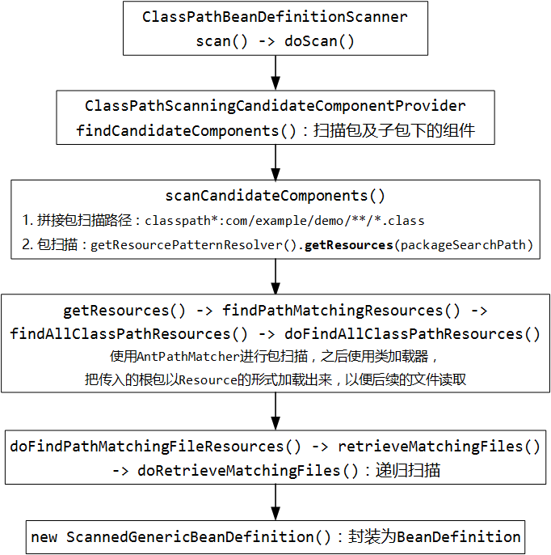
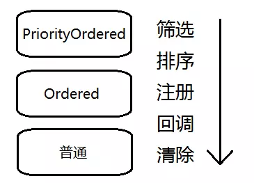

# refreshContext

> prepareContext(context, environment, listeners, applicationArguments, printedBanner);        
>
> refreshContext(context);        
>
> afterRefresh(context, applicationArguments);

---

0. refreshContext

   ```java
   private void refreshContext(ConfigurableApplicationContext context) {
       refresh(context);
       if (this.registerShutdownHook) {
           try {
               // 注册关闭钩子方法
               context.registerShutdownHook();
           }
           catch (AccessControlException ex) {
               // Not allowed in some environments.
           }
       }
   }
   ```

   它直接调了refresh方法（注意此时还是 SpringApplication，没有进到真正的IOC容器），后面又注册了一个关闭的钩子。这个 registerShutdownHook 方法的文档注释：

   > Register a shutdown hook with the JVM runtime, closing this context on JVM shutdown unless it has already been closed at that time.
   >
   > 向JVM运行时注册一个shutdown的钩子，除非JVM当时已经关闭，否则在JVM关闭时关闭上下文。

   可以大概看出来，这个钩子的作用是监听JVM关闭时销毁IOC容器和里面的Bean。这里面有一个很经典的应用：应用停止时释放数据库连接池里面的连接。

   refresh()方法

   ```java
   protected void refresh(ApplicationContext applicationContext) {
       Assert.isInstanceOf(AbstractApplicationContext.class, applicationContext);
       //调用applicationContext.refresh()
       ((AbstractApplicationContext) applicationContext).refresh();
   }
   ```

   <font color="red">`AbstractApplicationContext`</font> 中的 <font color="red">**refresh**</font> 是IOC容器启动时的最核心方法：

   ```java
   //最终调到AbstractApplicationContext的refresh方法
   public void refresh() throws BeansException, IllegalStateException {
       synchronized (this.startupShutdownMonitor) {
           // Prepare this context for refreshing.
           // 1. 初始化前的预处理
           prepareRefresh();
   
           // Tell the subclass to refresh the internal bean factory.
           // 2. 获取BeanFactory，加载所有bean的定义信息（未实例化）
           ConfigurableListableBeanFactory beanFactory = obtainFreshBeanFactory();
   
           // Prepare the bean factory for use in this context.
           // 3. BeanFactory的预处理配置
           prepareBeanFactory(beanFactory);
   
           try {
               // Allows post-processing of the bean factory in context subclasses.
               // 4. 准备BeanFactory完成后进行的后置处理
               postProcessBeanFactory(beanFactory);
   
               // Invoke factory processors registered as beans in the context.
               // 5. 执行BeanFactory创建后的后置处理器
               invokeBeanFactoryPostProcessors(beanFactory);
   
               // Register bean processors that intercept bean creation.
               // 6. 注册Bean的后置处理器
               registerBeanPostProcessors(beanFactory);
   
               // Initialize message source for this context.
               // 7. 初始化MessageSource
               initMessageSource();
   
               // Initialize event multicaster for this context.
               // 8. 初始化事件派发器
               initApplicationEventMulticaster();
   
               // Initialize other special beans in specific context subclasses.
               // 9. 子类的多态onRefresh
               onRefresh();
   
               // Check for listener beans and register them.
               // 10. 注册监听器
               registerListeners();
             
               //到此为止，BeanFactory已创建完成
   
               // Instantiate all remaining (non-lazy-init) singletons.
               // 11. 初始化所有剩下的单例Bean
               finishBeanFactoryInitialization(beanFactory);
   
               // Last step: publish corresponding event.
               // 12. 完成容器的创建工作
               finishRefresh();
           }
   
           catch (BeansException ex) {
               if (logger.isWarnEnabled()) {
                   logger.warn("Exception encountered during context initialization - " +
                           "cancelling refresh attempt: " + ex);
               }
   
               // Destroy already created singletons to avoid dangling resources.
               destroyBeans();
   
               // Reset 'active' flag.
               cancelRefresh(ex);
   
               // Propagate exception to caller.
               throw ex;
           }
   
           finally {
               // Reset common introspection caches in Spring's core, since we
               // might not ever need metadata for singleton beans anymore...
               // 13. 清除缓存
               resetCommonCaches();
           }
       }
   }
   ```

   ---
   
1. prepareRefresh：初始化前的预处理

   ```java
   protected void prepareRefresh() {
       this.startupDate = System.currentTimeMillis(); // 记录启动时间
       this.closed.set(false); // 标记IOC容器的关闭状态为false
       this.active.set(true); // 标记IOC容器已激活
   
       if (logger.isInfoEnabled()) {
           logger.info("Refreshing " + this);
       }
   
       // Initialize any placeholder property sources in the context environment
       // 1.1 初始化属性配置
       initPropertySources();
   
       // Validate that all properties marked as required are resolvable
       // see ConfigurablePropertyResolver#setRequiredProperties
       // 1.2 属性校验,所有必须属性已经标记为已解决状态
       getEnvironment().validateRequiredProperties();
   
       // Allow for the collection of early ApplicationEvents,
       // to be published once the multicaster is available...
       // 这个集合的作用，是保存容器中的一些事件，以便在合适的时候利用事件广播器来广播这些事件
       // 【配合registerListeners方法中的第三部分使用】
       this.earlyApplicationEvents = new LinkedHashSet<>();
   }
   ```

   1. initPropertySources：初始化属性配置

      ```java
      // 这个方法是一个模板方法，留给子类重写，默认不做任何事情。
      protected void initPropertySources() {
          // For subclasses: do nothing by default.
      }
      
      // 在 GenericWebApplicationContext 中有重写，而 AnnotationConfigServletWebServerApplicationContext 继承了它
      protected void initPropertySources() {
          // 获取环境对象
          ConfigurableEnvironment env = getEnvironment();
          if (env instanceof ConfigurableWebEnvironment) {
              //调用环境对象的初始化属性来源方法
              ((ConfigurableWebEnvironment) env).initPropertySources(this.servletContext, null);
          }
      }
      
      //StandardServletEnvironment 重写方法
      public void initPropertySources(@Nullable ServletContext servletContext, @Nullable ServletConfig servletConfig) {
          //web应用上下文工具.初始化servlet属性
          WebApplicationContextUtils.initServletPropertySources(getPropertySources(), servletContext, servletConfig);
      }
      
      //继续调用,追踪 WebApplicationContextUtils.initServletPropertySources
      //servlet上下文初始化参数
      public static final String SERVLET_CONTEXT_PROPERTY_SOURCE_NAME = "servletContextInitParams";
      //servlet配置初始化参数
      public static final String SERVLET_CONFIG_PROPERTY_SOURCE_NAME = "servletConfigInitParams";
      
      public static void initServletPropertySources(MutablePropertySources sources,
              @Nullable ServletContext servletContext, @Nullable ServletConfig servletConfig) {
      
          Assert.notNull(sources, "'propertySources' must not be null");
          String name = StandardServletEnvironment.SERVLET_CONTEXT_PROPERTY_SOURCE_NAME;
          //存在对应source类
          //把 Servlet 的一些初始化参数放入IOC容器中（类似于 web.xml 中的参数放入IOC容器）。
          if (servletContext != null && sources.contains(name) && sources.get(name) instanceof StubPropertySource) {
              sources.replace(name, new ServletContextPropertySource(name, servletContext));
          }
          name = StandardServletEnvironment.SERVLET_CONFIG_PROPERTY_SOURCE_NAME;
          if (servletConfig != null && sources.contains(name) && sources.get(name) instanceof StubPropertySource) {
              sources.replace(name, new ServletConfigPropertySource(name, servletConfig));
          }
      }
      ```

      ---

   2. validateRequiredProperties：属性校验

      ```java
      // AbstractEnvironment
      public void validateRequiredProperties() throws MissingRequiredPropertiesException {
          this.propertyResolver.validateRequiredProperties();
      }
      
      // AbstractPropertyResolver
      public void validateRequiredProperties() {
          MissingRequiredPropertiesException ex = new MissingRequiredPropertiesException();
          for (String key : this.requiredProperties) {
              // 如果必须属性中有不存在的(null)
              if (this.getProperty(key) == null) {
                  ex.addMissingRequiredProperty(key);
              }
          }
          if (!ex.getMissingRequiredProperties().isEmpty()) {
              throw ex;
          }
      }obtainFreshBeanFactory：获取BeanFactory，加载所有bean的定义信息
      ```

   ---

2. obtainFreshBeanFactory：获取BeanFactory，加载所有bean的定义信息

```java
protected ConfigurableListableBeanFactory obtainFreshBeanFactory() {
    // 2.1 刷新BeanFactory
    refreshBeanFactory();
    // 获取刷新完的beanFactory
    return getBeanFactory();
}
```

1. refreshBeanFactory

   ```java
   // 接口抽象方法
   protected abstract void refreshBeanFactory() throws BeansException, IllegalStateException;

   // GenericApplicationContext 实现
   protected final void refreshBeanFactory() throws IllegalStateException {
       // CAS设置context为已刷新状态
       if (!this.refreshed.compareAndSet(false, true)) {
           throw new IllegalStateException(
                   "GenericApplicationContext does not support multiple refresh attempts: just call 'refresh' once");
       }
       // 设置序列化id
       this.beanFactory.setSerializationId(getId());
   }
   ```
   
2. getBeanFactory

   ```java
   // 获取Bean
   public final ConfigurableListableBeanFactory getBeanFactory() {
       return this.beanFactory;
   }
   ```

---

3.prepareBeanFactory：BeanFactory的预处理配置

```java
protected void prepareBeanFactory(ConfigurableListableBeanFactory beanFactory) {
    // Tell the internal bean factory to use the context's class loader etc.
    // 设置BeanFactory的类加载器、表达式解析器等
    beanFactory.setBeanClassLoader(getClassLoader());
    beanFactory.setBeanExpressionResolver(new StandardBeanExpressionResolver(beanFactory.getBeanClassLoader()));
    // 资源编辑器是啥玩意(?)
    beanFactory.addPropertyEditorRegistrar(new ResourceEditorRegistrar(this, getEnvironment()));

    // Configure the bean factory with context callbacks.
    // 3.1 配置一个可回调注入ApplicationContext的BeanPostProcessor
    beanFactory.addBeanPostProcessor(new ApplicationContextAwareProcessor(this));
    // 忽略依赖接口是什么意思(?)
    beanFactory.ignoreDependencyInterface(EnvironmentAware.class);
    beanFactory.ignoreDependencyInterface(EmbeddedValueResolverAware.class);
    beanFactory.ignoreDependencyInterface(ResourceLoaderAware.class);
    beanFactory.ignoreDependencyInterface(ApplicationEventPublisherAware.class);
    beanFactory.ignoreDependencyInterface(MessageSourceAware.class);
    beanFactory.ignoreDependencyInterface(ApplicationContextAware.class);

    // BeanFactory interface not registered as resolvable type in a plain factory.
    // MessageSource registered (and found for autowiring) as a bean.
    // 3.2 自动注入的支持
    beanFactory.registerResolvableDependency(BeanFactory.class, beanFactory);
    beanFactory.registerResolvableDependency(ResourceLoader.class, this);
    beanFactory.registerResolvableDependency(ApplicationEventPublisher.class, this);
    beanFactory.registerResolvableDependency(ApplicationContext.class, this);

    // Register early post-processor for detecting inner beans as ApplicationListeners.
    // 3.3 配置一个可加载所有监听器的组件
    beanFactory.addBeanPostProcessor(new ApplicationListenerDetector(this));

    // Detect a LoadTimeWeaver and prepare for weaving, if found.
    // 加载时间织入bean?(AOP统计bean创建时间?)
    if (beanFactory.containsBean(LOAD_TIME_WEAVER_BEAN_NAME)) {
        beanFactory.addBeanPostProcessor(new LoadTimeWeaverAwareProcessor(beanFactory));
        // Set a temporary ClassLoader for type matching.
        beanFactory.setTempClassLoader(new ContextTypeMatchClassLoader(beanFactory.getBeanClassLoader()));
    }

    // Register default environment beans.
    // 注册了默认的运行时环境、系统配置属性、系统环境的信息
    if (!beanFactory.containsLocalBean(ENVIRONMENT_BEAN_NAME)) {
        beanFactory.registerSingleton(ENVIRONMENT_BEAN_NAME, getEnvironment());
    }
    if (!beanFactory.containsLocalBean(SYSTEM_PROPERTIES_BEAN_NAME)) {
        beanFactory.registerSingleton(SYSTEM_PROPERTIES_BEAN_NAME, getEnvironment().getSystemProperties());
    }
    if (!beanFactory.containsLocalBean(SYSTEM_ENVIRONMENT_BEAN_NAME)) {
        beanFactory.registerSingleton(SYSTEM_ENVIRONMENT_BEAN_NAME, getEnvironment().getSystemEnvironment());
    }
}
```

3.0 【重要】BeanPostProcessor

> Factory hook that allows for custom modification of new bean instances, e.g. checking for marker interfaces or wrapping them with proxies. ApplicationContexts can autodetect BeanPostProcessor beans in their bean definitions and apply them to any beans subsequently created. Plain bean factories allow for programmatic registration of post-processors, applying to all beans created through this factory. Typically, post-processors that populate beans via marker interfaces or the like will implement postProcessBeforeInitialization, while post-processors that wrap beans with proxies will normally implement postProcessAfterInitialization.
>
> 这个接口允许自定义修改新的Bean的实例，例如检查它们的接口或者将他们包装成代理对象等，
>
> ApplicationContexts能自动察觉到我们在 `BeanPostProcessor` 里对对象作出的改变，并在后来创建该对象时应用其对应的改变。普通的bean工厂允许对后置处理器进行程序化注册，它适用于通过该工厂创建的所有bean。
>
> 通常，通过标记接口等填充bean的后处理器将实现 `postProcessBeforeInitialization`，而使用代理包装bean的后处理器将实现 `postProcessAfterInitialization`。

它可以在对象实例化但初始化之前，以及初始化之后进行一些后置处理。

3.0.2 【执行时机】Bean初始化的顺序及BeanPostProcessor的执行时机

结论:

- 初始化执行顺序：
  - 构造方法
  - `@PostConstruct` / `init-method`
  - `InitializingBean` 的 `afterPropertiesSet` 方法
- BeanPostProcessor的执行时机
  - before：构造方法之后，`@PostConstruct` 之前
  - after：`afterPropertiesSet` 之后

3.1 addBeanPostProcessor(new ApplicationContextAwareProcessor(this));

回到正题,springboot的初始化

```java
   // Configure the bean factory with context callbacks.
    // 3.1 配置一个可回调注入ApplicationContext的BeanPostProcessor
    beanFactory.addBeanPostProcessor(new ApplicationContextAwareProcessor(this));
    beanFactory.ignoreDependencyInterface(EnvironmentAware.class);
    beanFactory.ignoreDependencyInterface(EmbeddedValueResolverAware.class);
    beanFactory.ignoreDependencyInterface(ResourceLoaderAware.class);
    beanFactory.ignoreDependencyInterface(ApplicationEventPublisherAware.class);
    beanFactory.ignoreDependencyInterface(MessageSourceAware.class);
    beanFactory.ignoreDependencyInterface(ApplicationContextAware.class);
```

配置了一个BeanPostProcessor后又忽略了一些接口

3.1.1 ApplicationContextAwareProcessor

> BeanPostProcessor implementation that passes the ApplicationContext to beans that implement the EnvironmentAware, EmbeddedValueResolverAware, ResourceLoaderAware, ApplicationEventPublisherAware, MessageSourceAware and/or ApplicationContextAware interfaces. Implemented interfaces are satisfied in order of their mention above. Application contexts will automatically register this with their underlying bean factory. Applications do not use this directly.
>
> BeanPostProcessor 实现，它将 ApplicationContext 传递给实现 `EnvironmentAware`，`EmbeddedValueResolverAware`，`ResourceLoaderAware`，`ApplicationEventPublisherAware`，`MessageSourceAware` 和/或 `ApplicationContextAware` 接口的bean。
>
> 按照上面提到的顺序满足已实现的接口。
>
> IOC容器将自动在其基础bean工厂中注册它。应用程序不直接使用它。

```java
public Object postProcessBeforeInitialization(final Object bean, String beanName) throws BeansException {
    AccessControlContext acc = null;

    //如果bean是被忽略的接口中的任意一种的实现类(避免重复注入?)
    if (System.getSecurityManager() != null &&
            (bean instanceof EnvironmentAware || bean instanceof EmbeddedValueResolverAware ||
                    bean instanceof ResourceLoaderAware || bean instanceof ApplicationEventPublisherAware ||
                    bean instanceof MessageSourceAware || bean instanceof ApplicationContextAware)) {
        acc = this.applicationContext.getBeanFactory().getAccessControlContext();
    }

    if (acc != null) {
        AccessController.doPrivileged((PrivilegedAction<Object>) () -> {
            invokeAwareInterfaces(bean);
            return null;
        }, acc);
    }
    else {
        // 往下调用
        invokeAwareInterfaces(bean);
    }

    return bean;
}
//根据接口类型,分别注入需要的属性
private void invokeAwareInterfaces(Object bean) {
    if (bean instanceof Aware) {
        if (bean instanceof EnvironmentAware) {
            ((EnvironmentAware) bean).setEnvironment(this.applicationContext.getEnvironment());
        }
        if (bean instanceof EmbeddedValueResolverAware) {
            ((EmbeddedValueResolverAware) bean).setEmbeddedValueResolver(this.embeddedValueResolver);
        }
        if (bean instanceof ResourceLoaderAware) {
            ((ResourceLoaderAware) bean).setResourceLoader(this.applicationContext);
        }
        if (bean instanceof ApplicationEventPublisherAware) {
            ((ApplicationEventPublisherAware) bean).setApplicationEventPublisher(this.applicationContext);
        }
        if (bean instanceof MessageSourceAware) {
            ((MessageSourceAware) bean).setMessageSource(this.applicationContext);
        }
        if (bean instanceof ApplicationContextAware) {
            ((ApplicationContextAware) bean).setApplicationContext(this.applicationContext);
        }
    }
}
```

---

3.2 registerResolvableDependency：自动注入的支持

```java
    // BeanFactory interface not registered as resolvable type in a plain factory.
    // MessageSource registered (and found for autowiring) as a bean.
	// 简单来说,下面这些bean并没有作为bean注册到beanfactory/applicationcontext,但是又可能遇到需要注入的情况,所以将这些特殊的对象也当成bean加入到resolvableDependencies属性中,即支持自动注入
    beanFactory.registerResolvableDependency(BeanFactory.class, beanFactory);
    beanFactory.registerResolvableDependency(ResourceLoader.class, this);
    beanFactory.registerResolvableDependency(ApplicationEventPublisher.class, this);
    beanFactory.registerResolvableDependency(ApplicationContext.class, this);

// 在DefaultListableBeanFactory 中实现该方法
/** Map from dependency type to corresponding autowired value. */
private final Map<Class<?>, Object> resolvableDependencies = new ConcurrentHashMap<>(16);

/**
Register a special dependency type with corresponding autowired value. This is intended for factory/context references that are supposed to be autowirable but are not defined as beans in the factory: e.g. a dependency of type ApplicationContext resolved to the ApplicationContext instance that the bean is living in. Note: There are no such default types registered in a plain BeanFactory, not even for the BeanFactory interface itself.

用相应的自动装配值注册一个特殊的依赖类型。

这适用于应该是可自动执行但未在工厂中定义为bean的工厂/上下文引用：类型为 ApplicationContext 的依赖关系已解析为Bean所在的 ApplicationContext 实例。

注意：在普通 BeanFactory 中没有注册这样的默认类型，甚至 BeanFactory 接口本身也没有。
*/
public void registerResolvableDependency(Class<?> dependencyType, @Nullable Object autowiredValue) {
    Assert.notNull(dependencyType, "Dependency type must not be null");
    if (autowiredValue != null) {
        if (!(autowiredValue instanceof ObjectFactory || dependencyType.isInstance(autowiredValue))) {
            throw new IllegalArgumentException("Value [" + autowiredValue +
                    "] does not implement specified dependency type [" + dependencyType.getName() + "]");
        }
        this.resolvableDependencies.put(dependencyType, autowiredValue);
    }
}
```

3.3 addBeanPostProcessor(new ApplicationListenerDetector(this))

```java
    // Register early post-processor for detecting inner beans as ApplicationListeners.
    beanFactory.addBeanPostProcessor(new ApplicationListenerDetector(this));

/**
BeanPostProcessor that detects beans which implement the ApplicationListener interface. This catches beans that can't reliably be detected by getBeanNamesForType and related operations which only work against top-level beans.

BeanPostProcessor，用于检测实现 ApplicationListener 接口的bean。这将捕获 getBeanNamesForType 和仅对顶级bean有效的相关操作无法可靠检测到的bean。
*/
ApplicationListenerDetector
    
public Object postProcessAfterInitialization(Object bean, String beanName) {
    //如果bean是Listener
    if (bean instanceof ApplicationListener) {
        // potentially not detected as a listener by getBeanNamesForType retrieval
        Boolean flag = this.singletonNames.get(beanName);
        if (Boolean.TRUE.equals(flag)) {
            // singleton bean (top-level or inner): register on the fly
            this.applicationContext.addApplicationListener((ApplicationListener<?>) bean);
        }
        //非单例情况下,不允许
        else if (Boolean.FALSE.equals(flag)) {
            if (logger.isWarnEnabled() && !this.applicationContext.containsBean(beanName)) {
                // inner bean with other scope - can't reliably process events
                logger.warn("Inner bean '" + beanName + "' implements ApplicationListener interface " +
                        "but is not reachable for event multicasting by its containing ApplicationContext " +
                        "because it does not have singleton scope. Only top-level listener beans are allowed " +
                        "to be of non-singleton scope.");
            }
            this.singletonNames.remove(beanName);
        }
    }
    return bean;
}
```

---

4. postProcessBeanFactory：BeanFactory的后置处理

```java
/** AbstractApplicationContext 中的模板方法 */
protected void postProcessBeanFactory(ConfigurableListableBeanFactory beanFactory) {
}

/** AnnotationConfigServletWebServerApplicationContext 重写 */
protected void postProcessBeanFactory(ConfigurableListableBeanFactory beanFactory) {
    //调用父类方法
    //父类 ServletWebServerApplicationContext 的 postProcessBeanFactory 方法
    super.postProcessBeanFactory(beanFactory);
    // 包扫描
    if (this.basePackages != null && this.basePackages.length > 0) {
        this.scanner.scan(this.basePackages);
    }
    if (!this.annotatedClasses.isEmpty()) {
        // 注册所有被注解标记的类
        this.reader.register(ClassUtils.toClassArray(this.annotatedClasses));
    }
}
```

4.1 ServletWebServerApplicationContext.postProcessBeanFactory

```java
// ServletWebServerApplicationContext
protected void postProcessBeanFactory(ConfigurableListableBeanFactory beanFactory) {
    // 注册ServletContext注入器
    // 专门注入servletContext对象(一个web应用一个context)
    beanFactory.addBeanPostProcessor(new WebApplicationContextServletContextAwareProcessor(this));
    beanFactory.ignoreDependencyInterface(ServletContextAware.class);
    registerWebApplicationScopes();
}
```

4.1.1 注册WebApplicationContextServletContextAwareProcessor

> Variant of ServletContextAwareProcessor for use with a ConfigurableWebApplicationContext. Can be used when registering the processor can occur before the ServletContext or ServletConfig have been initialized.
>
> `ServletContextAwareProcessor` 的扩展，用于 `ConfigurableWebApplicationContext` 。可以在初始化 ServletContext 或 ServletConfig 之前进行处理器注册时使用。


父类ServletContextAwareProcessor相关文档

> BeanPostProcessor implementation that passes the ServletContext to beans that implement the ServletContextAware interface. Web application contexts will automatically register this with their underlying bean factory. Applications do not use this directly.
>
> 将 ServletContext 传递给实现 ServletContextAware 接口的Bean的 BeanPostProcessor 实现。
>
> Web应用程序上下文将自动将其注册到其底层bean工厂，应用程序不直接使用它。


看一下实现方法的源码,分别向ServletContextAware和ServletConfigAware中注入需要的配置对象

```java
public Object postProcessBeforeInitialization(Object bean, String beanName) throws BeansException {
    if (getServletContext() != null && bean instanceof ServletContextAware) {
        ((ServletContextAware) bean).setServletContext(getServletContext());
    }
    if (getServletConfig() != null && bean instanceof ServletConfigAware) {
        ((ServletConfigAware) bean).setServletConfig(getServletConfig());
    }
    return bean;
}
```

4.1.2 registerWebApplicationScopes

```java
private void registerWebApplicationScopes() {
    // 已存在的web应用范围
    ExistingWebApplicationScopes existingScopes = new ExistingWebApplicationScopes(getBeanFactory());
    WebApplicationContextUtils.registerWebApplicationScopes(getBeanFactory());
    existingScopes.restore();
}
```

4.1.2.1 ExistingWebApplicationScopes

部分源码如下:

```java
public static class ExistingWebApplicationScopes {

    private static final Set<String> SCOPES;

    /**
    联想到jsp的四大域对象
    page
    request
    session
    servletContext
    */
    
    static {
        Set<String> scopes = new LinkedHashSet<>();
        //request域
        scopes.add(WebApplicationContext.SCOPE_REQUEST);
        //session域
        scopes.add(WebApplicationContext.SCOPE_SESSION);
        SCOPES = Collections.unmodifiableSet(scopes);
    }
  
    /**
    把现在缓存的所有作用域，注册到 BeanFactory 中
    
    小册作者的见解:
    将Web的request域和session域注册到IOC容器，让IOC容器知道这两种作用域（学过 SpringFramework 都知道Bean的作用域有request 和 session）。
    */
    public void restore() {
        this.scopes.forEach((key, value) -> {
            if (logger.isInfoEnabled()) {
                logger.info("Restoring user defined scope " + key);
            }
            this.beanFactory.registerScope(key, value);
        });
    }
```

4.1.2.2 WebApplicationContextUtils.registerWebApplicationScopes

```java
/**
* Register web-specific scopes ("request", "session", "globalSession")
* with the given BeanFactory, as used by the WebApplicationContext.

指定的web作用域(request,session,globalSession)注册到给定的被web应用上下文使用beanFactory

* @param beanFactory the BeanFactory to configure
*/
public static void registerWebApplicationScopes(ConfigurableListableBeanFactory beanFactory) {
		registerWebApplicationScopes(beanFactory, null);
}

/**

*/
public static void registerWebApplicationScopes(ConfigurableListableBeanFactory beanFactory,
			@Nullable ServletContext sc) {
    	//String SCOPE_REQUEST = "request";
    	//String SCOPE_SESSION = "session";
		//将request域和session域注册到beanFactory容器中
		beanFactory.registerScope(WebApplicationContext.SCOPE_REQUEST, new RequestScope());
		beanFactory.registerScope(WebApplicationContext.SCOPE_SESSION, new SessionScope());
		if (sc != null) {
			ServletContextScope appScope = new ServletContextScope(sc);
			beanFactory.registerScope(WebApplicationContext.SCOPE_APPLICATION, appScope);
			// Register as ServletContext attribute, for ContextCleanupListener to detect it.
			sc.setAttribute(ServletContextScope.class.getName(), appScope);
		}
		//同理,这边解决以下特殊依赖问题,保证可以获取对象
		beanFactory.registerResolvableDependency(ServletRequest.class, new RequestObjectFactory());
		beanFactory.registerResolvableDependency(ServletResponse.class, new ResponseObjectFactory());
		beanFactory.registerResolvableDependency(HttpSession.class, new SessionObjectFactory());
		beanFactory.registerResolvableDependency(WebRequest.class, new WebRequestObjectFactory());
		if (jsfPresent) {
			FacesDependencyRegistrar.registerFacesDependencies(beanFactory);
		}
	}
```

回到 `AnnotationConfigServletWebServerApplicationContext` 中：

```java
    if (this.basePackages != null && this.basePackages.length > 0) {
        this.scanner.scan(this.basePackages);
    }
```

4.2 【重要】包扫描

```java
private final AnnotatedBeanDefinitionReader reader;
private final ClassPathBeanDefinitionScanner scanner;

/**
在 AnnotationConfigServletWebServerApplicationContext 中有声明 注解Bean定义解析器 和 类路径Bean定义扫描器 的类型，可以依此类型来查看原理。
*/

// ClassPathBeanDefinitionScanner
// 模板方法,真正的实现在doScan里
public int scan(String... basePackages) {
    //先确认已经注册了多少个beanDefinition
    int beanCountAtScanStart = this.registry.getBeanDefinitionCount();

    doScan(basePackages);

    // Register annotation config processors, if necessary.
    if (this.includeAnnotationConfig) {
        AnnotationConfigUtils.registerAnnotationConfigProcessors(this.registry);
    }
	//返回新增的数量
    return (this.registry.getBeanDefinitionCount() - beanCountAtScanStart);
}

//真正进行扫描的方法
protected Set<BeanDefinitionHolder> doScan(String... basePackages) {
    Assert.notEmpty(basePackages, "At least one base package must be specified");
    Set<BeanDefinitionHolder> beanDefinitions = new LinkedHashSet<>();
    // 只有主启动类所在包
    for (String basePackage : basePackages) {
        // 4.2.1 - 4.2.5 扫描包及子包下的组件
        Set<BeanDefinition> candidates = findCandidateComponents(basePackage);
        // 4.3 ......
    }
    return beanDefinitions;
}
```

4.2.1 findCandidateComponents

```java
private CandidateComponentsIndex componentsIndex;
/**
父类 ClassPathScanningCandidateComponentProvider 的 findCandidateComponents 方法
*/
public Set<BeanDefinition> findCandidateComponents(String basePackage) {
    if (this.componentsIndex != null && indexSupportsIncludeFilters()) {
        // 如果由扫描索引并且索引支持include过滤器
        // 走特定扫描
        return addCandidateComponentsFromIndex(this.componentsIndex, basePackage);
    }
    else {
        // 否则正常扫描
        return scanCandidateComponents(basePackage);
    }
}
```

4.2.2 scanCandidateComponents

```java
private Set<BeanDefinition> scanCandidateComponents(String basePackage) {
		Set<BeanDefinition> candidates = new LinkedHashSet<>();
		try {
            //String CLASSPATH_ALL_URL_PREFIX = "classpath*:"; 追加classpath*:前缀
            //resolveBasePackage将包名中的.替换为/
            //static final String DEFAULT_RESOURCE_PATTERN = "**/*.class"; 追加class后缀
            //类路径下当前包路径下所有的class
			String packageSearchPath = ResourcePatternResolver.CLASSPATH_ALL_URL_PREFIX +
					resolveBasePackage(basePackage) + '/' + this.resourcePattern;
			Resource[] resources = getResourcePatternResolver().getResources(packageSearchPath);
			for (Resource resource : resources) {
				if (resource.isReadable()) {
					try {
						MetadataReader metadataReader = getMetadataReaderFactory().getMetadataReader(resource);
                        //获取注解
						if (isCandidateComponent(metadataReader)) {
							ScannedGenericBeanDefinition sbd = new ScannedGenericBeanDefinition(metadataReader);
							sbd.setResource(resource);
							sbd.setSource(resource);
                            //如果是包扫描对象(@Component,@Controller,@Service,@Repository,@Configuration...)
							if (isCandidateComponent(sbd)) {
								candidates.add(sbd);
							}
						}
					}
					catch (Throwable ex) {
						throw new BeanDefinitionStoreException(
								"Failed to read candidate component class: " + resource, ex);
					}
				}
			}
		}
		catch (IOException ex) {
			throw new BeanDefinitionStoreException("I/O failure during classpath scanning", ex);
		}
		return candidates;
	}
```

4.2.3 getResourcePatternResolver

```java
private ResourcePatternResolver getResourcePatternResolver() {
    if (this.resourcePatternResolver == null) {
        //PathMatchingResourcePatternResolver.class
        this.resourcePatternResolver = new PathMatchingResourcePatternResolver();
    }
    return this.resourcePatternResolver;
}
```

4.2.4 getResources：包扫描

```java
String CLASSPATH_ALL_URL_PREFIX = "classpath*:";

public Resource[] getResources(String locationPattern) throws IOException {
    Assert.notNull(locationPattern, "Location pattern must not be null");
    //首先必须以classpath*:开头
    if (locationPattern.startsWith(CLASSPATH_ALL_URL_PREFIX)) {
        // a class path resource (multiple resources for same name possible)
        //开始匹配去除classpath*:头部分
        if (getPathMatcher().isPattern(locationPattern.substring(CLASSPATH_ALL_URL_PREFIX.length()))) {
            // a class path resource pattern
            return findPathMatchingResources(locationPattern);
        }
        else {
            // all class path resources with the given name
            return findAllClassPathResources(locationPattern.substring(CLASSPATH_ALL_URL_PREFIX.length()));
        }
    }
    else {
        // Generally only look for a pattern after a prefix here,
        // and on Tomcat only after the "*/" separator for its "war:" protocol.
        // war:开头的war包
        int prefixEnd = (locationPattern.startsWith("war:") ? locationPattern.indexOf("*/") + 1 :
                locationPattern.indexOf(':') + 1);
        if (getPathMatcher().isPattern(locationPattern.substring(prefixEnd))) {
            // a file pattern
            return findPathMatchingResources(locationPattern);
        }
        else {
            // a single resource with the given name
            return new Resource[] {getResourceLoader().getResource(locationPattern)};
        }
    }
}
```

PathMatcher只存在一个实现类 AntPathMatcher,即`SpringFramework` 支持的是ant规则声明包。

4.2.4.1 findPathMatchingResources：根据Ant路径进行包扫描

```java
protected Resource[] findPathMatchingResources(String locationPattern) throws IOException {
    // 4.2.4.1.1 截取扫描根路径
    String rootDirPath = determineRootDir(locationPattern);
    // 截取剩下扫描路径（**/*.class）
    String subPattern = locationPattern.substring(rootDirPath.length());
    // 4.2.4.2,3 获取扫描包路径下的所有包
    Resource[] rootDirResources = getResources(rootDirPath);
    Set<Resource> result = new LinkedHashSet<>(16);
    for (Resource rootDirResource : rootDirResources) {
        rootDirResource = resolveRootDirResource(rootDirResource);
        URL rootDirUrl = rootDirResource.getURL();
        if (equinoxResolveMethod != null && rootDirUrl.getProtocol().startsWith("bundle")) {
            URL resolvedUrl = (URL) ReflectionUtils.invokeMethod(equinoxResolveMethod, null, rootDirUrl);
            if (resolvedUrl != null) {
                rootDirUrl = resolvedUrl;
            }
            rootDirResource = new UrlResource(rootDirUrl);
        }
        if (rootDirUrl.getProtocol().startsWith(ResourceUtils.URL_PROTOCOL_VFS)) {
            result.addAll(VfsResourceMatchingDelegate.findMatchingResources(rootDirUrl, subPattern, getPathMatcher()));
        }
        else if (ResourceUtils.isJarURL(rootDirUrl) || isJarResource(rootDirResource)) {
            result.addAll(doFindPathMatchingJarResources(rootDirResource, rootDirUrl, subPattern));
        }
        else {
            result.addAll(doFindPathMatchingFileResources(rootDirResource, subPattern));
        }
    }
    if (logger.isTraceEnabled()) {
        logger.trace("Resolved location pattern [" + locationPattern + "] to resources " + result);
    }
    return result.toArray(new Resource[0]);
}
```

截取跟路径

```java
protected String determineRootDir(String location) {
    //classpath*:com/example/demo/*/*.class
    // 第一个:的索引值
    int prefixEnd = location.indexOf(':') + 1;
	// 字符串长度
    int rootDirEnd = location.length();
    // 
    while (rootDirEnd > prefixEnd && getPathMatcher().isPattern(location.substring(prefixEnd, rootDirEnd))) {
        //rootDirEnd -1 代表最后一位索引值,为什么 -2(最后一位允许是/)
        rootDirEnd = location.lastIndexOf('/', rootDirEnd - 2) + 1;
    }
    if (rootDirEnd == 0) {
        // 0 -> 1
        rootDirEnd = prefixEnd;
    }
    
    return location.substring(0, rootDirEnd);
}
```

```java
// 4.2.4.1.1 截取扫描根路径
String rootDirPath = determineRootDir(locationPattern);
// 截取剩下扫描路径（**/*.class）
String subPattern = locationPattern.substring(rootDirPath.length());
Resource[] rootDirResources = getResources(rootDirPath);

/**
截取完成后，又把根路径传入了那个 getResources 方法。
由于这一次没有后缀了，只有根路径，故进入的分支方法会不一样
classpath*:com/example/demo/
*/
public Resource[] getResources(String locationPattern) throws IOException {
    Assert.notNull(locationPattern, "Location pattern must not be null");
    if (locationPattern.startsWith(CLASSPATH_ALL_URL_PREFIX)) {
        // a class path resource (multiple resources for same name possible)
        if (getPathMatcher().isPattern(locationPattern.substring(CLASSPATH_ALL_URL_PREFIX.length()))) {
            // a class path resource pattern
            return findPathMatchingResources(locationPattern);
        }
        else {
            // ↓ ↓ ↓ ↓ ↓ ↓ ↓ ↓ ↓ ↓ ↓ ↓ ↓ ↓ ↓ ↓ ↓ ↓ ↓ ↓
            // all class path resources with the given name
            return findAllClassPathResources(locationPattern.substring(CLASSPATH_ALL_URL_PREFIX.length()));
        }
    }
    // ...
```

4.2.4.2 findAllClassPathResources

```java
protected Resource[] findAllClassPathResources(String location) throws IOException {
    String path = location;
    if (path.startsWith("/")) {
        //去除开头的/
        path = path.substring(1);
    }
    //                     ↓ ↓ ↓ ↓ ↓ ↓ ↓ ↓ ↓ ↓ ↓ ↓ ↓ ↓
    Set<Resource> result = doFindAllClassPathResources(path);
    if (logger.isTraceEnabled()) {
        logger.trace("Resolved classpath location [" + location + "] to resources " + result);
    }
    return result.toArray(new Resource[0]);
}
```

4.2.4.3 doFindAllClassPathResources

```java
protected Set<Resource> doFindAllClassPathResources(String path) throws IOException {
    Set<Resource> result = new LinkedHashSet<>(16);
    ClassLoader cl = getClassLoader();
    Enumeration<URL> resourceUrls = (cl != null ? cl.getResources(path) : ClassLoader.getSystemResources(path));
    while (resourceUrls.hasMoreElements()) {
        URL url = resourceUrls.nextElement();
        // 封装URL,用Resource封装URL
        result.add(convertClassLoaderURL(url));
    }
    if ("".equals(path)) {
        // The above result is likely to be incomplete, i.e. only containing file system references.
        // We need to have pointers to each of the jar files on the classpath as well...
        addAllClassLoaderJarRoots(cl, result);
    }
    return result;
}
```

4.2.4.4 扫描包

```java
    Resource[] rootDirResources = getResources(rootDirPath);
    Set<Resource> result = new LinkedHashSet<>(16);
    for (Resource rootDirResource : rootDirResources) {
        // 这边会对封装(URL)的Resource对象作处理,默认返回原值
        rootDirResource = resolveRootDirResource(rootDirResource);
        // 获取URL
        URL rootDirUrl = rootDirResource.getURL();
        /** 
        // Detect Equinox OSGi (e.g. on WebSphere 6.1)
			Class<?> fileLocatorClass = ClassUtils.forName("org.eclipse.core.runtime.FileLocator",
					PathMatchingResourcePatternResolver.class.getClassLoader());
			equinoxResolveMethod = fileLocatorClass.getMethod("resolve", URL.class);
        */
        //专门处理OSGI的分支方法
        if (equinoxResolveMethod != null && rootDirUrl.getProtocol().startsWith("bundle")) {
            URL resolvedUrl = (URL) ReflectionUtils.invokeMethod(equinoxResolveMethod, null, rootDirUrl);
            if (resolvedUrl != null) {
                rootDirUrl = resolvedUrl;
            }
            rootDirResource = new UrlResource(rootDirUrl);
        }
        // vfs开头url
        if (rootDirUrl.getProtocol().startsWith(ResourceUtils.URL_PROTOCOL_VFS)) {
            result.addAll(VfsResourceMatchingDelegate.findMatchingResources(rootDirUrl, subPattern, getPathMatcher()));
        }
        // jar包或者
        // isJarResource 默认返回false,可以继承实现
        else if (ResourceUtils.isJarURL(rootDirUrl) || isJarResource(rootDirResource)) {
            result.addAll(doFindPathMatchingJarResources(rootDirResource, rootDirUrl, subPattern));
        }
        // 否则就是文件
        else {
            // ↓ ↓ ↓ ↓ ↓ ↓ ↓ ↓ ↓ ↓ ↓ ↓ ↓
            result.addAll(doFindPathMatchingFileResources(rootDirResource, subPattern));
        }
    }
```

4.2.4.5 doFindPathMatchingFileResources

```java
/**
默认在 PathMatchingResourcePatternResolver 中有实现
被 ServletContextResourcePatternResolver 重写
*/

// ServletContextResourcePatternResolver
// 根dir 和 后缀部分,拼成完成的URL
protected Set<Resource> doFindPathMatchingFileResources(Resource rootDirResource, String subPattern) throws IOException {
    // 在默认的项目内部包扫描中，与 ServletContextResource 没有关系，故还是要回到 PathMatchingResourcePatternResolver 中,走else分支的super方法调用
    if (rootDirResource instanceof ServletContextResource) {
        ServletContextResource scResource = (ServletContextResource) rootDirResource;
        ServletContext sc = scResource.getServletContext();
        String fullPattern = scResource.getPath() + subPattern;
        Set<Resource> result = new LinkedHashSet<>(8);
        doRetrieveMatchingServletContextResources(sc, fullPattern, scResource.getPath(), result);
        return result;
    }
    else {
        return super.doFindPathMatchingFileResources(rootDirResource, subPattern);
    }
}
```

4.2.4.6 PathMatchingResourcePatternResolver.doFindPathMatchingFileResources

```java
// ServletContextResourcePatternResolver
// 方法调用 super.doFindPathMatchingFileResources
protected Set<Resource> doFindMatchingFileSystemResources(File rootDir, String subPattern) throws IOException {
    if (logger.isTraceEnabled()) {
        logger.trace("Looking for matching resources in directory tree [" + rootDir.getPath() + "]");
    }
    //   获取匹配的文件方法      ↓ ↓ ↓ ↓ ↓ ↓ ↓ ↓ ↓ ↓ ↓
    Set<File> matchingFiles = retrieveMatchingFiles(rootDir, subPattern);
    Set<Resource> result = new LinkedHashSet<>(matchingFiles.size());
    for (File file : matchingFiles) {
        result.add(new FileSystemResource(file));
    }
    return result;
}
```

4.2.4.7 retrieveMatchingFiles

```java
protected Set<File> retrieveMatchingFiles(File rootDir, String pattern) throws IOException {
    // 不存在的检查
    if (!rootDir.exists()) {
        // log
        return Collections.emptySet();
    }
    // 非文件夹检查
    if (!rootDir.isDirectory()) {
        // log
        return Collections.emptySet();
    }
    // 不可读检查
    if (!rootDir.canRead()) {
        // log
        return Collections.emptySet();
    }
    String fullPattern = StringUtils.replace(rootDir.getAbsolutePath(), File.separator, "/");
    if (!pattern.startsWith("/")) {
        fullPattern += "/";
    }
    // /**/*/**
    // 继续替换 /
    fullPattern = fullPattern + StringUtils.replace(pattern, File.separator, "/");
    Set<File> result = new LinkedHashSet<>(8);
    // 将result结合传入方法,全部往这个集合中放文件(set集合顺便去重)
    doRetrieveMatchingFiles(fullPattern, rootDir, result);
    return result;
}
```

4.2.4.8 doRetrieveMatchingFiles：递归扫描

```java
protected void doRetrieveMatchingFiles(String fullPattern, File dir, Set<File> result) throws IOException {
    /** 不重要的log
    if (logger.isTraceEnabled()) {
        logger.trace("Searching directory [" + dir.getAbsolutePath() +
                "] for files matching pattern [" + fullPattern + "]");
    }*/
    for (File content : listDirectory(dir)) {
        String currPath = StringUtils.replace(content.getAbsolutePath(), File.separator, "/");
        if (content.isDirectory() && getPathMatcher().matchStart(fullPattern, currPath + "/")) {
            if (!content.canRead()) {
                if (logger.isDebugEnabled()) {
                    logger.debug("Skipping subdirectory [" + dir.getAbsolutePath() +
                            "] because the application is not allowed to read the directory");
                }
            }
            else {
                // 递归 获取文件夹(目录)中的所有文件
                doRetrieveMatchingFiles(fullPattern, content, result);
            }
        }
        // 非目录就添加至result集合中
        if (getPathMatcher().match(fullPattern, currPath)) {
            result.add(content);
        }
    }
}
```

4.2.5 解析Component

```java
    Resource[] resources = getResourcePatternResolver().getResources(packageSearchPath);
    for (Resource resource : resources) {
        if (traceEnabled) {
            logger.trace("Scanning " + resource);
        }
        if (resource.isReadable()) {
            try {
                MetadataReader metadataReader = getMetadataReaderFactory().getMetadataReader(resource);
                // 感觉medatada是根据类上的注解@Component @Configuration @Controller @Service... 这些注解来判断是否为候选Bean
                if (isCandidateComponent(metadataReader)) {
                    // 是需要被扫描的类,封装为BeanDefinition对象
                    ScannedGenericBeanDefinition sbd = new ScannedGenericBeanDefinition(metadataReader);
                    sbd.setResource(resource);
                    sbd.setSource(resource);
                    if (isCandidateComponent(sbd)) {
                        if (debugEnabled) {
                            logger.debug("Identified candidate component class: " + resource);
                        }
                        candidates.add(sbd);
                    }
                    // else ......
```

4.2.5.1 isCandidateComponent

```java
protected boolean isCandidateComponent(MetadataReader metadataReader) throws IOException {
    //如果在排除过滤器中匹配,return false
    for (TypeFilter tf : this.excludeFilters) {
        if (tf.match(metadataReader, getMetadataReaderFactory())) {
            return false;
        }
    }
    //如果在包含过滤器中匹配,返回true
    /**
    AnnotationTypeFilter
    匹配两个注解
    @org.springframework.stereotype.Component
    @javax.annotation.ManagedBean
    
    判断class是否被 @Component / @ManagedBean 标注。至此发现了真正扫描 @Component 的原理
    */
    for (TypeFilter tf : this.includeFilters) {
        if (tf.match(metadataReader, getMetadataReaderFactory())) {
            return isConditionMatch(metadataReader);
        }
    }
    return false;
}
```

至此,BeanDefinition获取完成



---

4.3 扫描完BeanDefinition后

```java
    Set<BeanDefinition> candidates = findCandidateComponents(basePackage);
    for (BeanDefinition candidate : candidates) {
        // 作用域处理 (Singleton ProtoType request session globalSession)
        ScopeMetadata scopeMetadata = this.scopeMetadataResolver.resolveScopeMetadata(candidate);
        candidate.setScope(scopeMetadata.getScopeName());
        String beanName = this.beanNameGenerator.generateBeanName(candidate, this.registry);
        
        if (candidate instanceof AbstractBeanDefinition) {
            postProcessBeanDefinition((AbstractBeanDefinition) candidate, beanName);
        }
        // 注解类定义对象 分开处理(需要获取注解的值?)
        if (candidate instanceof AnnotatedBeanDefinition) {
            AnnotationConfigUtils.processCommonDefinitionAnnotations((AnnotatedBeanDefinition) candidate);
        }
        if (checkCandidate(beanName, candidate)) {
            BeanDefinitionHolder definitionHolder = new BeanDefinitionHolder(candidate, beanName);
            definitionHolder =
                    AnnotationConfigUtils.applyScopedProxyMode(scopeMetadata, definitionHolder, this.registry);
            beanDefinitions.add(definitionHolder);
            registerBeanDefinition(definitionHolder, this.registry);
        }
    }
```

4.3.1 beanNameGenerator.generateBeanName

...

4.3.2 postProcessBeanDefinition

```java
// 设置 BeanDefinition 的一些默认值
protected void postProcessBeanDefinition(AbstractBeanDefinition beanDefinition, String beanName) {
    beanDefinition.applyDefaults(this.beanDefinitionDefaults);
    if (this.autowireCandidatePatterns != null) {
        beanDefinition.setAutowireCandidate(PatternMatchUtils.simpleMatch(this.autowireCandidatePatterns, beanName));
    }
}
```

4.3.3 checkCandidate

> Check the given candidate's bean name, determining whether the corresponding bean definition needs to be registered or conflicts with an existing definition.
>
> 检查给定候选者的Bean名称，以确定是否需要注册相应的Bean定义或与现有定义冲突。

检查BeanName是否冲突的

4.3.4 registerBeanDefinition

```java
protected void registerBeanDefinition(BeanDefinitionHolder definitionHolder, BeanDefinitionRegistry registry) {
    BeanDefinitionReaderUtils.registerBeanDefinition(definitionHolder, registry);
}
```

---

5.invokeBeanFactoryPostProcessors：执行BeanFactory创建后的后置处理器

```java
protected void invokeBeanFactoryPostProcessors(ConfigurableListableBeanFactory beanFactory) {
    // 5.1 执行BeanFactory后置处理器
    PostProcessorRegistrationDelegate.invokeBeanFactoryPostProcessors(beanFactory, getBeanFactoryPostProcessors());

    // Detect a LoadTimeWeaver and prepare for weaving, if found in the meantime
    // (e.g. through an @Bean method registered by ConfigurationClassPostProcessor)
    if (beanFactory.getTempClassLoader() == null && beanFactory.containsBean(LOAD_TIME_WEAVER_BEAN_NAME)) {
        beanFactory.addBeanPostProcessor(new LoadTimeWeaverAwareProcessor(beanFactory));
        beanFactory.setTempClassLoader(new ContextTypeMatchClassLoader(beanFactory.getBeanClassLoader()));
    }
}
```

引出一个重要的概念BeanFactoryPostProcessor

对BeanFactory后置处理?

5.0 【重要】BeanFactoryPostProcessor

```java
public interface BeanFactoryPostProcessor{
/**
 * Modify the application context's internal bean factory after its standard
 * initialization. All bean definitions will have been loaded, but no beans
 * will have been instantiated yet. This allows for overriding or adding
 * properties even to eager-initializing beans.
 * 在应用程序上下文的标准初始化之后修改其内部bean工厂。
 * 所有bean定义都已经加载，但是还没有实例化bean。这允许覆盖或添加属性，甚至可以初始化bean。
 */
void postProcessBeanFactory(ConfigurableListableBeanFactory beanFactory) throws BeansException;
}
```

实现了这个接口，`BeanFactory` 标准初始化完毕后，可以对这个 `BeanFactory` 进行**后置处理**。

这个时机下，**所有的 `BeanDefinition` 已经被加载，但没有Bean被实例化**。

```java
public interface BeanDefinitionRegistryPostProcessor extends BeanFactoryPostProcessor{
   
/**
 * Modify the application context's internal bean definition registry after its
 * standard initialization. All regular bean definitions will have been loaded,
 * but no beans will have been instantiated yet. This allows for adding further
 * bean definitions before the next post-processing phase kicks in.
 * 在标准初始化之后修改应用程序上下文的内部bean定义注册表。
 * 所有常规bean定义都已加载，但还没有实例化bean。
 * 这允许在下一个后期处理阶段开始之前添加进一步的bean定义。
 */
void postProcessBeanDefinitionRegistry(BeanDefinitionRegistry registry) throws BeansException;
```

}

它的执行时机是**所有Bean的定义信息即将被加载但未实例化时**，也就是**先于 `BeanFactoryPostProcessor`**。

这边就存在一个问题,spring通过什么机制保证执行的有序性?

备选方案如下:

1.代码中判断并有序执行

2.通过@Order或者extends Order 根据order中的值有序执行

5.1 PostProcessorRegistrationDelegate.invokeBeanFactoryPostProcessors：回调后置处理器

```java
// 执行beanFactory后置处理器的方法
public static void invokeBeanFactoryPostProcessors(
        ConfigurableListableBeanFactory beanFactory, List<BeanFactoryPostProcessor> beanFactoryPostProcessors) {

    // Invoke BeanDefinitionRegistryPostProcessors first, if any.
    // 首先调用BeanDefinitionRegistryPostProcessor
    Set<String> processedBeans = new HashSet<>();

    // 这里要判断BeanFactory的类型，默认SpringBoot创建的BeanFactory是DefaultListableBeanFactory
    // 这个类实现了BeanDefinitionRegistry接口，则此if结构必进
    if (beanFactory instanceof BeanDefinitionRegistry) {
        BeanDefinitionRegistry registry = (BeanDefinitionRegistry) beanFactory;
        List<BeanFactoryPostProcessor> regularPostProcessors = new LinkedList<>();
        List<BeanDefinitionRegistryPostProcessor> registryProcessors = new LinkedList<>();

        // foreach中为了区分不同的后置处理器，并划分到不同的集合中
        // 注意如果是BeanDefinitionRegistryPostProcessor，根据原理描述，还会回调它的后置处理功能
        // 区分BeanFactoryPostProcessor和BeanDefinitionRegistryPostProcessor,后者需要优先执行
        for (BeanFactoryPostProcessor postProcessor : beanFactoryPostProcessors) {
            if (postProcessor instanceof BeanDefinitionRegistryPostProcessor) {
                BeanDefinitionRegistryPostProcessor registryProcessor =
                        (BeanDefinitionRegistryPostProcessor) postProcessor;
                registryProcessor.postProcessBeanDefinitionRegistry(registry);
                registryProcessors.add(registryProcessor);
            }
            else {
                regularPostProcessors.add(postProcessor);
            }
        }

        // Do not initialize FactoryBeans here: We need to leave all regular beans
        // uninitialized to let the bean factory post-processors apply to them!
        // Separate between BeanDefinitionRegistryPostProcessors that implement
        // PriorityOrdered, Ordered, and the rest.
        // 不要在这里初始化BeanFactory：我们需要保留所有未初始化的常规bean，以便让bean工厂后处理器应用到它们！
        // 独立于实现PriorityOrdered、Ordered和其他的BeanDefinitionRegistryPostProcessor之间。
        // 未实现顺序接口的处理器,处理时无需考虑顺序,最后执行?
        List<BeanDefinitionRegistryPostProcessor> currentRegistryProcessors = new ArrayList<>();
        // 这部分实际上想表达的意思是，在创建Bean之前，要先执行这些
        // BeanDefinitionRegistryPostProcessor的后置处理方法，并且实现了
        // PriorityOrdered排序接口或实现了Ordered接口的Bean需要优先被加载。

        // 下面一段是从BeanFactory中取出所有BeanDefinitionRegistryPostProcessor类型的全限定名（String[]）, 
        // 放到下面遍历，还要判断这些类里是否有实现PriorityOrdered接口的，
        // 如果有，存到集合里，之后进行排序、统一回调这些后置处理器

        // First, invoke the BeanDefinitionRegistryPostProcessors that implement PriorityOrdered.
        // 首先，调用实现PriorityOrdered接口的BeanDefinitionRegistryPostProcessors。
        String[] postProcessorNames =
                beanFactory.getBeanNamesForType(BeanDefinitionRegistryPostProcessor.class, true, false);
        for (String ppName : postProcessorNames) {
            if (beanFactory.isTypeMatch(ppName, PriorityOrdered.class)) {
                currentRegistryProcessors.add(beanFactory.getBean(ppName, BeanDefinitionRegistryPostProcessor.class));
                processedBeans.add(ppName);
            }
        }
        // current中是实现了排序接口的BeanDefinitionRegistryProcessor
        sortPostProcessors(currentRegistryProcessors, beanFactory);
        registryProcessors.addAll(currentRegistryProcessors);
        invokeBeanDefinitionRegistryPostProcessors(currentRegistryProcessors, registry);
        currentRegistryProcessors.clear();

        // Next, invoke the BeanDefinitionRegistryPostProcessors that implement Ordered.
        // 接下来，调用实现Ordered接口的BeanDefinitionRegistryPostProcessors。
        postProcessorNames = beanFactory.getBeanNamesForType(BeanDefinitionRegistryPostProcessor.class, true, false);
        for (String ppName : postProcessorNames) {
            if (!processedBeans.contains(ppName) && beanFactory.isTypeMatch(ppName, Ordered.class)) {
                currentRegistryProcessors.add(beanFactory.getBean(ppName, BeanDefinitionRegistryPostProcessor.class));
                processedBeans.add(ppName);
            }
        }
        sortPostProcessors(currentRegistryProcessors, beanFactory);
        registryProcessors.addAll(currentRegistryProcessors);
        invokeBeanDefinitionRegistryPostProcessors(currentRegistryProcessors, registry);
        //当前处理器集合清空,以放置新一批处理器
        currentRegistryProcessors.clear();

        // Finally, invoke all other BeanDefinitionRegistryPostProcessors until no further ones appear.
        // 最后，调用所有其他BeanDefinitionRegistryPostProcessor
        boolean reiterate = true;
        while (reiterate) {
            reiterate = false;
            postProcessorNames = beanFactory.getBeanNamesForType(BeanDefinitionRegistryPostProcessor.class, true, false);
            for (String ppName : postProcessorNames) {
                // 有一个集合processedBeans来放置已经执行过的processor_name
                if (!processedBeans.contains(ppName)) {
                    currentRegistryProcessors.add(beanFactory.getBean(ppName, BeanDefinitionRegistryPostProcessor.class));
                    processedBeans.add(ppName);
                    reiterate = true;
                }
            }
            sortPostProcessors(currentRegistryProcessors, beanFactory);
            registryProcessors.addAll(currentRegistryProcessors);
            invokeBeanDefinitionRegistryPostProcessors(currentRegistryProcessors, registry);
            currentRegistryProcessors.clear();
        }

        // Now, invoke the postProcessBeanFactory callback of all processors handled so far.
        // 回调所有BeanFactoryPostProcessor的postProcessBeanFactory方法
        invokeBeanFactoryPostProcessors(registryProcessors, beanFactory);
        invokeBeanFactoryPostProcessors(regularPostProcessors, beanFactory);
        // 先回调BeanDefinitionRegistryPostProcessor的postProcessBeanFactory方法
        // 再调用BeanFactoryPostProcessor的postProcessBeanFactory方法
    }

    // 如果BeanFactory没有实现BeanDefinitionRegistry接口，则进入下面的代码流程
    else {
        // Invoke factory processors registered with the context instance.
        // 调用在上下文实例中注册的工厂处理器。
        invokeBeanFactoryPostProcessors(beanFactoryPostProcessors, beanFactory);
    }

    // 下面的部分是回调BeanFactoryPostProcessor，思路与上面的几乎一样
  
    // Do not initialize FactoryBeans here: We need to leave all regular beans
    // uninitialized to let the bean factory post-processors apply to them!
    String[] postProcessorNames =
            beanFactory.getBeanNamesForType(BeanFactoryPostProcessor.class, true, false);

    // Separate between BeanFactoryPostProcessors that implement PriorityOrdered,
    // Ordered, and the rest.
    List<BeanFactoryPostProcessor> priorityOrderedPostProcessors = new ArrayList<>();
    List<String> orderedPostProcessorNames = new ArrayList<>();
    List<String> nonOrderedPostProcessorNames = new ArrayList<>();
    for (String ppName : postProcessorNames) {
        if (processedBeans.contains(ppName)) {
            // skip - already processed in first phase above
        }
        else if (beanFactory.isTypeMatch(ppName, PriorityOrdered.class)) {
            priorityOrderedPostProcessors.add(beanFactory.getBean(ppName, BeanFactoryPostProcessor.class));
        }
        else if (beanFactory.isTypeMatch(ppName, Ordered.class)) {
            orderedPostProcessorNames.add(ppName);
        }
        else {
            nonOrderedPostProcessorNames.add(ppName);
        }
    }

    // First, invoke the BeanFactoryPostProcessors that implement PriorityOrdered.
    sortPostProcessors(priorityOrderedPostProcessors, beanFactory);
    invokeBeanFactoryPostProcessors(priorityOrderedPostProcessors, beanFactory);

    // Next, invoke the BeanFactoryPostProcessors that implement Ordered.
    List<BeanFactoryPostProcessor> orderedPostProcessors = new ArrayList<>();
    for (String postProcessorName : orderedPostProcessorNames) {
        orderedPostProcessors.add(beanFactory.getBean(postProcessorName, BeanFactoryPostProcessor.class));
    }
    sortPostProcessors(orderedPostProcessors, beanFactory);
    invokeBeanFactoryPostProcessors(orderedPostProcessors, beanFactory);

    // Finally, invoke all other BeanFactoryPostProcessors.
    List<BeanFactoryPostProcessor> nonOrderedPostProcessors = new ArrayList<>();
    for (String postProcessorName : nonOrderedPostProcessorNames) {
        nonOrderedPostProcessors.add(beanFactory.getBean(postProcessorName, BeanFactoryPostProcessor.class));
    }
    invokeBeanFactoryPostProcessors(nonOrderedPostProcessors, beanFactory);

    // Clear cached merged bean definitions since the post-processors might have
    // modified the original metadata, e.g. replacing placeholders in values...
    // 清理缓存
    beanFactory.clearMetadataCache();
}
```

简单的执行逻辑顺序如下图



5.1.1 参数中的PostProcessor分类

```java
        // foreach中为了区分不同的后置处理器，并划分到不同的集合中
        // 注意如果是BeanDefinitionRegistryPostProcessor，根据原理描述，还会回调它的后置处理功能
        for (BeanFactoryPostProcessor postProcessor : beanFactoryPostProcessors) {
            if (postProcessor instanceof BeanDefinitionRegistryPostProcessor) {
                BeanDefinitionRegistryPostProcessor registryProcessor =
                        (BeanDefinitionRegistryPostProcessor) postProcessor;
                // 是 BeanDefinitionRegistryPostProcessor 的后置处理器单独挑出来，直接回调 postProcessBeanDefinitionRegistry 方法
                // 分组的同时,直接调用了后置处理方法!
                registryProcessor.postProcessBeanDefinitionRegistry(registry);
                registryProcessors.add(registryProcessor);
            }
            else {
                regularPostProcessors.add(postProcessor);
            }
        }
```

5.1.2 BeanFactory中取+排序+回调

```java
		// First, invoke the BeanDefinitionRegistryPostProcessors that implement PriorityOrdered.
        // 首先，调用实现PriorityOrdered接口的BeanDefinitionRegistryPostProcessors。
        String[] postProcessorNames =
                beanFactory.getBeanNamesForType(BeanDefinitionRegistryPostProcessor.class, true, false);
        for (String ppName : postProcessorNames) {
            if (beanFactory.isTypeMatch(ppName, PriorityOrdered.class)) {
                currentRegistryProcessors.add(beanFactory.getBean(ppName, BeanDefinitionRegistryPostProcessor.class));
                processedBeans.add(ppName);
            }
        }
        sortPostProcessors(currentRegistryProcessors, beanFactory);
        registryProcessors.addAll(currentRegistryProcessors);
        invokeBeanDefinitionRegistryPostProcessors(currentRegistryProcessors, registry);
        currentRegistryProcessors.clear();

        // Next, invoke the BeanDefinitionRegistryPostProcessors that implement Ordered.
        // 接下来，调用实现Ordered接口的BeanDefinitionRegistryPostProcessors。
        postProcessorNames = beanFactory.getBeanNamesForType(BeanDefinitionRegistryPostProcessor.class, true, false);
        for (String ppName : postProcessorNames) {
            if (!processedBeans.contains(ppName) && beanFactory.isTypeMatch(ppName, Ordered.class)) {
                currentRegistryProcessors.add(beanFactory.getBean(ppName, BeanDefinitionRegistryPostProcessor.class));
                processedBeans.add(ppName);
            }
        }
        sortPostProcessors(currentRegistryProcessors, beanFactory);
        registryProcessors.addAll(currentRegistryProcessors);
        invokeBeanDefinitionRegistryPostProcessors(currentRegistryProcessors, registry);
        currentRegistryProcessors.clear();

/**
把 BeanFactory 中所有的 BeanDefinitionRegistryPostProcessor 分成三部分：实现 PriorityOrdered 接口的、实现 Ordered 接口的，普通的
对前两种方式进行回调：筛选，排序，注册，回调，清除。
之后又用同样的逻辑，取所有的 BeanFactoryPostProcessor ，进行同样的操作
*/
```

5.2 【重要扩展】ConfigurationClassPostProcessor(BeanDefinitionRegistryPostProcessor)

> BeanFactoryPostProcessor used for bootstrapping processing of @Configuration classes. Registered by default when using `` or ``. Otherwise, may be declared manually as with any other BeanFactoryPostProcessor. This post processor is priority-ordered as it is important that any Bean methods declared in @Configuration classes have their corresponding bean definitions registered before any other BeanFactoryPostProcessor executes.
>
> `BeanFactoryPostProcessor`，用于 `@Configuration` 类的扫描加载处理。 使用`` 或 `` 时默认注册。否则，可以像其他任何 `BeanFactoryPostProcessor` 一样手动声明。 此后处理器按优先级排序，因为在 `@Configuration` 标注的类中声明的任何Bean方法在执行任何其他 `BeanFactoryPostProcessor` 之前都要注册其相应的Bean定义，这一点很重要。

```java
// 专门处理@Configuration (内部可能存在@Bean注解,效果类似@Component)
public void postProcessBeanDefinitionRegistry(BeanDefinitionRegistry registry) {
    int registryId = System.identityHashCode(registry);
    // 判断是否已经处理过
    if (this.registriesPostProcessed.contains(registryId)) {
        throw new IllegalStateException(
                "postProcessBeanDefinitionRegistry already called on this post-processor against " + registry);
    }
    if (this.factoriesPostProcessed.contains(registryId)) {
        throw new IllegalStateException(
                "postProcessBeanFactory already called on this post-processor against " + registry);
    }
    this.registriesPostProcessed.add(registryId);

    processConfigBeanDefinitions(registry);
}
```

真正执行后置处理的方法<font color='red'>processConfigBeanDefinitions</font>

```java
public void processConfigBeanDefinitions(BeanDefinitionRegistry registry) {
    List<BeanDefinitionHolder> configCandidates = new ArrayList<>();
    String[] candidateNames = registry.getBeanDefinitionNames();

    // 5.2.1 确定配置类和组件
    for (String beanName : candidateNames) {
        BeanDefinition beanDef = registry.getBeanDefinition(beanName);
        // 已经被设置未一个配置类,无需处理
        if (ConfigurationClassUtils.isFullConfigurationClass(beanDef) ||
                ConfigurationClassUtils.isLiteConfigurationClass(beanDef)) {
            if (logger.isDebugEnabled()) {
                logger.debug("Bean definition has already been processed as a configuration class: " + beanDef);
            }
        }
        // 判断是否真的是一个配置类,是就加入到配置类候补中
        else if (ConfigurationClassUtils.checkConfigurationClassCandidate(beanDef, this.metadataReaderFactory)) {
            configCandidates.add(new BeanDefinitionHolder(beanDef, beanName));
        }
    }

    // Return immediately if no @Configuration classes were found
    if (configCandidates.isEmpty()) {
        return;
    }

    // Sort by previously determined @Order value, if applicable
    // 对配置类进行排序
    configCandidates.sort((bd1, bd2) -> {
        int i1 = ConfigurationClassUtils.getOrder(bd1.getBeanDefinition());
        int i2 = ConfigurationClassUtils.getOrder(bd2.getBeanDefinition());
        return Integer.compare(i1, i2);
    });

    // Detect any custom bean name generation strategy supplied through the enclosing application context
    // 5.2.2 加载获取BeanNameGenerator
    SingletonBeanRegistry sbr = null;
    if (registry instanceof SingletonBeanRegistry) {
        sbr = (SingletonBeanRegistry) registry;
        if (!this.localBeanNameGeneratorSet) {
            BeanNameGenerator generator = (BeanNameGenerator) sbr.getSingleton(CONFIGURATION_BEAN_NAME_GENERATOR);
            if (generator != null) {
                this.componentScanBeanNameGenerator = generator;
                this.importBeanNameGenerator = generator;
            }
        }
    }

    if (this.environment == null) {
        this.environment = new StandardEnvironment();
    }

    // Parse each @Configuration class
    // 加载所有配置类
    ConfigurationClassParser parser = new ConfigurationClassParser(
            this.metadataReaderFactory, this.problemReporter, this.environment,
            this.resourceLoader, this.componentScanBeanNameGenerator, registry);

    Set<BeanDefinitionHolder> candidates = new LinkedHashSet<>(configCandidates);
    Set<ConfigurationClass> alreadyParsed = new HashSet<>(configCandidates.size());
    do {
        // 5.2.3 解析配置类
        parser.parse(candidates);
        parser.validate();

        Set<ConfigurationClass> configClasses = new LinkedHashSet<>(parser.getConfigurationClasses());
        // 这边应该一个都还没解析移除(alreadyParsed 为空)
        configClasses.removeAll(alreadyParsed);

        // Read the model and create bean definitions based on its content
        if (this.reader == null) {
            this.reader = new ConfigurationClassBeanDefinitionReader(
                    registry, this.sourceExtractor, this.resourceLoader, this.environment,
                    this.importBeanNameGenerator, parser.getImportRegistry());
        }
        // 5.2.4 解析配置类中的内容
        this.reader.loadBeanDefinitions(configClasses);
        alreadyParsed.addAll(configClasses);

        candidates.clear();
        // 5.2.5 加载配置类中的被@Bean标注的组件
        // 如果加载的数量大于候选的数量,说明由定义了@Bean的对象
        if (registry.getBeanDefinitionCount() > candidateNames.length) {
            String[] newCandidateNames = registry.getBeanDefinitionNames();
            Set<String> oldCandidateNames = new HashSet<>(Arrays.asList(candidateNames));
            Set<String> alreadyParsedClasses = new HashSet<>();
            for (ConfigurationClass configurationClass : alreadyParsed) {
                alreadyParsedClasses.add(configurationClass.getMetadata().getClassName());
            }
            for (String candidateName : newCandidateNames) {
                if (!oldCandidateNames.contains(candidateName)) {
                    BeanDefinition bd = registry.getBeanDefinition(candidateName);
                    if (ConfigurationClassUtils.checkConfigurationClassCandidate(bd, this.metadataReaderFactory) &&
                            !alreadyParsedClasses.contains(bd.getBeanClassName())) {
                        candidates.add(new BeanDefinitionHolder(bd, candidateName));
                    }
                }
            }
            candidateNames = newCandidateNames;
        }
    }
    while (!candidates.isEmpty());

    // Register the ImportRegistry as a bean in order to support ImportAware @Configuration classes
    // 将ImportRegistry注册为Bean，以支持ImportAware @Configuration类
    if (sbr != null && !sbr.containsSingleton(IMPORT_REGISTRY_BEAN_NAME)) {
        sbr.registerSingleton(IMPORT_REGISTRY_BEAN_NAME, parser.getImportRegistry());
    }

    // 清除缓存
    if (this.metadataReaderFactory instanceof CachingMetadataReaderFactory) {
        // Clear cache in externally provided MetadataReaderFactory; this is a no-op
        // for a shared cache since it'll be cleared by the ApplicationContext.
        ((CachingMetadataReaderFactory) this.metadataReaderFactory).clearCache();
    }
}
```

继续跟着小册分步解析这个大方法

5.2.1 确定配置类和组件

```java
    // 5.2.1 确定配置类和组件
    for (String beanName : candidateNames) {
        BeanDefinition beanDef = registry.getBeanDefinition(beanName);
        if (ConfigurationClassUtils.isFullConfigurationClass(beanDef) ||
                ConfigurationClassUtils.isLiteConfigurationClass(beanDef)) {
            if (logger.isDebugEnabled()) {
                logger.debug("Bean definition has already been processed as a configuration class: " + beanDef);
            }
        }
        else if (ConfigurationClassUtils.checkConfigurationClassCandidate(beanDef, this.metadataReaderFactory)) {
            configCandidates.add(new BeanDefinitionHolder(beanDef, beanName));
        }
    }

	//注意以下几个方法
public class ConfigurationClassUtils{
    isFullConfigurationClass{} //判断一个配置类是否为full类型
    isLiteConfigurationClass{} //判断一个配置类是否为lite类型
    checkConfigurationClassCandidate{} //检查一个类是否为配置类
}
```

5.2.1.1 full与lite

```java
public static boolean checkConfigurationClassCandidate(
        BeanDefinition beanDef, MetadataReaderFactory metadataReaderFactory) {

    // ......
	// 核心的源码在底下的if-else结构中。
    // 它会调 isFullConfigurationCandidate 和 isLiteConfigurationCandidate 来校验Bean的类型，而这两个方法的声明：
    if (isFullConfigurationCandidate(metadata)) {
        beanDef.setAttribute(CONFIGURATION_CLASS_ATTRIBUTE, CONFIGURATION_CLASS_FULL);
    }
    else if (isLiteConfigurationCandidate(metadata)) {
        beanDef.setAttribute(CONFIGURATION_CLASS_ATTRIBUTE, CONFIGURATION_CLASS_LITE);
    }
    else {
        return false;
    }

    // It's a full or lite configuration candidate... Let's determine the order value, if any.
    Integer order = getOrder(metadata);
    if (order != null) {
        beanDef.setAttribute(ORDER_ATTRIBUTE, order);
    }

    return true;
}


/**
方法源码如下
*/
// 是否标记了@Configuration注解
public static boolean isFullConfigurationCandidate(AnnotationMetadata metadata) {
    return metadata.isAnnotated(Configuration.class.getName());
}


private static final Set<String> candidateIndicators = new HashSet<>(8);
static {
    candidateIndicators.add(Component.class.getName());
    candidateIndicators.add(ComponentScan.class.getName());
    candidateIndicators.add(Import.class.getName());
    candidateIndicators.add(ImportResource.class.getName());
}
public static boolean isLiteConfigurationCandidate(AnnotationMetadata metadata) {
    // Do not consider an interface or an annotation...
    if (metadata.isInterface()) {
        return false;
    }

    // Any of the typical annotations found?
    for (String indicator : candidateIndicators) {
        if (metadata.isAnnotated(indicator)) {
            return true;
        }
    }

    // Finally, let's look for @Bean methods...
    try {
        return metadata.hasAnnotatedMethods(Bean.class.getName());
    }
    catch (Throwable ex) {
        if (logger.isDebugEnabled()) {
            logger.debug("Failed to introspect @Bean methods on class [" + metadata.getClassName() + "]: " + ex);
        }
        return false;
    }
}

/**
full：@Configuration 标注的类
lite：有 @Component 、@ComponentScan 、@Import 、@ImportResource 标注的类，以及 @Configuration 中标注 @Bean 的类。
*/
```

5.2.2 加载获取BeanNameGenerator

```java
    // Detect any custom bean name generation strategy supplied through the enclosing application context
    // 5.2.2 加载获取BeanNameGenerator
    SingletonBeanRegistry sbr = null;
    if (registry instanceof SingletonBeanRegistry) {
        sbr = (SingletonBeanRegistry) registry;
        if (!this.localBeanNameGeneratorSet) {
            BeanNameGenerator generator = (BeanNameGenerator) sbr.getSingleton(CONFIGURATION_BEAN_NAME_GENERATOR);
            if (generator != null) {
                this.componentScanBeanNameGenerator = generator;
                this.importBeanNameGenerator = generator;
            }
        }
    }
```

5.2.3 解析配置类 与 包扫描的触发时机

```java
    do {
        // 5.2.3 解析配置类
        parser.parse(candidates);
        parser.validate();

        // ......
        
       
public void parse(Set<BeanDefinitionHolder> configCandidates) {
    //遍历每一个BeanDefinition
    for (BeanDefinitionHolder holder : configCandidates) {
        BeanDefinition bd = holder.getBeanDefinition();
        try {
            //根据定义的来源不同,注解定义
            if (bd instanceof AnnotatedBeanDefinition) {
                parse(((AnnotatedBeanDefinition) bd).getMetadata(), holder.getBeanName());
            }
            //抽象类定义?
            else if (bd instanceof AbstractBeanDefinition && ((AbstractBeanDefinition) bd).hasBeanClass()) {
                parse(((AbstractBeanDefinition) bd).getBeanClass(), holder.getBeanName());
            }
            else {
                parse(bd.getBeanClassName(), holder.getBeanName());
            }
        }
        // catch ......
    }

    this.deferredImportSelectorHandler.process();
}
        
//遍历每一个 BeanDefinition，并根据类型来决定如何解析。SpringBoot 通常使用注解配置
protected final void parse(AnnotationMetadata metadata, String beanName) throws IOException {
    //处理配置类
    processConfigurationClass(new ConfigurationClass(metadata, beanName));
}

protected void processConfigurationClass(ConfigurationClass configClass) throws IOException {
    //解析配置类,首先判断是否需要跳过该配置类
    if (this.conditionEvaluator.shouldSkip(configClass.getMetadata(), ConfigurationPhase.PARSE_CONFIGURATION)) {
        return;
    }

    ConfigurationClass existingClass = this.configurationClasses.get(configClass);
    //如果已经存在并引入,合并
    if (existingClass != null) {
        if (configClass.isImported()) {
            if (existingClass.isImported()) {
                existingClass.mergeImportedBy(configClass);
            }
            // Otherwise ignore new imported config class; existing non-imported class overrides it.
            return;
        }
        //还未引入 isImported return false!
        else {
            // Explicit bean definition found, probably replacing an import.
            // Let's remove the old one and go with the new one.
            this.configurationClasses.remove(configClass);
            this.knownSuperclasses.values().removeIf(configClass::equals);
        }
    }

    // Recursively process the configuration class and its superclass hierarchy.
    SourceClass sourceClass = asSourceClass(configClass);
    do {
        sourceClass = doProcessConfigurationClass(configClass, sourceClass);
    }
    while (sourceClass != null);

    this.configurationClasses.put(configClass, configClass);
}
```

继续跟随源码,进入doProcessConfigurationClass方法

```java
/**
* 它来解析 @PropertySource 、@ComponentScan 、@Import 、@ImportResource 、@Bean 等  * 注解，并整理成一个 ConfigClass 。
*/
//传入配置类和它的顶层父类
protected final SourceClass doProcessConfigurationClass(ConfigurationClass configClass, SourceClass sourceClass)
        throws IOException {

    //如果是@Component注解
    if (configClass.getMetadata().isAnnotated(Component.class.getName())) {
        // Recursively process any member (nested) classes first
        // 递归处理成员类
        processMemberClasses(configClass, sourceClass);
    }

    // Process any @PropertySource annotations
    // @PropertySource注解
    for (AnnotationAttributes propertySource : AnnotationConfigUtils.attributesForRepeatable(
            sourceClass.getMetadata(), PropertySources.class,
            org.springframework.context.annotation.PropertySource.class)) {
        if (this.environment instanceof ConfigurableEnvironment) {
            processPropertySource(propertySource);
        }
        // ......
    }

    // Process any @ComponentScan annotations
    // 注解@ComponentScan注解(根据猜测,获取注解中的value,如果是默认值,则取当前类为根目录,进行包扫描)
    Set<AnnotationAttributes> componentScans = AnnotationConfigUtils.attributesForRepeatable(
            sourceClass.getMetadata(), ComponentScans.class, ComponentScan.class);
    // 如果@ComponentScan不是空的且不需要跳过,则递归的获取
    if (!componentScans.isEmpty() &&
            !this.conditionEvaluator.shouldSkip(sourceClass.getMetadata(), ConfigurationPhase.REGISTER_BEAN)) {
        for (AnnotationAttributes componentScan : componentScans) {
            // The config class is annotated with @ComponentScan -> perform the scan immediately
            // ......
        }
    }

    // Process any @Import annotations
    processImports(configClass, sourceClass, getImports(sourceClass), true);

    // Process any @ImportResource annotations
    AnnotationAttributes importResource =
            AnnotationConfigUtils.attributesFor(sourceClass.getMetadata(), ImportResource.class);
    if (importResource != null) {
        // ......
    }

    // Process individual @Bean methods
    // 获取锁有带@Bean注解的类方法,添加进configClass
    Set<MethodMetadata> beanMethods = retrieveBeanMethodMetadata(sourceClass);
    for (MethodMetadata methodMetadata : beanMethods) {
        configClass.addBeanMethod(new BeanMethod(methodMetadata, configClass));
    }

    // Process default methods on interfaces
    processInterfaces(configClass, sourceClass);

    // Process superclass, if any
    if (sourceClass.getMetadata().hasSuperClass()) {
        String superclass = sourceClass.getMetadata().getSuperClassName();
        if (superclass != null && !superclass.startsWith("java") &&
                !this.knownSuperclasses.containsKey(superclass)) {
            this.knownSuperclasses.put(superclass, configClass);
            // Superclass found, return its annotation metadata and recurse
            return sourceClass.getSuperClass();
        }
    }

    // No superclass -> processing is complete
    return null;
}
```

5.2.3.1 解析 @ComponentScan

```java
    // Process any @ComponentScan annotations
    Set<AnnotationAttributes> componentScans = AnnotationConfigUtils.attributesForRepeatable(
            sourceClass.getMetadata(), ComponentScans.class, ComponentScan.class);
    if (!componentScans.isEmpty() &&
            !this.conditionEvaluator.shouldSkip(sourceClass.getMetadata(), ConfigurationPhase.REGISTER_BEAN)) {
        for (AnnotationAttributes componentScan : componentScans) {
            // The config class is annotated with @ComponentScan -> perform the scan immediately
            // 立即进行包扫描
            Set<BeanDefinitionHolder> scannedBeanDefinitions =
                    this.componentScanParser.parse(componentScan, sourceClass.getMetadata().getClassName());
            // Check the set of scanned definitions for any further config classes and parse recursively if needed
            for (BeanDefinitionHolder holder : scannedBeanDefinitions) {
                BeanDefinition bdCand = holder.getBeanDefinition().getOriginatingBeanDefinition();
                if (bdCand == null) {
                    bdCand = holder.getBeanDefinition();
                }
                if (ConfigurationClassUtils.checkConfigurationClassCandidate(bdCand, this.metadataReaderFactory)) {
                    parse(bdCand.getBeanClassName(), holder.getBeanName());
                }
            }
        }
    }
```

5.2.3.2 ComponentScanAnnotationParser.parse

```java
public Set<BeanDefinitionHolder> parse(AnnotationAttributes componentScan, final String declaringClass) {
    ClassPathBeanDefinitionScanner scanner = new ClassPathBeanDefinitionScanner(this.registry,
            componentScan.getBoolean("useDefaultFilters"), this.environment, this.resourceLoader);

    // ......
    return scanner.doScan(StringUtils.toStringArray(basePackages));
}
```

先看一眼最后的return：doScan 方法！原来包扫描的触发时机在这里：执行 ConfigurationClassPostProcessor 的 postProcessBeanDefinitionRegistry 方法，解析 @ComponentScan 时触发。

5.2.3.3 new ClassPathBeanDefinitionScanner

```java
//这边使用AnnotationBeanNameGenerator
private BeanNameGenerator beanNameGenerator = new AnnotationBeanNameGenerator();
private ScopeMetadataResolver scopeMetadataResolver = new AnnotationScopeMetadataResolver();

public ClassPathBeanDefinitionScanner(BeanDefinitionRegistry registry, boolean useDefaultFilters,
        Environment environment, @Nullable ResourceLoader resourceLoader) {

    Assert.notNull(registry, "BeanDefinitionRegistry must not be null");
    this.registry = registry;

    if (useDefaultFilters) {
        registerDefaultFilters();
    }
    setEnvironment(environment);
    setResourceLoader(resourceLoader);
}
```

5.2.3.4 【扩展】AnnotationBeanNameGenerator 的Bean名称生成规则

```java
public class AnnotationBeanNameGenerator implements BeanNameGenerator {

	private static final String COMPONENT_ANNOTATION_CLASSNAME = "org.springframework.stereotype.Component";

	//重写了获取BeanName的方法
    //先执行下面的 determineBeanNameFromAnnotation 方法，看这些模式注解上是否有显式的声明 value 属性，如果没有，则进入下面的 buildDefaultBeanName 方法，它会取类名的全称，之后调 Introspector.decapitalize 方法将首字母转为小写。
	@Override
	public String generateBeanName(BeanDefinition definition, BeanDefinitionRegistry registry) {
		if (definition instanceof AnnotatedBeanDefinition) {
			String beanName = determineBeanNameFromAnnotation((AnnotatedBeanDefinition) definition);
			if (StringUtils.hasText(beanName)) {
				// Explicit bean name found.
				return beanName;
			}
		}
		// Fallback: generate a unique default bean name.
		return buildDefaultBeanName(definition, registry);
	}

    //从注解中获取value值作为默认的beanName
	@Nullable
	protected String determineBeanNameFromAnnotation(AnnotatedBeanDefinition annotatedDef) {
		AnnotationMetadata amd = annotatedDef.getMetadata();
		Set<String> types = amd.getAnnotationTypes();
		String beanName = null;
		for (String type : types) {
			AnnotationAttributes attributes = AnnotationConfigUtils.attributesFor(amd, type);
			if (attributes != null && isStereotypeWithNameValue(type, amd.getMetaAnnotationTypes(type), attributes)) {
				Object value = attributes.get("value");
				if (value instanceof String) {
					String strVal = (String) value;
					if (StringUtils.hasLength(strVal)) {
						if (beanName != null && !strVal.equals(beanName)) {
							throw new IllegalStateException("Stereotype annotations suggest inconsistent " +
									"component names: '" + beanName + "' versus '" + strVal + "'");
						}
						beanName = strVal;
					}
				}
			}
		}
		return beanName;
	}

	protected boolean isStereotypeWithNameValue(String annotationType,
			Set<String> metaAnnotationTypes, @Nullable Map<String, Object> attributes) {

		boolean isStereotype = annotationType.equals(COMPONENT_ANNOTATION_CLASSNAME) ||
				metaAnnotationTypes.contains(COMPONENT_ANNOTATION_CLASSNAME) ||
				annotationType.equals("javax.annotation.ManagedBean") ||
				annotationType.equals("javax.inject.Named");

		return (isStereotype && attributes != null && attributes.containsKey("value"));
	}

    //获取默认名称的方法
	protected String buildDefaultBeanName(BeanDefinition definition, BeanDefinitionRegistry registry) {
		return buildDefaultBeanName(definition);
	}

	protected String buildDefaultBeanName(BeanDefinition definition) {
		String beanClassName = definition.getBeanClassName();
		Assert.state(beanClassName != null, "No bean class name set");
		String shortClassName = ClassUtils.getShortName(beanClassName);
		return Introspector.decapitalize(shortClassName);
	}

}

    public static String decapitalize(String name) {
        if (name == null || name.length() == 0) {
            return name;
        }
        if (name.length() > 1 && Character.isUpperCase(name.charAt(1)) &&
                        Character.isUpperCase(name.charAt(0))){
            return name;
        }
        char chars[] = name.toCharArray();
        chars[0] = Character.toLowerCase(chars[0]);
        return new String(chars);
    }
```

5.2.4 loadBeanDefinitions：解析配置类中的内容

```java
public void loadBeanDefinitions(Set<ConfigurationClass> configurationModel) {
    TrackedConditionEvaluator trackedConditionEvaluator = new TrackedConditionEvaluator();
    //遍历配置类,并加载内部类定义
    for (ConfigurationClass configClass : configurationModel) {
        loadBeanDefinitionsForConfigurationClass(configClass, trackedConditionEvaluator);
    }
}
```

```java
private void loadBeanDefinitionsForConfigurationClass(
        ConfigurationClass configClass, TrackedConditionEvaluator trackedConditionEvaluator) {
	//如果是需要跳过的,在registry中移除该k-v
    if (trackedConditionEvaluator.shouldSkip(configClass)) {
        String beanName = configClass.getBeanName();
        if (StringUtils.hasLength(beanName) && this.registry.containsBeanDefinition(beanName)) {
            this.registry.removeBeanDefinition(beanName);
        }
        this.importRegistry.removeImportingClass(configClass.getMetadata().getClassName());
        return;
    }
	
    //如果已经被引入了
    if (configClass.isImported()) {
        registerBeanDefinitionForImportedConfigurationClass(configClass);
    }
    for (BeanMethod beanMethod : configClass.getBeanMethods()) {
        //遍历bean定义,并加载由@Bean注解标记的方法
        loadBeanDefinitionsForBeanMethod(beanMethod);
    }

    loadBeanDefinitionsFromImportedResources(configClass.getImportedResources());
    loadBeanDefinitionsFromRegistrars(configClass.getImportBeanDefinitionRegistrars());
}
```

以 读取 @Bean 注解标注的方法为例，看一眼它对Bean的解析和加载：（方法很长，关键注释已标注在源码中）

```java
private void loadBeanDefinitionsForBeanMethod(BeanMethod beanMethod) {
    ConfigurationClass configClass = beanMethod.getConfigurationClass();
    MethodMetadata metadata = beanMethod.getMetadata();
    String methodName = metadata.getMethodName();

    // Do we need to mark the bean as skipped by its condition?
    // 判断该Bean是否要被跳过
    if (this.conditionEvaluator.shouldSkip(metadata, ConfigurationPhase.REGISTER_BEAN)) {
        //有一个集合专门存放需要跳过的类定义方法名
        configClass.skippedBeanMethods.add(methodName);
        return;
    }
    // 如果已经处理为需要跳过的方法
    if (configClass.skippedBeanMethods.contains(methodName)) {
        return;
    }

    // 校验是否标注了@Bean注解
    AnnotationAttributes bean = AnnotationConfigUtils.attributesFor(metadata, Bean.class);
    Assert.state(bean != null, "No @Bean annotation attributes");

    // Consider name and any aliases
     // Bean的名称处理规则：如果Bean中标注了name，取第一个；没有标注，取方法名
    List<String> names = new ArrayList<>(Arrays.asList(bean.getStringArray("name")));
    String beanName = (!names.isEmpty() ? names.remove(0) : methodName);

    // Register aliases even when overridden
    // 其余声明的name被视为Bean的别名
    for (String alias : names) {
        this.registry.registerAlias(beanName, alias);
    }

    // Has this effectively been overridden before (e.g. via XML)?
    // 注解Bean如果覆盖了xml配置的Bean，要看BeanName是否相同，相同则抛出异常
    if (isOverriddenByExistingDefinition(beanMethod, beanName)) {
        if (beanName.equals(beanMethod.getConfigurationClass().getBeanName())) {
            throw new BeanDefinitionStoreException(beanMethod.getConfigurationClass().getResource().getDescription(),
                    beanName, "Bean name derived from @Bean method '" + beanMethod.getMetadata().getMethodName() +
                    "' clashes with bean name for containing configuration class; please make those names unique!");
        }
        return;
    }

    ConfigurationClassBeanDefinition beanDef = new ConfigurationClassBeanDefinition(configClass, metadata);
    beanDef.setResource(configClass.getResource());
    beanDef.setSource(this.sourceExtractor.extractSource(metadata, configClass.getResource()));

    // 被@Bean标注的方法是否为一个静态方法
    if (metadata.isStatic()) {
        // static @Bean method
        beanDef.setBeanClassName(configClass.getMetadata().getClassName());
        beanDef.setFactoryMethodName(methodName);
    }
    else {
        // instance @Bean method
        // 实例Bean，设置它的工厂方法为该方法名。这个工厂方法在后续创建Bean时会利用到
        beanDef.setFactoryBeanName(configClass.getBeanName());
        beanDef.setUniqueFactoryMethodName(methodName);
    }
    beanDef.setAutowireMode(AbstractBeanDefinition.AUTOWIRE_CONSTRUCTOR);
   
    //跳过必须检测?
    beanDef.setAttribute(org.springframework.beans.factory.annotation.RequiredAnnotationBeanPostProcessor.
            SKIP_REQUIRED_CHECK_ATTRIBUTE, Boolean.TRUE);

    AnnotationConfigUtils.processCommonDefinitionAnnotations(beanDef, metadata);

    Autowire autowire = bean.getEnum("autowire");
    if (autowire.isAutowire()) {
        beanDef.setAutowireMode(autowire.value());
    }

    // 是否需要自动注入
    boolean autowireCandidate = bean.getBoolean("autowireCandidate");
    if (!autowireCandidate) {
        beanDef.setAutowireCandidate(false);
    }

    // 初始化方法
    String initMethodName = bean.getString("initMethod");
    if (StringUtils.hasText(initMethodName)) {
        beanDef.setInitMethodName(initMethodName);
    }

    // 销毁方法
    String destroyMethodName = bean.getString("destroyMethod");
    beanDef.setDestroyMethodName(destroyMethodName);

    // Consider scoping
    ScopedProxyMode proxyMode = ScopedProxyMode.NO;
    AnnotationAttributes attributes = AnnotationConfigUtils.attributesFor(metadata, Scope.class);
    if (attributes != null) {
        beanDef.setScope(attributes.getString("value"));
        proxyMode = attributes.getEnum("proxyMode");
        if (proxyMode == ScopedProxyMode.DEFAULT) {
            proxyMode = ScopedProxyMode.NO;
        }
    }

    // Replace the original bean definition with the target one, if necessary
    // 如果有必要，将原始bean定义替换为目标bean定义
    BeanDefinition beanDefToRegister = beanDef;
    if (proxyMode != ScopedProxyMode.NO) {
        BeanDefinitionHolder proxyDef = ScopedProxyCreator.createScopedProxy(
                new BeanDefinitionHolder(beanDef, beanName), this.registry,
                proxyMode == ScopedProxyMode.TARGET_CLASS);
        beanDefToRegister = new ConfigurationClassBeanDefinition(
                (RootBeanDefinition) proxyDef.getBeanDefinition(), configClass, metadata);
    }

    if (logger.isTraceEnabled()) {
        logger.trace(String.format("Registering bean definition for @Bean method %s.%s()",
                configClass.getMetadata().getClassName(), beanName));
    }
    // 注册Bean定义信息
    this.registry.registerBeanDefinition(beanName, beanDefToRegister);
}
```

5.2.5 加载配置类中的未加载完成的被@Bean标注的组件

```java
        // 5.2.4 加载配置类中的被@Bean标注的组件
        if (registry.getBeanDefinitionCount() > candidateNames.length) {
            String[] newCandidateNames = registry.getBeanDefinitionNames();
            Set<String> oldCandidateNames = new HashSet<>(Arrays.asList(candidateNames));
            Set<String> alreadyParsedClasses = new HashSet<>();
            for (ConfigurationClass configurationClass : alreadyParsed) {
                alreadyParsedClasses.add(configurationClass.getMetadata().getClassName());
            }
            for (String candidateName : newCandidateNames) {
                if (!oldCandidateNames.contains(candidateName)) {
                    BeanDefinition bd = registry.getBeanDefinition(candidateName);
                    if (ConfigurationClassUtils.checkConfigurationClassCandidate(bd, this.metadataReaderFactory) &&
                            !alreadyParsedClasses.contains(bd.getBeanClassName())) {
                        candidates.add(new BeanDefinitionHolder(bd, candidateName));
                    }
                }
            }
            candidateNames = newCandidateNames;
        }
```

在上面的配置类都加载完成后，它要比对 `BeanDefinition` 的个数，以及被处理过的数量。只要数量不对应，就会展开那些配置类继续加载。

## 6. registerBeanPostProcessors：注册 BeanPostProcessor

```java
protected void registerBeanPostProcessors(ConfigurableListableBeanFactory beanFactory) {
    //后置处理器注册委托
    PostProcessorRegistrationDelegate.registerBeanPostProcessors(beanFactory, this);
}

public static void registerBeanPostProcessors(
        ConfigurableListableBeanFactory beanFactory, AbstractApplicationContext applicationContext) {
	
    //获取所有BeanPostProcessor的全路径类名
    String[] postProcessorNames = beanFactory.getBeanNamesForType(BeanPostProcessor.class, true, false);

    // Register BeanPostProcessorChecker that logs an info message when
    // a bean is created during BeanPostProcessor instantiation, i.e. when
    // a bean is not eligible for getting processed by all BeanPostProcessors.
    int beanProcessorTargetCount = beanFactory.getBeanPostProcessorCount() + 1 + postProcessorNames.length;
    // 现有的数量+1+所有名称的数量
    // 确认数量是否一致?
    beanFactory.addBeanPostProcessor(new BeanPostProcessorChecker(beanFactory, beanProcessorTargetCount));

    // 这次拿的接口类型是BeanPostProcessor，并且创建了更多的List，分别存放不同的PostProcessor
    // Separate between BeanPostProcessors that implement PriorityOrdered,
    // Ordered, and the rest.
    List<BeanPostProcessor> priorityOrderedPostProcessors = new ArrayList<>();
    List<BeanPostProcessor> internalPostProcessors = new ArrayList<>();
    List<String> orderedPostProcessorNames = new ArrayList<>();
    List<String> nonOrderedPostProcessorNames = new ArrayList<>();
    // 根据PriorityOrdered、Ordered接口，对这些BeanPostProcessor进行归类
    for (String ppName : postProcessorNames) {
        if (beanFactory.isTypeMatch(ppName, PriorityOrdered.class)) {
            BeanPostProcessor pp = beanFactory.getBean(ppName, BeanPostProcessor.class);
            priorityOrderedPostProcessors.add(pp);
            // MergedBeanDefinitionPostProcessor类型的后置处理器被单独放在一个集合中，说明该接口比较特殊
            if (pp instanceof MergedBeanDefinitionPostProcessor) {
                internalPostProcessors.add(pp);
            }
        }
        else if (beanFactory.isTypeMatch(ppName, Ordered.class)) {
            orderedPostProcessorNames.add(ppName);
        }
        else {
            nonOrderedPostProcessorNames.add(ppName);
        }
    }

    // First, register the BeanPostProcessors that implement PriorityOrdered.
    // 注册实现了PriorityOrdered的BeanPostProcessor
    sortPostProcessors(priorityOrderedPostProcessors, beanFactory);
    registerBeanPostProcessors(beanFactory, priorityOrderedPostProcessors);

    // Next, register the BeanPostProcessors that implement Ordered.
    // 注册实现了Ordered接口的BeanPostProcessor
    List<BeanPostProcessor> orderedPostProcessors = new ArrayList<>();
    for (String ppName : orderedPostProcessorNames) {
        BeanPostProcessor pp = beanFactory.getBean(ppName, BeanPostProcessor.class);
        orderedPostProcessors.add(pp);
        if (pp instanceof MergedBeanDefinitionPostProcessor) {
            internalPostProcessors.add(pp);
        }
    }
    sortPostProcessors(orderedPostProcessors, beanFactory);
    registerBeanPostProcessors(beanFactory, orderedPostProcessors);

    // Now, register all regular BeanPostProcessors.
    // 注册普通的BeanPostProcessor
    List<BeanPostProcessor> nonOrderedPostProcessors = new ArrayList<>();
    for (String ppName : nonOrderedPostProcessorNames) {
        BeanPostProcessor pp = beanFactory.getBean(ppName, BeanPostProcessor.class);
        nonOrderedPostProcessors.add(pp);
        if (pp instanceof MergedBeanDefinitionPostProcessor) {
            internalPostProcessors.add(pp);
        }
    }
    registerBeanPostProcessors(beanFactory, nonOrderedPostProcessors);

    // Finally, re-register all internal BeanPostProcessors.
    // 最最后，才注册那些MergedBeanDefinitionPostProcessor
    sortPostProcessors(internalPostProcessors, beanFactory);
    registerBeanPostProcessors(beanFactory, internalPostProcessors);

    // Re-register post-processor for detecting inner beans as ApplicationListeners,
    // moving it to the end of the processor chain (for picking up proxies etc).
    // 手动加了一个ApplicationListenerDetector，它是一个ApplicationListener的检测器
    // 这个检测器用于在最后检测IOC容器中的Bean是否为ApplicationListener接口的实现类，如果是，还会有额外的作用
    beanFactory.addBeanPostProcessor(new ApplicationListenerDetector(applicationContext));
}
```

6.1 MergedBeanDefinitionPostProcessor

这个接口类型的处理器被单独放入internalPostProcessors集合中,所以单独讲解

> Post-processor callback interface for merged bean definitions at runtime. BeanPostProcessor implementations may implement this sub-interface in order to post-process the merged bean definition (a processed copy of the original bean definition) that the Spring BeanFactory uses to create a bean instance. The postProcessMergedBeanDefinition method may for example introspect the bean definition in order to prepare some cached metadata before post-processing actual instances of a bean. It is also allowed to modify the bean definition but only for definition properties which are actually intended for concurrent modification. Essentially, this only applies to operations defined on the RootBeanDefinition itself but not to the properties of its base classes.
>
> 在运行时用于合并bean定义的后处理器回调接口。 `BeanPostProcessor` 实现可以实现此子接口，以便对Spring `BeanFactory` 用于创建bean实例的合并bean定义（原始bean定义的已处理副本）进行后处理。
>
> `postProcessMergedBeanDefinition` 方法可以例如内省bean定义，以便在对bean的实际实例进行后处理之前准备一些缓存的元数据。还允许修改bean定义，但只允许修改实际上用于并行修改的定义属性。本质上，这仅适用于 `RootBeanDefinition` 本身定义的操作，不适用于其基类的属性。

其实现类是<font color="red">AutowiredAnnotationBeanPostProcessor</font>,自动注入的后置处理器,实现自动注入!

6.1.1 【重要】AutowiredAnnotationBeanPostProcessor

> BeanPostProcessor implementation that autowires annotated fields, setter methods and arbitrary config methods. Such members to be injected are detected through a Java 5 annotation: by default, Spring's @Autowired and @Value annotations. Also supports JSR-330's @Inject annotation, if available, as a direct alternative to Spring's own @Autowired. Only one constructor (at max) of any given bean class may declare this annotation with the 'required' parameter set to true, indicating the constructor to autowire when used as a Spring bean. If multiple non-required constructors declare the annotation, they will be considered as candidates for autowiring. The constructor with the greatest number of dependencies that can be satisfied by matching beans in the Spring container will be chosen. If none of the candidates can be satisfied, then a primary/default constructor (if present) will be used. If a class only declares a single constructor to begin with, it will always be used, even if not annotated. An annotated constructor does not have to be public. Fields are injected right after construction of a bean, before any config methods are invoked. Such a config field does not have to be public.
>
> `BeanPostProcessor` 的实现，可自动连接带注解的字段，setter方法和任意config方法。通过Java 5注释检测要注入的此类成员：默认情况下，Spring的 `@Autowired` 和 `@Value` 注解。 还支持JSR-330的 `@Inject` 注解（如果可用），以替代Spring自己的 `@Autowired` 。 任何给定bean类的构造器（最大）只能使用 "required" 参数设置为true来声明此批注，指示在用作Spring bean时要自动装配的构造器。如果多个不需要的构造函数声明了注释，则它们将被视为自动装配的候选对象。将选择通过匹配Spring容器中的bean可以满足的依赖关系数量最多的构造函数。如果没有一个候选者满意，则将使用主/默认构造函数（如果存在）。如果一个类仅声明一个单一的构造函数开始，即使没有注释，也将始终使用它。带注解的构造函数不必是public的。 在构造任何bean之后，调用任何配置方法之前，立即注入字段。这样的配置字段不必是public的。 Config方法可以具有任意名称和任意数量的参数。这些参数中的每个参数都将与Spring容器中的匹配bean自动连接。 Bean属性设置器方法实际上只是这种常规config方法的特例。 Config方法不必是public的。

实现了 <font color="red">`MergedBeanDefinitionPostProcessor`</font> ，那自然要实现接口中的方法：<font color="red">`postProcessMergedBeanDefinition`</font>

```java
public void postProcessMergedBeanDefinition(RootBeanDefinition beanDefinition, Class<?> beanType, String beanName) {
    // 先获取注入的依赖，再进行对象检查
    // 寻找需要自动注入的元数据
    InjectionMetadata metadata = findAutowiringMetadata(beanName, beanType, null);
    metadata.checkConfigMembers(beanDefinition);
}
```

6.1.1.1 findAutowiringMetadata

```java
private InjectionMetadata findAutowiringMetadata(String beanName, Class<?> clazz, @Nullable PropertyValues pvs) {
    // Fall back to class name as cache key, for backwards compatibility with custom callers.
    String cacheKey = (StringUtils.hasLength(beanName) ? beanName : clazz.getName());
    // 首先在CHM中寻找,尽量无锁化
    // Quick check on the concurrent map first, with minimal locking.
    // 首先从缓存中取，如果没有才创建
    InjectionMetadata metadata = this.injectionMetadataCache.get(cacheKey);
    if (InjectionMetadata.needsRefresh(metadata, clazz)) {
        synchronized (this.injectionMetadataCache) {
            metadata = this.injectionMetadataCache.get(cacheKey);
            // 单例的doublecheck,避免已经有线程完成了上述操作
            if (InjectionMetadata.needsRefresh(metadata, clazz)) {
                if (metadata != null) {
                    metadata.clear(pvs);
                }
                // 构建自动装配的信息
                metadata = buildAutowiringMetadata(clazz);
                // 放入缓存
                this.injectionMetadataCache.put(cacheKey, metadata);
            }
        }
    }
    return metadata;
}
```

6.1.1.2 buildAutowiringMetadata

```java
private InjectionMetadata buildAutowiringMetadata(final Class<?> clazz) {
    List<InjectionMetadata.InjectedElement> elements = new ArrayList<>();
    Class<?> targetClass = clazz;
    
    // 循环获取父类信息
    do {
        final List<InjectionMetadata.InjectedElement> currElements = new ArrayList<>();

        // 循环获取类上的属性，并判断是否有@Autowired等注入类注解
        ReflectionUtils.doWithLocalFields(targetClass, field -> {
            AnnotationAttributes ann = findAutowiredAnnotation(field);
            if (ann != null) {
                if (Modifier.isStatic(field.getModifiers())) {
                    if (logger.isInfoEnabled()) {
                        logger.info("Autowired annotation is not supported on static fields: " + field);
                    }
                    return;
                }
                boolean required = determineRequiredStatus(ann);
                currElements.add(new AutowiredFieldElement(field, required));
            }
        });

        // 循环获取类上的方法，并判断是否有需要依赖的项
        ReflectionUtils.doWithLocalMethods(targetClass, method -> {
            Method bridgedMethod = BridgeMethodResolver.findBridgedMethod(method);
            if (!BridgeMethodResolver.isVisibilityBridgeMethodPair(method, bridgedMethod)) {
                return;
            }
            AnnotationAttributes ann = findAutowiredAnnotation(bridgedMethod);
            if (ann != null && method.equals(ClassUtils.getMostSpecificMethod(method, clazz))) {
                if (Modifier.isStatic(method.getModifiers())) {
                    if (logger.isInfoEnabled()) {
                        logger.info("Autowired annotation is not supported on static methods: " + method);
                    }
                    return;
                }
                if (method.getParameterCount() == 0) {
                    if (logger.isInfoEnabled()) {
                        logger.info("Autowired annotation should only be used on methods with parameters: " +
                                method);
                    }
                }
                boolean required = determineRequiredStatus(ann);
                PropertyDescriptor pd = BeanUtils.findPropertyForMethod(bridgedMethod, clazz);
                currElements.add(new AutowiredMethodElement(method, required, pd));
            }
        });

        elements.addAll(0, currElements);
        targetClass = targetClass.getSuperclass();
    }
    // 判断是否已经回溯到Object类
    while (targetClass != null && targetClass != Object.class);

    return new InjectionMetadata(clazz, elements);
}
```

do-while 循环是用来一步一步往父类上爬的（可以看到这个循环体的最后一行是获取父类，判断条件是判断是否爬到了 `Object`）

```java
// 反射遍历当前类的属性，并判断上面是否有 @Autowired 等类型的注解
private final Set<Class<? extends Annotation>> autowiredAnnotationTypes = new LinkedHashSet<>(4);

public AutowiredAnnotationBeanPostProcessor() {
    this.autowiredAnnotationTypes.add(Autowired.class);
    this.autowiredAnnotationTypes.add(Value.class);
    try {
        this.autowiredAnnotationTypes.add((Class<? extends Annotation>)
                ClassUtils.forName("javax.inject.Inject", AutowiredAnnotationBeanPostProcessor.class.getClassLoader()));
    }
    catch (ClassNotFoundException ex) {
        // JSR-330 API not available - simply skip.
    }
}
// 判断Autowired,Value和javax.inject.Inject这三个类型的注解
private AnnotationAttributes findAutowiredAnnotation(AccessibleObject ao) {
    if (ao.getAnnotations().length > 0) {  // autowiring annotations have to be local
        for (Class<? extends Annotation> type : this.autowiredAnnotationTypes) {
            AnnotationAttributes attributes = AnnotatedElementUtils.getMergedAnnotationAttributes(ao, type);
            if (attributes != null) {
                return attributes;
            }
        }
    }
    return null;
}
```

这部分判断的几种注解： `@Autowired` 、`@Value` 、`@Inject`

同时也会对方法参数中书否带有以上注解进行判断!

6.1.1.3 checkConfigMembers

```java
public void checkConfigMembers(RootBeanDefinition beanDefinition) {
    Set<InjectedElement> checkedElements = new LinkedHashSet<>(this.injectedElements.size());
    for (InjectedElement element : this.injectedElements) {
        Member member = element.getMember();
        if (!beanDefinition.isExternallyManagedConfigMember(member)) {
            beanDefinition.registerExternallyManagedConfigMember(member);
            checkedElements.add(element);
            if (logger.isTraceEnabled()) {
                logger.trace("Registered injected element on class [" + this.targetClass.getName() + "]: " + element);
            }
        }
    }
    this.checkedElements = checkedElements;
}
```

这里涉及了`Member`这个概念

> Member is an interface that reflects identifying information about a single member (a field or a method) or a constructor.
>
> 反映有关单个成员（字段或方法）或构造函数的标识信息的接口。

6.2 ApplicationListenerDetector

注册在BeanPostProcessor中的最后一步，显式声明的

`ApplicationListenerDetector` 也实现了 `MergedBeanDefinitionPostProcessor`

```java
public void postProcessMergedBeanDefinition(RootBeanDefinition beanDefinition, Class<?> beanType, String beanName) {
    this.singletonNames.put(beanName, beanDefinition.isSingleton());
}
```

只是保存Bean是否为单实例Bean的信息。这个单实例Bean的机制在前面也提到过，只有单实例Bean才能注册到监听器列表中。

7.initMessageSource：初始化MessageSource

```java
public static final String MESSAGE_SOURCE_BEAN_NAME = "messageSource";

//部分只有该类中需要的常量信息,不需要直接写入到常量类中,在该class中用public static final String申明即可
protected void initMessageSource() {
    ConfigurableListableBeanFactory beanFactory = getBeanFactory();
    // 检查是否已经存在了MessageSource组件，如果有，直接赋值
    if (beanFactory.containsLocalBean(MESSAGE_SOURCE_BEAN_NAME)) {
        this.messageSource = beanFactory.getBean(MESSAGE_SOURCE_BEAN_NAME, MessageSource.class);
        // Make MessageSource aware of parent MessageSource.
        if (this.parent != null && this.messageSource instanceof HierarchicalMessageSource) {
            //等级的,即有继承关系的
            HierarchicalMessageSource hms = (HierarchicalMessageSource) this.messageSource;
            if (hms.getParentMessageSource() == null) {
                // Only set parent context as parent MessageSource if no parent MessageSource
                // registered already.
                hms.setParentMessageSource(getInternalParentMessageSource());
            }
        }
        if (logger.isDebugEnabled()) {
            logger.debug("Using MessageSource [" + this.messageSource + "]");
        }
    }
    // 如果没有，创建一个，并注册到BeanFactory中
    else {
        // Use empty MessageSource to be able to accept getMessage calls.
        DelegatingMessageSource dms = new DelegatingMessageSource();
        dms.setParentMessageSource(getInternalParentMessageSource());
        this.messageSource = dms;
        beanFactory.registerSingleton(MESSAGE_SOURCE_BEAN_NAME, this.messageSource);
        if (logger.isDebugEnabled()) {
            logger.debug("Unable to locate MessageSource with name '" + MESSAGE_SOURCE_BEAN_NAME +
                    "': using default [" + this.messageSource + "]");
        }
    }
}
```

它默认创建的实现类是 `DelegatingMessageSource` ，它的文档注释：

> Empty <font color="red">`MessageSource`</font> that delegates all calls to the parent MessageSource. If no parent is available, it simply won't resolve any message.
>
> Used as placeholder by AbstractApplicationContext, if the context doesn't define its own MessageSource. Not intended for direct use in applications.
>
> 空的MessageSource，将所有调用委派给父MessageSource。如果没有父母可用，它将根本无法解决任何消息。
>
> 如果上下文未定义其自己的MessageSource，则AbstractApplicationContext用作占位符。不适用于直接在应用程序中使用。

8.initApplicationEventMulticaster：初始化事件派发器

```java
private ApplicationEventMulticaster applicationEventMulticaster;

public static final String APPLICATION_EVENT_MULTICASTER_BEAN_NAME = "applicationEventMulticaster";

// 初始化当前ApplicationContext的事件广播器
protected void initApplicationEventMulticaster() {
    ConfigurableListableBeanFactory beanFactory = getBeanFactory();
    //与上述其余组件一样,首先先判断是否已经创建了该组件,如果已经存在,直接获取
    if (beanFactory.containsLocalBean(APPLICATION_EVENT_MULTICASTER_BEAN_NAME)) {
        // 8.1 ApplicationEventMulticaster
        this.applicationEventMulticaster =
                beanFactory.getBean(APPLICATION_EVENT_MULTICASTER_BEAN_NAME, ApplicationEventMulticaster.class);
        if (logger.isDebugEnabled()) {
            logger.debug("Using ApplicationEventMulticaster [" + this.applicationEventMulticaster + "]");
        }
    }
    else {
        //否则,其默认实现类是SimpleApplicationEventMulticaster
        this.applicationEventMulticaster = new SimpleApplicationEventMulticaster(beanFactory);
        beanFactory.registerSingleton(APPLICATION_EVENT_MULTICASTER_BEAN_NAME, this.applicationEventMulticaster);
        if (logger.isDebugEnabled()) {
            logger.debug("Unable to locate ApplicationEventMulticaster with name '" +
                    APPLICATION_EVENT_MULTICASTER_BEAN_NAME +
                    "': using default [" + this.applicationEventMulticaster + "]");
        }
    }
}
```

8.1 ApplicationEventMulticaster

> Interface to be implemented by objects that can manage a number of ApplicationListener objects, and publish events to them.
>
> 由可以管理多个 `ApplicationListener` 对象并向其发布事件的对象实现的接口。

由此可知其功能是一个事件发布器。它的核心方法-事件发布的源码如下：

```java
@Override
public void multicastEvent(ApplicationEvent event) {
    // 往下面的方法跳转
    //根据这个方法,我猜测它会根据时间的类型分别进行处理
    multicastEvent(event, resolveDefaultEventType(event));
}

@Override
public void multicastEvent(final ApplicationEvent event, @Nullable ResolvableType eventType) {
    //如果该事件有类型,则按照时间类型处理,否则按照默认类型处理
    //这边给我一个启示,就是如果需要编写代码,自己实现的部分就是默认类型,并提供接口供外部扩展
    ResolvableType type = (eventType != null ? eventType : resolveDefaultEventType(event));
    Executor executor = getTaskExecutor();
    //根据事件类型获取对应监听器
    for (ApplicationListener<?> listener : getApplicationListeners(event, type)) {
        //这个执行器在这边的作用是对监听增加AOP?
        if (executor != null) {
            executor.execute(() -> invokeListener(listener, event));
        }
        else {
            // 执行监听器，继续往下跳转
            invokeListener(listener, event);
        }
    }
}

protected void invokeListener(ApplicationListener<?> listener, ApplicationEvent event) {
    ErrorHandler errorHandler = getErrorHandler();
    if (errorHandler != null) {
        //如果有异常处理器,则进行try-catch异常处理
        try {
            // 真正执行监听器的方法
            doInvokeListener(listener, event);
        }
        catch (Throwable err) {
            errorHandler.handleError(err);
        }
    }
    //否则让程序直接崩溃?
    else {
        doInvokeListener(listener, event);
    }
}

private void doInvokeListener(ApplicationListener listener, ApplicationEvent event) {
    try {
        // ApplicationListener的方法
        listener.onApplicationEvent(event);
    }
    catch (ClassCastException ex) {
        String msg = ex.getMessage();
        if (msg == null || matchesClassCastMessage(msg, event.getClass())) {
            // Possibly a lambda-defined listener which we could not resolve the generic event type for
            // -> let's suppress the exception and just log a debug message.
            Log logger = LogFactory.getLog(getClass());
            if (logger.isTraceEnabled()) {
                logger.trace("Non-matching event type for listener: " + listener, ex);
            }
        }
        else {
            throw ex;
        }
    }
}onRefresh：子类扩展刷新
```

9.onRefresh：子类扩展刷新

```java
protected void onRefresh() throws BeansException {
    // For subclasses: do nothing by default.
    //模板方法,空实现,由具体实现类实现需要的逻辑	
}
```

10.registerListeners：注册监听器

```java
protected void registerListeners() {
    // Register statically specified listeners first.
    // 把所有的IOC容器中以前缓存好的一组ApplicationListener取出来，添加到事件派发器中
    for (ApplicationListener<?> listener : getApplicationListeners()) {
        getApplicationEventMulticaster().addApplicationListener(listener);
    }

    // Do not initialize FactoryBeans here: We need to leave all regular beans
    // uninitialized to let post-processors apply to them!
    // 拿到BeanFactory中定义的所有的ApplicationListener类型的组件全部取出，添加到事件派发器中
    String[] listenerBeanNames = getBeanNamesForType(ApplicationListener.class, true, false);
    for (String listenerBeanName : listenerBeanNames) {
        getApplicationEventMulticaster().addApplicationListenerBean(listenerBeanName);
    }

    // Publish early application events now that we finally have a multicaster...
    // 10.1 广播早期事件
    Set<ApplicationEvent> earlyEventsToProcess = this.earlyApplicationEvents;
    // 取出所有早期事件后,将其清空?
    this.earlyApplicationEvents = null;
    // 如果存在早期事件,进行广播
    if (earlyEventsToProcess != null) {
        for (ApplicationEvent earlyEvent : earlyEventsToProcess) {
            getApplicationEventMulticaster().multicastEvent(earlyEvent);
        }
    }
}

public Collection<ApplicationListener<?>> getApplicationListeners() {
    return this.applicationListeners;
}
```

10.1 earlyEvent：早期事件

在 <font color='red'>`refresh`</font> 方法的<font color="red"> `prepareRefresh`</font> 中，最后一步有这么一句：

```
    // Allow for the collection of early ApplicationEvents,
    // to be published once the multicaster is available...
    // 这个集合的作用，是保存容器中的一些事件，以便在合适的时候利用事件广播器来广播这些事件
    // 【配合registerListeners方法中的第三部分使用】
    this.earlyApplicationEvents = new LinkedHashSet<>();
```

早期事件的发布时机：**监听器被注册，但其余的单实例Bean还没有创建时**。

早期事件的设计由来：**留给开发者，在后置处理器和监听器都被创建好，其余的单实例Bean还没有创建时，提供一个预留的时机来处理一些额外的事情**。

10.2 【扩展】SpringFramework中的观察者模式

事件派发器（广播器）、事件监听器（被通知者）、事件（ApplicationEvent），其实这就是构成观察者模式的三大组件

- 广播器（`ApplicationEventMulticaster`）：观察事件发生
- 被通知者（`ApplicationListener`）：接收广播器发送的广播，并做出相应的行为